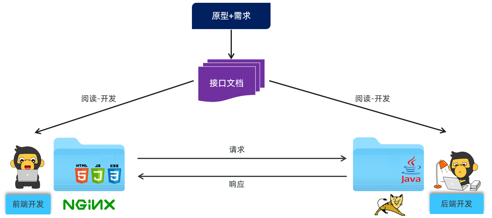
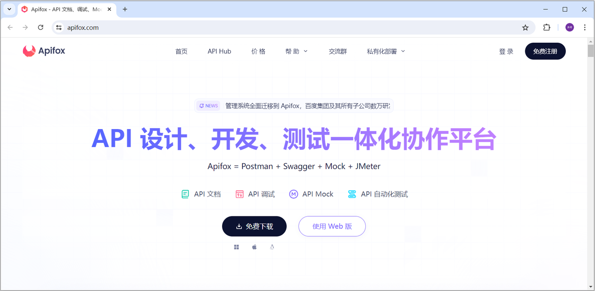

<h1 style="text-align: center;">开发规范</h1>

---

## 前后端分离开发

### 混合开发的劣势

#### （1）沟通成本高：后台人员发现前端有问题，需要找前端人员修改，前端修改成功，再交给后台人员使用

#### （2）分工不明确：后台开发人员需要开发后台代码，也需要开发部分前端代码。很难培养专业人才

#### （3）不便管理：所有的代码都在一个工程中

#### （4）难以维护：前端代码更新，和后台无关，但是需要整个工程包括后台一起重新打包部署。

### 基本介绍

<br/>


#### （1）我们将原先的工程分为前端工程和后端工程这 2 个工程，然后前端工程交给专业的前端人员开发，后端工程交给专业的后端人员开发

#### （2）前端页面需要数据，可以通过发送异步请求，从后台工程获取。但是，我们前后台是分开来开发的，那么前端人员怎么知道后台返回数据的格式呢？后端人员开发，怎么知道前端人员需要的数据格式呢？

#### （3）所以针对这个问题，我们前后台统一制定一套规范！我们前后台开发人员都需要遵循这套规范开发，这就是我们的<span style="color: red;">接口文档</span>

#### （4）接口文档有离线版和在线版本，接口文档示可以查询今天提供<span style="color: red;">资料/接口文档</span>里面的资料

#### （5）那么接口文档的内容怎么来的呢？是我们后台开发者根据产品经理提供的产品原型和需求文档所撰写出来的，产品原型示例可以参考今天提供<span style="color: red;">资料/页面原型</span>里面的资料

### 开发流程

<br/>


#### （1）需求分析：首先我们需要阅读需求文档，分析需求，理解需求

#### （2）接口定义：查询接口文档中关于需求的接口的定义，包括地址，参数，响应数据类型等等

#### （3）前后台并行开发：各自按照接口文档进行开发，实现需求

#### （4）测试：前后台开发完了，各自按照接口文档进行测试

#### （5）前后段联调测试：前段工程请求后端工程，测试功能

## Restful 接口风格

### 什么是接口

> #### 后端 web 开发中，接口指的是<span style="color: red;">功能接口</span>，可以理解为一个功能就是一个接口，不是 JavaSE 中的接口

### 什么是 Rest 风格

> #### REST（Representational State Transfer），表述性状态转换，它是一种软件架构风格

### 传统 URL 风格劣势

#### （1）传统 URL 风格如下

> #### `http://localhost:8080/user/getById?id=1` GET：查询 id 为 1 的用户
>
> #### `http://localhost:8080/user/saveUser` POST：新增用户
>
> #### `http://localhost:8080/user/updateUser` POST：修改用户
>
> #### `http://localhost:8080/user/deleteUser?id=1` GET：删除 id 为 1 的用户

#### （2）劣势分析

> #### 我们看到，原始的传统 URL 呢，定义比较复杂，而且将资源的访问行为对外暴露出来了。而且，对于开发人员来说，每一个开发人员都有自己的命名习惯，就拿根据 id 查询用户信息来说的，不同的开发人员定义的路径可能是这样的：getById，selectById，queryById，loadById... 。 每一个人都有自己的命名习惯，如果都按照各自的习惯来，一个项目组，几十号或上百号人，那最终开发出来的项目，将会变得难以维护，<span style="color: red;">没有一个统一的标准</span>

### Restful 风格介绍

> #### 在 REST 风格的 URL 中，通过四种请求方式，来操作数据的增删改查
>
> #### （1）<span style="color: red;">GET ： 查询</span>
>
> #### （2）<span style="color: red;">POST ：新增</span>
>
> #### （3）<span style="color: red;">PUT ： 修改</span>
>
> #### （4）<span style="color: red;">DELETE ：删除</span>

### ⚠️ 注意事项

> #### （1）REST 是风格，<span style="color: red;">是约定</span>方式，约定<span style="color: red;">不是规定</span>，可以打破
>
> #### （2）描述模块的功能通常使用复数，也就是<span style="color: red;">加 s 的格式</span>来描述，<span style="color: red;">表示此类资源</span>，而非单个资源。如：users、emps、books…

### Restful 风格案例

> #### `http://localhost:8080/users/1` GET：查询 id 为 1 的用户
>
> #### `http://localhost:8080/users` POST：新增用户
>
> #### `http://localhost:8080/users` PUT：修改用户
>
> #### `http://localhost:8080/users/1` DELETE：删除 id 为 1 的用户

## Apifox 接口测试

### 问题引入

> #### 我们将会基于 <span style="color: red;">Restful 风格的接口</span>进行交互，那么其中就涉及到常见的 4 中请求方式，包括：<span style="color: red;">POST、DELETE、PUT、GET</span>

#### 因为在浏览器地中所发起的所有的请求，都是 GET 方式的请求。那大家就需要思考两个问题：

> #### （1）前后端都在并行开发，后端开发完对应的接口之后，如何对接口进行请求测试呢？
>
> #### （2）前后端都在并行开发，前端开发过程中，如何获取到数据，测试页面的渲染展示呢？

#### 那这里我们就可以借助一些接口测试工具，比如项：<span style="color: red;">Postman、Apipost、Apifox</span> 等

#### 那这些工具的使用基本类似，只不过 <span style="color: red;">Apifox 工具的功能更强强大、更加完善</span>

### 基本介绍

#### （1）介绍：Apifox 是一款集成了 Api 文档、Api 调试、Api Mock、Api 测试的一体化协作平台。

#### （2）作用：接口文档管理、接口请求测试、Mock 服务。

#### （3）官网： https://apifox.com/

<br/>


### 软件安装

> #### 前往官网下载安装包，双击 exe 文件，安装即可

### ⚠️ 安装注意点

> #### 双击 exe 文件后，选择安装路径后不会自动生成安装目录，需要手动创建 Apifox 安装目录，并再次选择安装目录

## ⭐ 统一响应结果 Result

> #### 为了统一规范响应的结果，这里给定了一套规范，即为封装类 Result
>
> #### code 状态码：1 表示成功，0 表示失败
>
> #### msg ：返回的响应信息
>
> #### data ：返回的数据（json 对象）

```java
package com.itheima.pojo;

import lombok.Data;
import java.io.Serializable;

/**
 * 后端统一返回结果
 */
@Data
public class Result {

    private Integer code; //编码：1成功，0为失败
    private String msg; //错误信息
    private Object data; //数据

    public static Result success() {
        Result result = new Result();
        result.code = 1;
        result.msg = "success";
        return result;
    }

    public static Result success(Object object) {
        Result result = new Result();
        result.data = object;
        result.code = 1;
        result.msg = "success";
        return result;
    }

    public static Result error(String msg) {
        Result result = new Result();
        result.msg = msg;
        result.code = 0;
        return result;
    }

}
```
