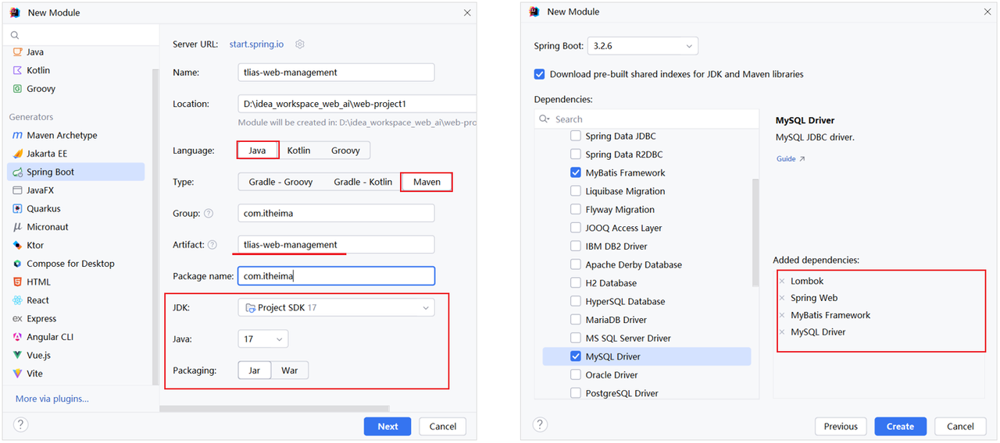

<h1 style="text-align: center;">工程搭建</h1>

---

## ⭐ 项目接口文档

> #### https://heuqqdmbyk.feishu.cn/wiki/GyZVwpRf6ir89qkKtFqc0HlTnhg

## 需要的相关依赖

> #### 创建 SpringBoot 工程，并引入 <span style="color:red">web 开发起步依赖、mybatis、mysql 驱动、lombok</span>



## ⚠️ 注意点

> #### 若 lombok 注解还是无法生效，按照 Springboot 案例中出现的问题解决方案相同，删配置 + 加版本

## 数据库准备

### SQL 语句

> #### 创建 tlias 数据库，并准备 dept 部门表

```sql
CREATE TABLE dept (
  id int unsigned PRIMARY KEY AUTO_INCREMENT COMMENT 'ID, 主键',
  name varchar(10) NOT NULL UNIQUE COMMENT '部门名称',
  create_time datetime DEFAULT NULL COMMENT '创建时间',
  update_time datetime DEFAULT NULL COMMENT '修改时间'
) COMMENT '部门表';

INSERT INTO dept VALUES (1,'学工部','2023-09-25 09:47:40','2024-07-25 09:47:40'),
                      (2,'教研部','2023-09-25 09:47:40','2024-08-09 15:17:04'),
                      (3,'咨询部','2023-09-25 09:47:40','2024-07-30 21:26:24'),
                      (4,'就业部','2023-09-25 09:47:40','2024-07-25 09:47:40'),
                      (5,'人事部','2023-09-25 09:47:40','2024-07-25 09:47:40'),
                      (6,'行政部','2023-11-30 20:56:37','2024-07-30 20:56:37');
```

### 配置 application.yml

> #### properties 文件层级不清晰，代码冗余，采用 yml 配置文件
>
> #### 需要自己替换的内容：项目名称、用户名、密码

```yml
spring:
  application:
    name: tlias-web-management
  #mysql连接配置
  datasource:
    driver-class-name: com.mysql.cj.jdbc.Driver
    url: jdbc:mysql://localhost:3306/tlias
    username: root
    password:
# 配置 mybatis 日志输出
mybatis:
  configuration:
    log-impl: org.apache.ibatis.logging.stdout.StdOutImpl
```

## 准备包结构及代码

### 基础包结构

<br/>


### 实体类 Dept

```java
package com.itheima.pojo;

import lombok.AllArgsConstructor;
import lombok.Data;
import lombok.NoArgsConstructor;

import java.time.LocalDateTime;

@Data
@NoArgsConstructor
@AllArgsConstructor
public class Dept {
    private Integer id;
    private String name;
    private LocalDateTime createTime;
    private LocalDateTime updateTime;
}
```

### ⭐ 统一响应结果 Result

```java
package com.itheima.pojo;

import lombok.Data;
import java.io.Serializable;

/**
 * 后端统一返回结果
 */
@Data
public class Result {

    private Integer code; //编码：1成功，0为失败
    private String msg; //错误信息
    private Object data; //数据

    public static Result success() {
        Result result = new Result();
        result.code = 1;
        result.msg = "success";
        return result;
    }

    public static Result success(Object object) {
        Result result = new Result();
        result.data = object;
        result.code = 1;
        result.msg = "success";
        return result;
    }

    public static Result error(String msg) {
        Result result = new Result();
        result.msg = msg;
        result.code = 0;
        return result;
    }

}
```

### DeptMapper

```java
package com.jacksonling.mapper;

import org.apache.ibatis.annotations.Mapper;

@Mapper
public interface DeptMapper {
}
```

### DeptService

```java
package com.jacksonling.service;

public interface DeptService {
}
```

### DeptServiceImpl

```java
package com.jacksonling.service.impl;

import com.jacksonling.service.DeptService;
import org.springframework.stereotype.Service;

@Service
public class DeptServiceImpl implements DeptService {
}
```

### DeptController

```java
package com.jacksonling.controller;

import org.springframework.web.bind.annotation.RestController;

/**
 * 部门管理控制层
 */
@RestController
public class DeptController {
}
```

## ⚠️ 修改文件编码


## 检查工作

> #### （1）检查项目的编码，全部配置 UTF-8，尤其是 yml 文件编码
>
> #### （2）检查项目配置的 JDK 版本
>
> #### （3）检查项目的 Maven 配置

## ⭐ 完整的 sql 脚本

```sql
-- dept
CREATE TABLE dept (
  id int unsigned PRIMARY KEY AUTO_INCREMENT COMMENT 'ID, 主键',
  name varchar(10) NOT NULL UNIQUE COMMENT '部门名称',
  create_time datetime DEFAULT NULL COMMENT '创建时间',
  update_time datetime DEFAULT NULL COMMENT '修改时间'
) COMMENT '部门表';

INSERT INTO dept VALUES (1,'学工部','2023-09-25 09:47:40','2024-07-25 09:47:40'),
                      (2,'教研部','2023-09-25 09:47:40','2024-08-09 15:17:04'),
                      (3,'咨询部','2023-09-25 09:47:40','2024-07-30 21:26:24'),
                      (4,'就业部','2023-09-25 09:47:40','2024-07-25 09:47:40'),
                      (5,'人事部','2023-09-25 09:47:40','2024-07-25 09:47:40'),
                      (6,'行政部','2023-11-30 20:56:37','2024-07-30 20:56:37');

-- emp
create table emp(
    id int unsigned primary key auto_increment comment 'ID,主键',
    username varchar(20) not null unique comment '用户名',
    password varchar(50) default '123456' comment '密码',
    name varchar(10) not null comment '姓名',
    gender tinyint unsigned not null comment '性别, 1:男, 2:女',
    phone char(11) not null unique comment '手机号',
    job tinyint unsigned comment '职位, 1 班主任, 2 讲师 , 3 学工主管, 4 教研主管, 5 咨询师',
    salary int unsigned comment '薪资',
    image varchar(300) comment '头像',
    entry_date date comment '入职日期',
    dept_id int unsigned comment '部门ID',
    create_time datetime comment '创建时间',
    update_time datetime comment '修改时间'
) comment '员工表';

INSERT INTO emp VALUES
    (1,'shinaian','123456','施耐庵',1,'13309090001',4,15000,'https://web-framework.oss-cn-hangzhou.aliyuncs.com/2023/1.jpg','2000-01-01',2,'2023-10-20 16:35:33','2023-11-16 16:11:26'),
    (2,'songjiang','123456','宋江',1,'13309090002',2,8600,'https://web-framework.oss-cn-hangzhou.aliyuncs.com/2023/1.jpg','2015-01-01',2,'2023-10-20 16:35:33','2023-10-20 16:35:37'),
    (3,'lujunyi','123456','卢俊义',1,'13309090003',2,8900,'https://web-framework.oss-cn-hangzhou.aliyuncs.com/2023/1.jpg','2008-05-01',2,'2023-10-20 16:35:33','2023-10-20 16:35:39'),
    (4,'wuyong','123456','吴用',1,'13309090004',2,9200,'https://web-framework.oss-cn-hangzhou.aliyuncs.com/2023/1.jpg','2007-01-01',2,'2023-10-20 16:35:33','2023-10-20 16:35:41'),
    (5,'gongsunsheng','123456','公孙胜',1,'13309090005',2,9500,'https://web-framework.oss-cn-hangzhou.aliyuncs.com/2023/1.jpg','2012-12-05',2,'2023-10-20 16:35:33','2023-10-20 16:35:43'),
    (6,'huosanniang','123456','扈三娘',2,'13309090006',3,6500,'https://web-framework.oss-cn-hangzhou.aliyuncs.com/2023/1.jpg','2013-09-05',1,'2023-10-20 16:35:33','2023-10-20 16:35:45'),
    (7,'chaijin','123456','柴进',1,'13309090007',1,4700,'https://web-framework.oss-cn-hangzhou.aliyuncs.com/2023/1.jpg','2005-08-01',1,'2023-10-20 16:35:33','2023-10-20 16:35:47'),
    (8,'likui','123456','李逵',1,'13309090008',1,4800,'https://web-framework.oss-cn-hangzhou.aliyuncs.com/2023/1.jpg','2014-11-09',1,'2023-10-20 16:35:33','2023-10-20 16:35:49'),
    (9,'wusong','123456','武松',1,'13309090009',1,4900,'https://web-framework.oss-cn-hangzhou.aliyuncs.com/2023/1.jpg','2011-03-11',1,'2023-10-20 16:35:33','2023-10-20 16:35:51'),
    (10,'linchong','123456','林冲',1,'13309090010',1,5000,'https://web-framework.oss-cn-hangzhou.aliyuncs.com/2023/1.jpg','2013-09-05',1,'2023-10-20 16:35:33','2023-10-20 16:35:53'),
    (11,'huyanzhuo','123456','呼延灼',1,'13309090011',2,9700,'https://web-framework.oss-cn-hangzhou.aliyuncs.com/2023/1.jpg','2007-02-01',2,'2023-10-20 16:35:33','2023-10-20 16:35:55'),
    (12,'xiaoliguang','123456','小李广',1,'13309090012',2,10000,'https://web-framework.oss-cn-hangzhou.aliyuncs.com/2023/1.jpg','2008-08-18',2,'2023-10-20 16:35:33','2023-10-20 16:35:57'),
    (13,'yangzhi','123456','杨志',1,'13309090013',1,5300,'https://web-framework.oss-cn-hangzhou.aliyuncs.com/2023/1.jpg','2012-11-01',1,'2023-10-20 16:35:33','2023-10-20 16:35:59'),
    (14,'shijin','123456','史进',1,'13309090014',2,10600,'https://web-framework.oss-cn-hangzhou.aliyuncs.com/2023/1.jpg','2002-08-01',2,'2023-10-20 16:35:33','2023-10-20 16:36:01'),
    (15,'sunerniang','123456','孙二娘',2,'13309090015',2,10900,'https://web-framework.oss-cn-hangzhou.aliyuncs.com/2023/1.jpg','2011-05-01',2,'2023-10-20 16:35:33','2023-10-20 16:36:03'),
    (16,'luzhishen','123456','鲁智深',1,'13309090016',2,9600,'https://web-framework.oss-cn-hangzhou.aliyuncs.com/2023/1.jpg','2010-01-01',2,'2023-10-20 16:35:33','2023-10-20 16:36:05'),
    (17,'liying','12345678','李应',1,'13309090017',1,5800,'https://web-framework.oss-cn-hangzhou.aliyuncs.com/2023/1.jpg','2015-03-21',1,'2023-10-20 16:35:33','2023-10-20 16:36:07'),
    (18,'shiqian','123456','时迁',1,'13309090018',2,10200,'https://web-framework.oss-cn-hangzhou.aliyuncs.com/2023/1.jpg','2015-01-01',2,'2023-10-20 16:35:33','2023-10-20 16:36:09'),
    (19,'gudasao','123456','顾大嫂',2,'13309090019',2,10500,'https://web-framework.oss-cn-hangzhou.aliyuncs.com/2023/1.jpg','2008-01-01',2,'2023-10-20 16:35:33','2023-10-20 16:36:11'),
    (20,'ruanxiaoer','123456','阮小二',1,'13309090020',2,10800,'https://web-framework.oss-cn-hangzhou.aliyuncs.com/2023/1.jpg','2018-01-01',2,'2023-10-20 16:35:33','2023-10-20 16:36:13'),
    (21,'ruanxiaowu','123456','阮小五',1,'13309090021',5,5200,'https://web-framework.oss-cn-hangzhou.aliyuncs.com/2023/1.jpg','2015-01-01',3,'2023-10-20 16:35:33','2023-10-20 16:36:15'),
    (22,'ruanxiaoqi','123456','阮小七',1,'13309090022',5,5500,'https://web-framework.oss-cn-hangzhou.aliyuncs.com/2023/1.jpg','2016-01-01',3,'2023-10-20 16:35:33','2023-10-20 16:36:17'),
    (23,'ruanji','123456','阮籍',1,'13309090023',5,5800,'https://web-framework.oss-cn-hangzhou.aliyuncs.com/2023/1.jpg','2012-01-01',3,'2023-10-20 16:35:33','2023-10-20 16:36:19'),
    (24,'tongwei','123456','童威',1,'13309090024',5,5000,'https://web-framework.oss-cn-hangzhou.aliyuncs.com/2023/1.jpg','2006-01-01',3,'2023-10-20 16:35:33','2023-10-20 16:36:21'),
    (25,'tongmeng','123456','童猛',1,'13309090025',5,4800,'https://web-framework.oss-cn-hangzhou.aliyuncs.com/2023/1.jpg','2002-01-01',3,'2023-10-20 16:35:33','2023-10-20 16:36:23'),
    (26,'yanshun','123456','燕顺',1,'13309090026',5,5400,'https://web-framework.oss-cn-hangzhou.aliyuncs.com/2023/1.jpg','2011-01-01',3,'2023-10-20 16:35:33','2023-11-08 22:12:46'),
    (27,'lijun','123456','李俊',1,'13309090027',2,6600,'https://web-framework.oss-cn-hangzhou.aliyuncs.com/2023/1.jpg','2004-01-01',2,'2023-10-20 16:35:33','2023-11-16 17:56:59'),
    (28,'lizhong','123456','李忠',1,'13309090028',5,5000,'https://web-framework.oss-cn-hangzhou.aliyuncs.com/2023/1.jpg','2007-01-01',3,'2023-10-20 16:35:33','2023-11-17 16:34:22'),
    (30,'liyun','123456','李云',1,'13309090030',NULL,NULL,'https://web-framework.oss-cn-hangzhou.aliyuncs.com/2023/1.jpg','2020-03-01',NULL,'2023-10-20 16:35:33','2023-10-20 16:36:31'),
    (36,'linghuchong','123456','令狐冲',1,'18809091212',2,6800,'https://web-framework.oss-cn-hangzhou.aliyuncs.com/2023/1.jpg','2023-10-19',2,'2023-10-20 20:44:54','2023-11-09 09:41:04');


-- emp_expr
create table emp_expr(
    id int unsigned primary key auto_increment comment 'ID, 主键',
    emp_id int unsigned comment '员工ID',
    begin date comment '开始时间',
    end  date comment '结束时间',
    company varchar(50) comment '公司名称',
    job varchar(50) comment '职位'
)comment '工作经历';

-- emp_login_log
CREATE TABLE `emp_login_log` (
  `id` int unsigned NOT NULL AUTO_INCREMENT COMMENT 'ID',
  `username` varchar(20) DEFAULT NULL COMMENT '用户名',
  `password` varchar(32) DEFAULT NULL COMMENT '密码',
  `login_time` datetime DEFAULT NULL COMMENT '登录时间',
  `is_success` tinyint unsigned DEFAULT NULL COMMENT '是否成功, 1:成功, 0:失败',
  `jwt` varchar(1000) DEFAULT NULL COMMENT 'JWT令牌',
  `cost_time` bigint unsigned DEFAULT NULL COMMENT '耗时, 单位:ms',
  PRIMARY KEY (`id`)
) ENGINE=InnoDB AUTO_INCREMENT=7 DEFAULT CHARSET=utf8mb4 COLLATE=utf8mb4_general_ci COMMENT='登录日志表';

-- emp_log
CREATE TABLE `emp_log` (
  `id` int unsigned NOT NULL AUTO_INCREMENT COMMENT 'ID, 主键',
  `operate_time` datetime DEFAULT NULL COMMENT '操作时间',
  `info` varchar(2000) DEFAULT NULL COMMENT '日志信息',
  PRIMARY KEY (`id`)
) ENGINE=InnoDB AUTO_INCREMENT=4 DEFAULT CHARSET=utf8mb4 COLLATE=utf8mb4_general_ci COMMENT='员工日志表';

-- clazz
create table clazz(
    id   int unsigned primary key auto_increment comment 'ID,主键',
    name  varchar(30) not null unique  comment '班级名称',
    room  varchar(20) comment '班级教室',
    begin_date date not null comment '开课时间',
    end_date date not null comment '结课时间',
    master_id int unsigned null comment '班主任ID, 关联员工表ID',
    subject tinyint unsigned not null comment '学科, 1:java, 2:前端, 3:大数据, 4:Python, 5:Go, 6: 嵌入式',
    create_time datetime  comment '创建时间',
    update_time datetime  comment '修改时间'
)comment '班级表';

INSERT INTO clazz VALUES (1,'JavaEE就业163期','212','2024-04-30','2024-06-29',10,1,'2024-06-01 17:08:23','2024-06-01 17:39:58'),
    (2,'前端就业90期','210','2024-07-10','2024-01-20',3,2,'2024-06-01 17:45:12','2024-06-01 17:45:12'),
    (3,'JavaEE就业165期','108','2024-06-15','2024-12-25',6,1,'2024-06-01 17:45:40','2024-06-01 17:45:40'),
    (4,'JavaEE就业166期','105','2024-07-20','2024-02-20',20,1,'2024-06-01 17:46:10','2024-06-01 17:46:10'),
    (5,'大数据就业58期','209','2024-08-01','2024-02-15',7,3,'2024-06-01 17:51:21','2024-06-01 17:51:21'),
    (6,'JavaEE就业167期','325','2024-11-20','2024-05-10',36,1,'2024-11-15 11:35:46','2024-12-13 14:31:24');

-- student
create table student(
  id int unsigned primary key auto_increment comment 'ID,主键',
  name varchar(10)  not null comment '姓名',
  no char(10)  not null unique comment '学号',
  gender tinyint unsigned  not null comment '性别, 1: 男, 2: 女',
  phone  varchar(11)  not null unique comment '手机号',
  id_card  char(18)  not null unique comment '身份证号',
  is_college tinyint unsigned  not null comment '是否来自于院校, 1:是, 0:否',
  address  varchar(100)  comment '联系地址',
  degree  tinyint unsigned  comment '最高学历, 1:初中, 2:高中, 3:大专, 4:本科, 5:硕士, 6:博士',
  graduation_date date comment '毕业时间',
  clazz_id  int unsigned not null comment '班级ID, 关联班级表ID',
  violation_count tinyint unsigned default '0' not null comment '违纪次数',
  violation_score tinyint unsigned default '0' not null comment '违纪扣分',
  create_time  datetime  comment '创建时间',
  update_time  datetime  comment '修改时间'
) comment '学员表';


INSERT INTO student VALUES (1,'段誉','2022000001',1,'18800000001','110120000300200001',1,'北京市昌平区建材城西路1号',1,'2021-07-01',2,0,0,'2024-11-14 21:22:19','2024-11-15 16:20:59'),
    (2,'萧峰','2022000002',1,'18800210003','110120000300200002',1,'北京市昌平区建材城西路2号',2,'2022-07-01',1,0,0,'2024-11-14 21:22:19','2024-11-14 21:22:19'),
    (3,'虚竹','2022000003',1,'18800013001','110120000300200003',1,'北京市昌平区建材城西路3号',2,'2024-07-01',1,0,0,'2024-11-14 21:22:19','2024-11-14 21:22:19'),
    (4,'萧远山','2022000004',1,'18800003211','110120000300200004',1,'北京市昌平区建材城西路4号',3,'2024-07-01',1,0,0,'2024-11-14 21:22:19','2024-11-14 21:22:19'),
    (5,'阿朱','2022000005',2,'18800160002','110120000300200005',1,'北京市昌平区建材城西路5号',4,'2020-07-01',1,0,0,'2024-11-14 21:22:19','2024-11-14 21:22:19'),
    (6,'阿紫','2022000006',2,'18800000034','110120000300200006',1,'北京市昌平区建材城西路6号',4,'2021-07-01',2,0,0,'2024-11-14 21:22:19','2024-11-14 21:22:19'),
    (7,'游坦之','2022000007',1,'18800000067','110120000300200007',1,'北京市昌平区建材城西路7号',4,'2022-07-01',2,0,0,'2024-11-14 21:22:19','2024-11-14 21:22:19'),
    (8,'康敏','2022000008',2,'18800000077','110120000300200008',1,'北京市昌平区建材城西路8号',5,'2024-07-01',2,0,0,'2024-11-14 21:22:19','2024-11-14 21:22:19'),
    (9,'徐长老','2022000009',1,'18800000341','110120000300200009',1,'北京市昌平区建材城西路9号',3,'2024-07-01',2,0,0,'2024-11-14 21:22:19','2024-11-14 21:22:19'),
    (10,'云中鹤','2022000010',1,'18800006571','110120000300200010',1,'北京市昌平区建材城西路10号',2,'2020-07-01',2,0,0,'2024-11-14 21:22:19','2024-11-14 21:22:19'),
    (11,'钟万仇','2022000011',1,'18800000391','110120000300200011',1,'北京市昌平区建材城西路11号',4,'2021-07-01',1,0,0,'2024-11-14 21:22:19','2024-11-15 16:21:24'),
    (12,'崔百泉','2022000012',1,'18800000781','110120000300200018',1,'北京市昌平区建材城西路12号',4,'2022-07-05',3,6,17,'2024-11-14 21:22:19','2024-12-13 14:33:58'),
    (13,'耶律洪基','2022000013',1,'18800008901','110120000300200013',1,'北京市昌平区建材城西路13号',4,'2024-07-01',2,0,0,'2024-11-14 21:22:19','2024-11-15 16:21:21'),
    (14,'天山童姥','2022000014',2,'18800009201','110120000300200014',1,'北京市昌平区建材城西路14号',4,'2024-07-01',1,0,0,'2024-11-14 21:22:19','2024-11-15 16:21:17'),
    (15,'刘竹庄','2022000015',1,'18800009401','110120000300200015',1,'北京市昌平区建材城西路15号',3,'2020-07-01',4,0,0,'2024-11-14 21:22:19','2024-11-14 21:22:19'),
    (16,'李春来','2022000016',1,'18800008501','110120000300200016',1,'北京市昌平区建材城西路16号',4,'2021-07-01',4,0,0,'2024-11-14 21:22:19','2024-11-14 21:22:19'),
    (17,'王语嫣','2022000017',2,'18800007601','110120000300200017',1,'北京市昌平区建材城西路17号',2,'2022-07-01',4,0,0,'2024-11-14 21:22:19','2024-11-14 21:22:19'),
    (18,'郑成功','2024001101',1,'13309092345','110110110110110110',0,'北京市昌平区回龙观街道88号',5,'2021-07-01',3,2,7,'2024-11-15 16:26:18','2024-11-15 16:40:10');

-- operate_log
CREATE TABLE `operate_log` (
  `id` int unsigned NOT NULL AUTO_INCREMENT COMMENT 'ID',
  `operate_emp_id` int unsigned DEFAULT NULL COMMENT '操作人ID',
  `operate_time` datetime DEFAULT NULL COMMENT '操作时间',
  `class_name` varchar(100) DEFAULT NULL COMMENT '操作的类名',
  `method_name` varchar(100) DEFAULT NULL COMMENT '操作的方法名',
  `method_params` varchar(1000) DEFAULT NULL COMMENT '方法参数',
  `return_value` varchar(2000) DEFAULT NULL COMMENT '返回值, 存储json格式',
  `cost_time` int DEFAULT NULL COMMENT '方法执行耗时, 单位:ms',
  PRIMARY KEY (`id`)
) ENGINE=InnoDB AUTO_INCREMENT=20 DEFAULT CHARSET=utf8mb4 COLLATE=utf8mb4_general_ci COMMENT='操作日志表';
```
