<h1 style="text-align: center;">部门管理</h1>

---

## 查询部门

### 思路分析

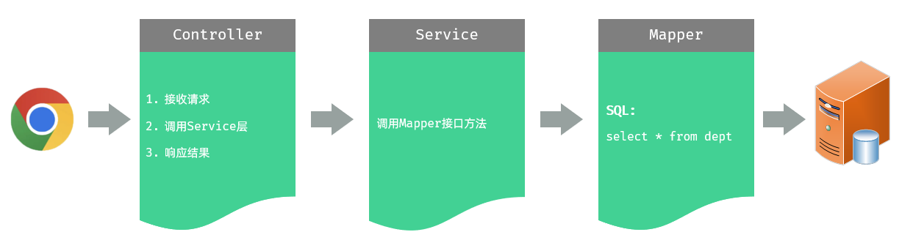

> #### Controller 层，负责接收前端发起的请求，并调用 service 查询部门数据，然后响应结果
>
> #### Service 层，负责调用 Mapper 接口方法，查询所有部门数据
>
> #### Mapper 层，执行查询所有部门数据的操作

### 限制请求方式

#### 问题分析

> #### 根据接口文档需求，以 GET 的方式请求，后端成功返回数据，但是经过测试，post、put、delete 请求方式均可成功发送请求并获取后端的响应数据，这时需要限制请求方式

#### @RequestMapping 的<span style="color:red">衍生注解</span>

> #### GET 方式：<span style="color:red">@GetMapping</span>
>
> #### POST 方式：<span style="color:red">@PostMapping</span>
>
> #### PUT 方式： <span style="color:red">@PutMapping</span>
>
> #### DELETE 方式：<span style="color:red">@DeleteMapping</span>

#### 方法一：在 controller 方法的 <span style="color:red">@RequestMapping</span> 注解中通过 <span style="color:red">method 属性</span>来限定

> #### 指定 value 属性为接口文档中指定的请求路径

```java
package com.jacksonling.controller;

import com.jacksonling.pojo.Dept;
import com.jacksonling.pojo.Result;
import com.jacksonling.service.DeptService;
import org.springframework.beans.factory.annotation.Autowired;
import org.springframework.web.bind.annotation.RequestMapping;
import org.springframework.web.bind.annotation.RequestMethod;
import org.springframework.web.bind.annotation.RestController;

import java.util.List;

/**
 * 部门管理控制层
 */
@RestController
public class DeptController {
    @Autowired
    private DeptService deptService;
    @RequestMapping(value = "/depts", method = RequestMethod.GET)
    // 统一响应的结果封装类 Result
    public Result list(){
        List<Dept> deptList = deptService.findAll();
        return Result.success(deptList);
    }
}
```

#### ⭐ 方法二：在 controller 方法上使用，@RequestMapping 的<span style="color:red">衍生注解</span>，该注解制定了请求方式（推荐）

```java
package com.jacksonling.controller;

import com.jacksonling.pojo.Dept;
import com.jacksonling.pojo.Result;
import com.jacksonling.service.DeptService;
import org.springframework.beans.factory.annotation.Autowired;
import org.springframework.web.bind.annotation.GetMapping;
import org.springframework.web.bind.annotation.RestController;

import java.util.List;

/**
 * 部门管理控制层
 */
@RestController
public class DeptController {
    @Autowired
    private DeptService deptService;
    @GetMapping("/depts")
    // 统一响应的结果封装类 Result
    public Result list(){
        List<Dept> deptList = deptService.findAll();
        return Result.success(deptList);
    }
}
```

### 数据封装

#### 在上述测试中，我们发现部门的数据中，id、name 两个属性是有值的，但是 createTime、updateTime 两个字段值并未成功封装，而数据库中是有对应的字段值的，这是为什么呢？

> #### （1） 实体类 <span style="color:red">属性名</span> 和数据库表查询返回的 <span style="color:red">字段名</span> 一致，mybatis 会自动封装
>
> #### （2） 如果实体类属性名和数据库表查询返回的字段名<span style="color:red">不一致</span>，不能自动封装
>
> #### 提示：字段名指的是数据库中字段的名称，属性名指的是封装对象中的属性名

#### 方法一：在 DeptMapper 接口方法上，使用 <span style="color:red">@Results @Result</span> 注解进行手动结果映射

```java
@Results({@Result(column = "create_time", property = "createTime"),
          @Result(column = "update_time", property = "updateTime")})
@Select("select id, name, create_time, update_time from dept")
public List<Dept> findAll();
```

#### 方法二：起别名

```java
@Select("select id, name, create_time createTime, update_time updateTime from dept")
public List<Dept> findAll();
```

#### ⭐ 方法三：开启驼峰命名（推荐）

> #### 使用前提：<span style="color:red">实体类的属性与数据库表中的字段名严格遵守驼峰命名</span>
>
> #### 在 application.yml 中添加如下配置，快捷键：<span style="color:red">camel</span>

```yml
mybatis:
  configuration:
    map-underscore-to-camel-case: true
```

### 安装 Nginx

<br/>
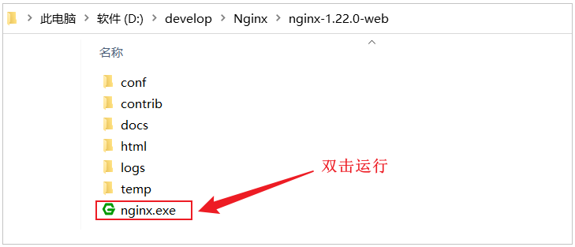

#### 打开浏览器，访问：`http://localhost:90`

<br/>
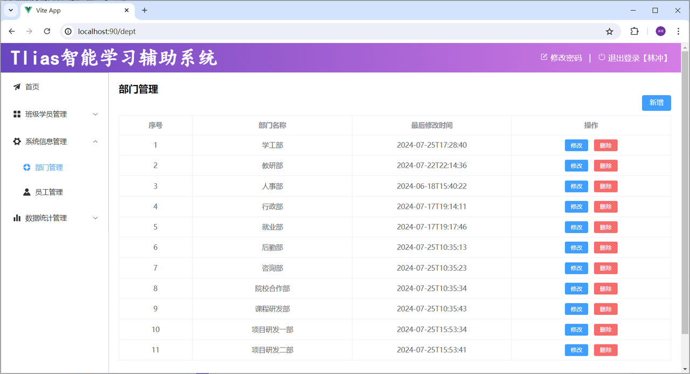

### Nginx 请求访问流程

> #### 前端工程请求服务器的地址为 `http://localhost:90/api/depts`，是如何访问到后端的 tomcat 服务器的？

<br/>
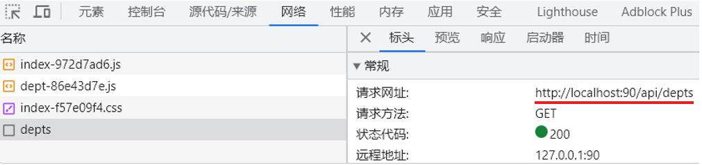

> #### 其实这里，是通过前端服务 Nginx 中提供的反向代理功能实现的

<br/>
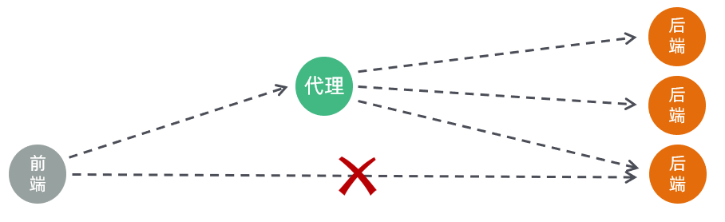

> #### （1）浏览器发起请求，请求的是 localhost:90 ，那其实请求的是 nginx 服务器
>
> #### （2）在 nginx 服务器中呢，并<span style="color:red">没有对请求直接进行处理，而是将请求转发给了后端的 tomcat 服务器</span>，最终由 tomcat 服务器来处理该请求

#### 这个过程就是通过 nginx 的反向代理实现的。 那为什么浏览器不直接请求后端的 tomcat 服务器，而是直接请求 nginx 服务器呢，主要有以下几点原因

<br/>
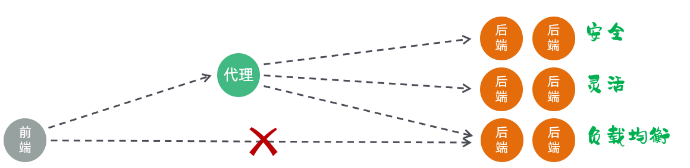

> #### （1）<span style="color:red">安全</span>：由于后端的 tomcat 服务器一般都会搭建集群，会有很多的服务器，把所有的 <span style="color:red">tomcat 暴露给前端</span>，让前端直接请求 tomcat，对于后端服务器是比较危险的
>
> #### （2）<span style="color:red">灵活</span>：基于 nginx 的<span style="color:red">反向代理</span>实现，更加灵活，<span style="color:red">后端想增加、减少服务器，对于前端来说是无感知的</span>，只需要在 nginx 中配置即可
>
> #### （3）<span style="color:red">负载均衡</span>：基于 nginx 的反向代理，可以很方便的实现后端 tomcat 的负载均衡操作

#### 具体的请求访问流程如下

<br/>
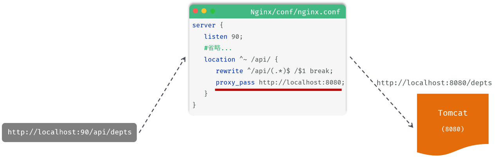

> #### （1）location：用于定义匹配特定 url 请求的规则
>
> #### （2）^~ /api/：表示精确匹配，即只匹配以 / api / 开头的路径
>
> #### （3）rewrite：该指令用于<span style="color:red">重写匹配到的 url 路径</span>
>
> #### （4）proxy_pass：该指令用于代理转发，它将匹配到的请求转发给位于后端的指令服务器

### 代码实现

#### （1）Controller 层

> #### 在 DeptController 中，增加 list 方法，代码如下

```java
/**
 * 部门管理控制器
 */
@RestController
public class DeptController {

    @Autowired
    private DeptService deptService;

    /**
     * 查询部门列表
     */
    @RequestMapping("/depts")
    public Result list(){
        List<Dept> deptList = deptService.findAll();
        return Result.success(deptList);
    }
}
```

#### （2） Service 层

> #### 在 DeptService 中，增加 findAll 方法，代码如下

```java
public interface DeptService {
    /**
     * 查询所有部门
     */
    public List<Dept> findAll();
}
```

> #### 在 DeptServiceImpl 中，增加 findAll 方法，代码如下

```java
@Service
public class DeptServiceImpl implements DeptService {

    @Autowired
    private DeptMapper deptMapper;

    public List<Dept> findAll() {
        return deptMapper.findAll();
    }
}
```

#### （3） Mapper 层

> #### 在 DeptMapper 中，增加 findAll 方法，代码如下

```java
@Mapper
public interface DeptMapper {
    /**
     * 查询所有部门
     */
    @Select("select * from dept")
    public List<Dept> findAll();

}
```

## 删除部门

### 思路分析

<br/>
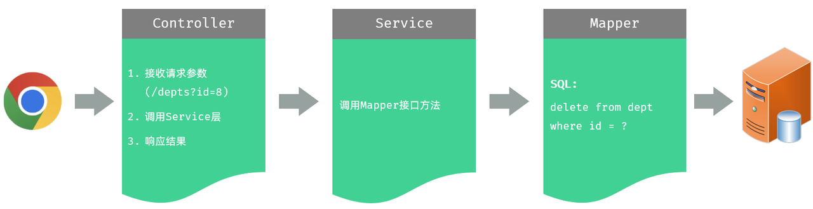

### 接收请求参数的方法

#### 方法一：通过原始的 HttpServletRequest 对象获取请求参数

```java
/**
* 根据ID删除部门 - 简单参数接收: 方式一 (HttpServletRequest)
*/
@DeleteMapping("/depts")
public Result delete(HttpServletRequest request){
    String idStr = request.getParameter("id");
    int id = Integer.parseInt(idStr);

    System.out.println("根据ID删除部门: " + id);
    return Result.success();
}
```

#### 方案二：通过 Spring 提供的 <span style="color:red">@RequestParam</span> 注解，将请求参数<span style="color:red">绑定给方法形参</span>

> #### ⚠️ 注意点
>
> #### （1）@RequestParam 注解的 <span style="color:red">value</span> 属性，需要 <span style="color:red">与前端传递的参数名保持一致</span>
>
> #### （2）@RequestParam 注解 <span style="color:red">required 属性默认为 true</span>，代表该参数 <span style="color:red">必须传递</span>，如果 <span style="color:red">不传递将报错</span>。 如果参数可选，可以将属性设置为 false
>
> #### （3）@RequestParam(value = "id", <span style="color:red">required = false</span>) Integer deptId
>
> #### （4）@RequestParam(defaultValue="默认值")，<span style="color:red">defaultValue</span> 属性可用于<span style="color:red">设置请求参数默认值</span>

```java
@DeleteMapping("/depts")
public Result delete(@RequestParam("id") Integer deptId){
    System.out.println("根据ID删除部门: " + deptId);
    return Result.success();
}
```

#### 方案三：如果请求参数名与形参变量名<span style="color:red">相同</span>，直接定义方法形参即可接收（<span style="color:red">省略 @RequestParam</span>）

```java
@DeleteMapping("/depts")
public Result delete(Integer id){
    System.out.println("根据ID删除部门: " + deptId);
    return Result.success();
}
```

### 代码实现

#### （1）Controller 层

> #### 在 DeptMapper 中，增加 delete 方法，代码实现如下

```java
/**
 * 根据id删除部门 - delete http://localhost:8080/depts?id=1
 */
@DeleteMapping("/depts")
public Result delete(Integer id){
    System.out.println("根据id删除部门, id=" + id);
    deptService.deleteById(id);
    return Result.success();
}
```

#### （2）Service 层

> #### 在 DeptService 中，增加 deleteById 方法，代码实现如下

```java
/**
 * 根据id删除部门
 */
void deleteById(Integer id);
```

> #### 在 DeptServiceImpl 中，增加 deleteById 方法，代码实现如下

```java
public void deleteById(Integer id) {
    deptMapper.deleteById(id);
}
```

#### （3）Mapper 层

> #### ⚠️ 如果 mapper 接口方法形参<span style="color:red">只有一个</span>普通类型的参数，#{…} 里面的<span style="color:red">属性名可以随便写</span>，如：#{id}、#{value}
>
> #### ⚠️ 如果有<span style="color:red">多个参数</span>，需要使用 <span style="color:red">@Parm 注解指定参数名</span>，具体见 MyBatis 笔记中 select 的相关笔记
>
> #### 在 DeptMapper 中，增加 deleteById 方法，代码实现如下

```java
/**
 * 根据id删除部门
 */
@Delete("delete from dept where id = #{id}")
void deleteById(Integer id);
```

## 新增部门

### 思路分析

<br/>
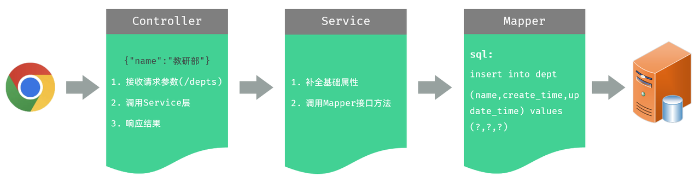

### 接收 json 数据的方法

#### 我们看到，在 controller 中，需要接收前端传递的请求参数，那接下来，我们就先来看看在服务器端的 <span style="color:red">Controller</span> 程序中，如何获取 json 格式的参数

> #### （1）JSON 格式的参数，通常会使用一个<span style="color:red">实体对象</span>进行接收
>
> #### （2）⚠️ 使用规则：JSON 数据的<span style="color:red">键名与方法形参对象的属性名相同</span>，并需要使用 <span style="color:red">@RequestBody 注解</span>标识
>
> #### （3）理解记忆：@RequestBody 翻译为请求体，然而 JSON 数据就是在请求体中，然后发送给后端的

#### 前端传递的请求参数格式为 json，内容如下：<span style="color:red">{"name":"研发部"}</span>，这里，我们可以通过一个对象来接收，<span style="color:red">只需要保证对象中有 name 属性</span>即可

<br/>
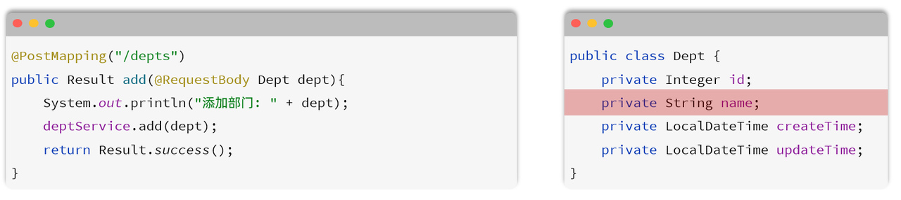

### 代码实现

#### （1） Controller 层

> #### 在 DeptController 中增加方法 save，具体代码如下

```java
/**
 * 新增部门 - POST http://localhost:8080/depts   请求参数：{"name":"研发部"}
 */
@PostMapping("/depts")
public Result save(@RequestBody Dept dept){
    System.out.println("新增部门, dept=" + dept);
    deptService.save(dept);
    return Result.success();
}
```

#### （2） Service 层

> #### 在 DeptService 中增加接口方法 save，具体代码如下

```java
/**
 * 新增部门
 */
void save(Dept dept);
```

> #### 在 DeptServiceImpl 中增加 save 方法，由于数据库中含有时间字段，这里需要在业务层手动设置然后传给 Mapper 层，完成添加部门的操作，具体代码如下

```java
public void save(Dept dept) {
    //补全基础属性
    dept.setCreateTime(LocalDateTime.now());
    dept.setUpdateTime(LocalDateTime.now());
    //保存部门
    deptMapper.insert(dept);
}
```

#### （3）Mapper 层

```java
/**
 * 保存部门
 */
@Insert("insert into dept(name,create_time,update_time) values(#{name},#{createTime},#{updateTime})")
void insert(Dept dept);
```

## 修改部门

### 思路分析

<br/>
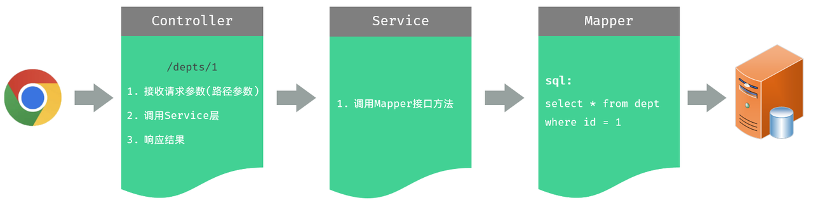

### 一、查询回显模块

### 接收路径参数

> #### /depts/1，/depts/2 这种在 url 中传递的参数，我们称之为路径参数，那么如何接收这样的路径参数呢 ？
>
> #### 路径参数：通过请求 URL 直接传递参数，使用 <span style="color:red">{…}</span> 来标识该路径参数，需要使用 <span style="color:red">@PathVariable 获取路径参数</span>
>
> #### ⚠️ 如果路径参数名与 controller 方法形参<span style="color:red">名称一致</span>，<span style="color:red">@PathVariable</span> 注解的 <span style="color:red">value 属性是可以省略</span>的

<br/>
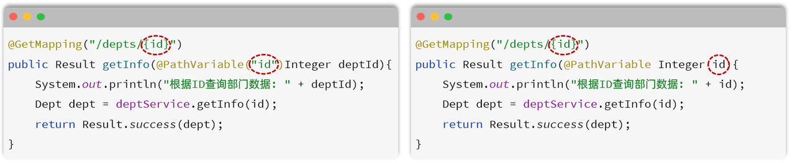

### 代码实现

#### （1）Controller 层

> #### 在 DeptController 中增加 getById 方法，具体代码如下

```java
@GetMapping("/depts/{id}")
public Result getById(@PathVariable Integer id){
    System.out.println("根据ID查询, id=" + id);
    Dept dept = deptService.getById(id);
    return Result.success(dept);
}
```

#### （2） Service 层

> #### 在 DeptService 中增加 getById 方法，具体代码如下

```java
/**
 * 根据id查询部门
 */
Dept getById(Integer id);
```

> #### 在 DeptServiceImpl 中增加 getById 方法，具体代码如下

```java
public Dept getById(Integer id) {
    return deptMapper.getById(id);
}
```

#### （3）Mapper 层

> #### 在 DeptMapper 中增加 getById 方法，具体代码如下

```java
/**
* 根据ID查询部门数据
*/
@Select("select id, name, create_time, update_time from dept where id = #{id}")
Dept getById(Integer id);
```

### 二、修改数据模块

### 思路分析

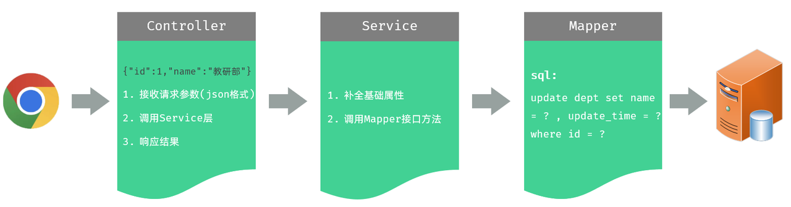

> #### 通过接口文档，我们可以看到前端传递的请求参数是 json 格式的请求参数，在 Controller 的方法中，我们可以通过 @RequestBody 注解来接收，并将其封装到一个对象中

### 代码实现

#### （1）Controller 层

> #### 在 DeptController 中增加 update 方法，具体代码如下

```java
/**
 * 修改部门 - PUT http://localhost:8080/depts  请求参数：{"id":1,"name":"研发部"}
 */
@PutMapping("/depts")
public Result update(@RequestBody Dept dept){
    System.out.println("修改部门, dept=" + dept);
    deptService.update(dept);
    return Result.success();
}
```

#### （2）Service 层

> #### 在 DeptService 中增加 update 方法

```java
/**
 * 修改部门
 */
void update(Dept dept);
```

> #### 在 DeptServiceImpl 中增加 update 方法。 由于是修改操作，每一次修改数据，都需要更新 updateTime。所以，具体代码如下

```java
public void update(Dept dept) {
    //补全基础属性
    dept.setUpdateTime(LocalDateTime.now());
    //保存部门
    deptMapper.update(dept);
}
```

#### （3）Mapper 层

> #### 在 DeptMapper 中增加 update 方法，具体代码如下

```java
/**
 * 更新部门
 */
@Update("update dept set name = #{name},update_time = #{updateTime} where id = #{id}")
void update(Dept dept);
```

## 优化请求路径写法

> #### 我们会发现，我们在 DeptController 中所定义的方法，所有的请求路径，都是 /depts 开头的，只要操作的是部门数据，请求路径都是 /depts 开头
>
> #### 那么这个时候，我们其实是可以把这个公共的路径 /depts 抽取到类上的，那在各个方法上，就可以省略了这个 /depts 路径。 代码如下

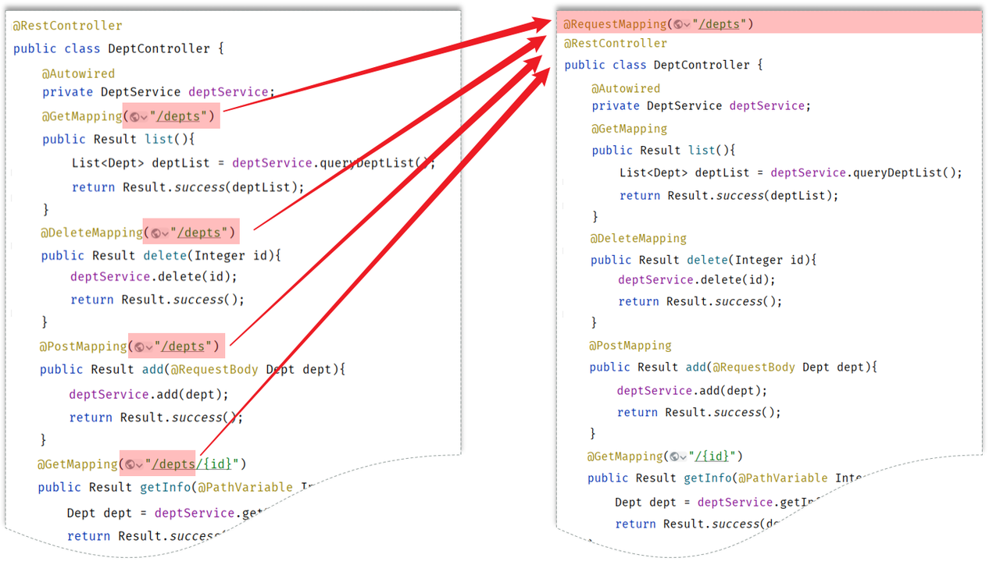

> #### ⚠️ 一个完整的请求路径，应该是类上的 @RequestMapping 的 value 属性 + 方法上的 @RequestMapping 的 value 属性
