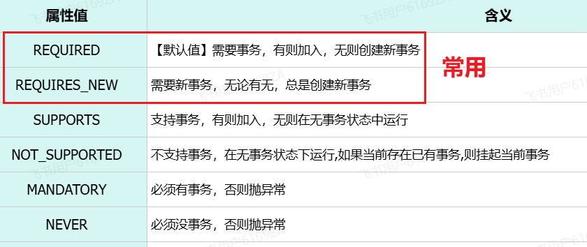
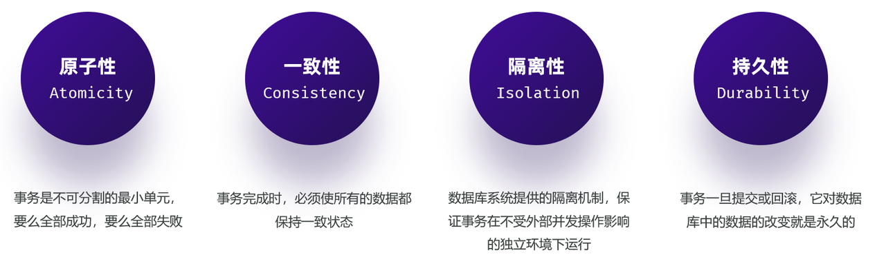

<h1 style="text-align: center;">Spring事务管理</h1>
 
- - -

## 问题引入

#### 目前我们实现的新增员工功能中，操作了两次数据库，执行了两次 insert 操作

> #### 第一次：保存员工的基本信息到 emp 表中
>
> #### 第二次：保存员工的工作经历信息到 emp_expr 表中

#### 问题分析

> #### 如果程序出现了异常，员工表 emp 数据保存成功了, 但是 emp_expr 员工工作经历信息表，数据保存失败了，这是不允许的

#### 事务引入

> #### 使用事务来管理，保持<span style="color: red;">一致性</span>，二者为一个整体，要么成功，要么失败

## 基本介绍

> #### 事务是一组操作的集合，它是一个不可分割的工作单位。事务会把所有的操作作为<span style="color: red;">一个整体</span>一起向系统提交或撤销操作请求，即这些操作 <span style="color: red;">要么同时成功，要么同时失败</span>
>
> #### <span style="color: red;">MySQL 的事务默认是自动提交的</span>，也就是说，当执行一条 DML 语句，MySQL 会立即<span style="color: red;">隐式</span>的提交事务

## MySQL 事务案例

> #### 事务控制主要三步操作：开启事务、提交事务 / 回滚事务
>
> #### 需要在这组操作执行之前，先开启事务 ( start transaction; / begin;)
>
> #### 所有操作如果全部都执行成功，则提交事务 ( commit; )
>
> #### 如果这组操作中，有任何一个操作执行失败，都应该回滚事务 ( rollback )

```sql
-- 开启事务
start transaction; / begin;

-- 1. 保存员工基本信息
insert into emp values (39, 'Tom', '123456', '汤姆', 1, '13300001111', 1, 4000, '1.jpg', '2023-11-01', 1, now(), now());

-- 2. 保存员工的工作经历信息
insert into emp_expr(emp_id, begin, end, company, job) values (39,'2019-01-01', '2020-01-01', '百度', '开发'),                                                                                                       (39,'2020-01-10', '2022-02-01', '阿里', '架构');

-- 提交事务(全部成功)
commit;

-- 回滚事务(有一个失败)
rollback;
```

## Spring 事务管理

### @Transactional 注解

#### （1）作用

> #### 就是在当前这个方法执行开始之前来开启事务，方法执行完毕之后提交事务。如果在这个方法执行的过程当中出现了异常，就会进行事务的回滚操作

#### （2）可定义的位置：<span style="color: red;">业务层</span>的方法上、类上、接口上

> #### 方法上：<span style="color: red;">当前方法</span>交给 spring 进行事务管理
>
> #### 类上：当前类中<span style="color: red;">所有的方法</span>都交由 spring 进行事务管理
>
> #### 接口上：接口下<span style="color: red;">所有的实现类</span>当中<span style="color: red;">所有的方法</span>都交给 spring 进行事务管理

#### （3）案例应用：新增员工

```java
@Transactional
@Override
public void save(Emp emp) {
    //1.补全基础属性
    emp.setCreateTime(LocalDateTime.now());
    emp.setUpdateTime(LocalDateTime.now());
    //2.保存员工基本信息
    empMapper.insert(emp);

    int i = 1/0;

    //3. 保存员工的工作经历信息 - 批量
    Integer empId = emp.getId();
    List<EmpExpr> exprList = emp.getExprList();
    if(!CollectionUtils.isEmpty(exprList)){
        exprList.forEach(empExpr -> empExpr.setEmpId(empId));
        empExprMapper.insertBatch(exprList);
    }
}
```

### 配置事务管理日志

```yml
#spring事务管理日志
logging:
  level:
    org.springframework.jdbc.support.JdbcTransactionManager: debug
```

### rollbackFor 属性

> #### 该属性是一个<span style="color:red">异常回滚属性</span>
>
> #### <span style="color:red">默认</span>情况下，只有出现 <span style="color: red;">RuntimeException</span>（运行时异常）<span style="color: red;">才会回滚事务</span>
>
> #### 通过 rollbackFor 这个属性可以<span style="color: red;">指定出现何种异常类型回滚事务</span>

```java
@Transactional(rollbackFor = Exception.class)
@Override
public void save(Emp emp) throws Exception {
    //1.补全基础属性
    emp.setCreateTime(LocalDateTime.now());
    emp.setUpdateTime(LocalDateTime.now());
    //2.保存员工基本信息
    empMapper.insert(emp);

    //int i = 1/0;
    if(true){
        throw new Exception("出异常啦....");
    }

    //3. 保存员工的工作经历信息 - 批量
    Integer empId = emp.getId();
    List<EmpExpr> exprList = emp.getExprList();
    if(!CollectionUtils.isEmpty(exprList)){
        exprList.forEach(empExpr -> empExpr.setEmpId(empId));
        empExprMapper.insertBatch(exprList);
    }
}
```

### propagation 属性

> #### 该属性是一个<span style="color:red">事务传播属性</span>

#### 什么是事务传播？

> #### 两个事务方法，一个 A 方法，一个 B 方法。在这两个方法上都添加了@Transactional 注解，就代表这两个方法都具有事务，而在 A 方法当中又去调用了 B 方法
>
> #### 所谓事务的传播行为，指的就是在 A 方法运行的时候，首先会开启一个事务，在 A 方法当中又调用了 B 方法， B 方法自身也具有事务，那么 B 方法在运行的时候，到底是加入到 A 方法的事务当中来，还是 B 方法在运行的时候新建一个事务？这个就涉及到了事务的传播行为

#### propagation 属性值

<br/>


#### REQUIREDS_NEW 属性应用举例

> #### 在新增员工信息时，无论是成功还是失败，都要记录操作日志

```java
@Service
public class EmpLogServiceImpl implements EmpLogService {

    @Autowired
    private EmpLogMapper empLogMapper;

    @Transactional(propagation = Propagation.REQUIRES_NEW)
    @Override
    public void insertLog(EmpLog empLog) {
        empLogMapper.insert(empLog);
    }
}

-----------------------------------------------------------------------------------------

@Autowired
private EmpMapper empMapper;
@Autowired
private EmpExprMapper empExprMapper;
@Autowired
private EmpLogService empLogService;

@Transactional(rollbackFor = {Exception.class})
@Override
public void save(Emp emp) {
    try {
        //1.补全基础属性
        emp.setCreateTime(LocalDateTime.now());
        emp.setUpdateTime(LocalDateTime.now());

        //2.保存员工基本信息
        empMapper.insert(emp);

        int i = 1/0;

        //3. 保存员工的工作经历信息 - 批量
        Integer empId = emp.getId();
        List<EmpExpr> exprList = emp.getExprList();
        if(!CollectionUtils.isEmpty(exprList)){
            exprList.forEach(empExpr -> empExpr.setEmpId(empId));
            empExprMapper.insertBatch(exprList);
        }
    } finally {
        //记录操作日志
        EmpLog empLog = new EmpLog(null, LocalDateTime.now(), emp.toString());
        empLogService.insertLog(empLog);
    }

}
```

### 事务的四大特性（ACID）



#### 原子性（Atomicity）

> #### 原子性是指事务包装的一组 sql 是一个不可分割的工作单元，事务中的操作<span style="color:red">要么全部成功，要么全部失败</span>

#### 一致性（Consistency）

> #### 一个事务完成之后数据都必须处于一致性状态
>
> #### （1）如果事务成功的完成，那么数据库的所有变化将生效
>
> #### （2）如果事务执行出现错误，那么数据库的所有变化将会被回滚（撤销），返回到原始状态

#### 隔离性（Isolation）

> #### 多个用户并发的访问数据库时，一个用户的事务不能被其他用户的事务干扰，<span style="color:red">多个并发的事务之间要相互隔离</span>
>
> #### 一个事务的成功或者失败<span style="color:red">对于其他的事务是没有影响</span>

#### 持久性（Durability）

> #### 一个事务一旦被提交或回滚，它对数据库的<span style="color:red">改变将是永久性的</span>，哪怕数据库发生异常，重启之后数据依然存在
