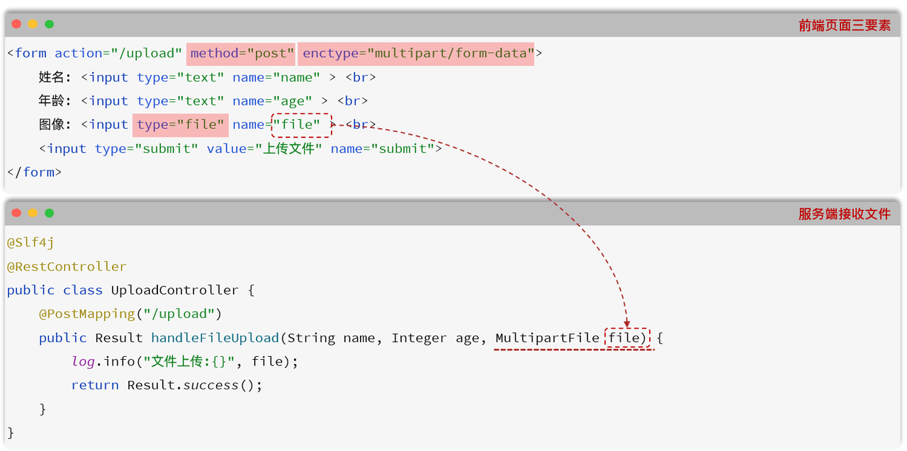
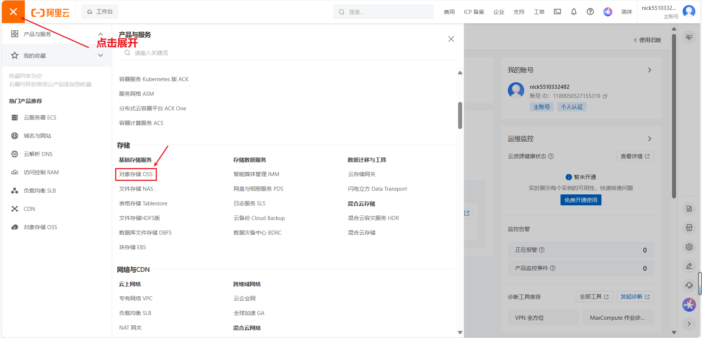
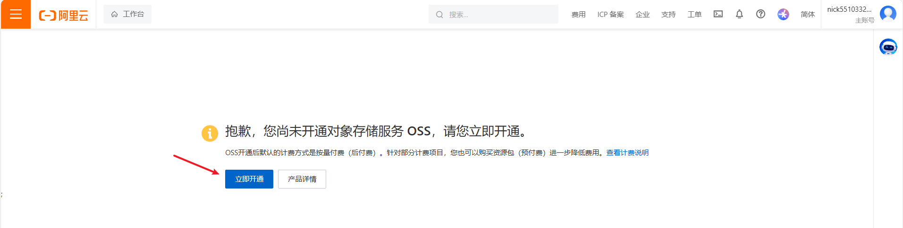
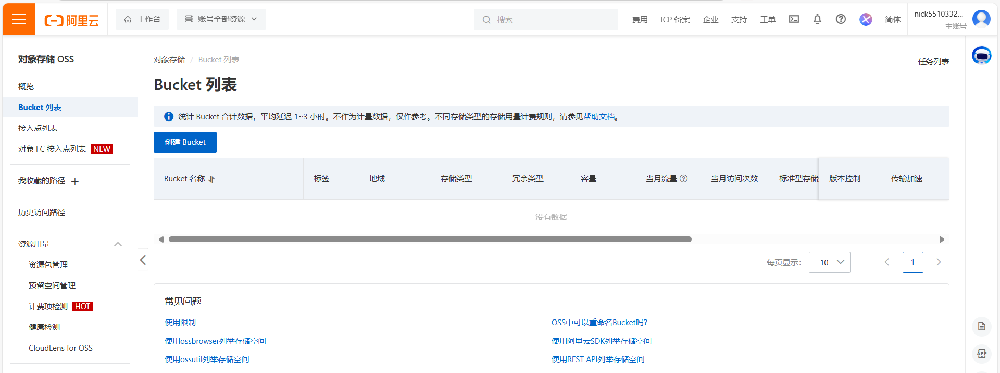
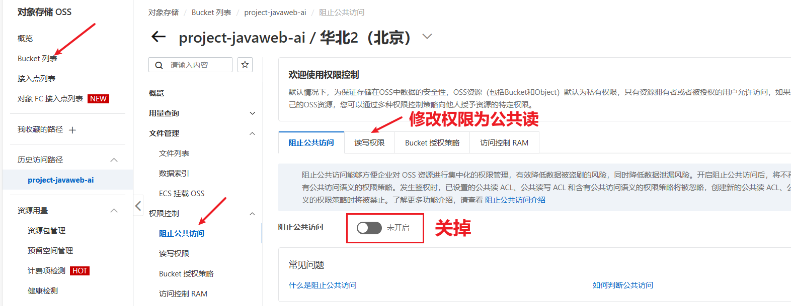
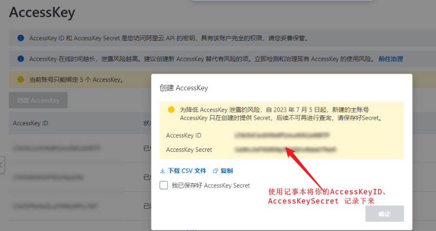
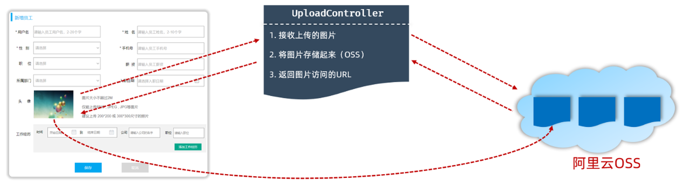
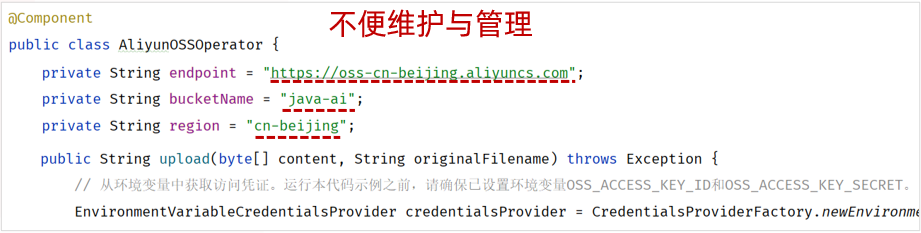
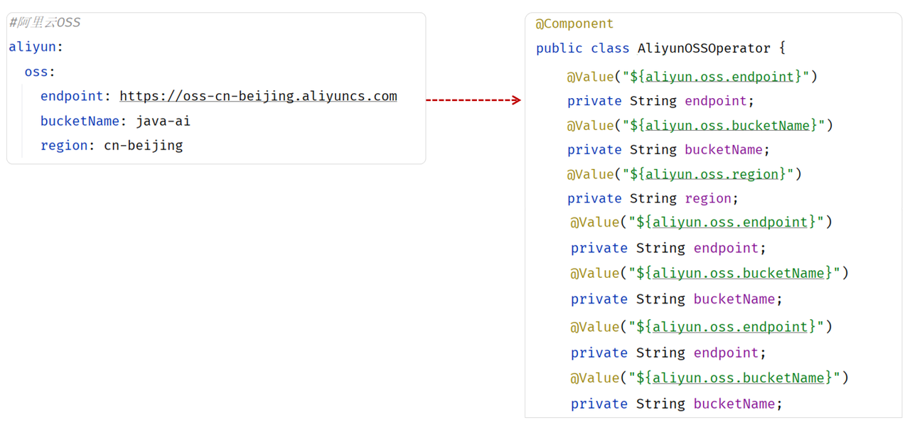
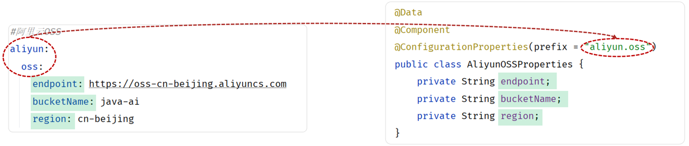

<h1 style="text-align: center;">文件上传</h1>
 
- - -

## 前端代码案例

```html
<!DOCTYPE html>
<html lang="en">
  <head>
    <meta charset="UTF-8" />
    <title>上传文件</title>
  </head>
  <body>
    <form action="/upload" method="post" enctype="multipart/form-data">
      姓名: <input type="text" name="username" /><br />
      年龄: <input type="text" name="age" /><br />
      头像: <input type="file" name="file" /><br />
      <input type="submit" value="提交" />
    </form>
  </body>
</html>
```

#### 上传文件的原始 form 表单，要求表单必须具备以下三点（上传文件页面三要素）

> #### （1）表单必须有 <span style="color: red;">file 域</span>，用于选择要上传的文件
>
> #### （2）表单提交方式<span style="color: red;">必须为 POST</span>：通常上传的文件会比较大，所以需要使用 POST 提交方式
>
> #### （3）表单的编码类型 <span style="color: red;">enctype</span> 必须要设置为：<span style="color: red;">multipart/form-data</span>：普通默认的编码格式是不适合传输大型的二进制数据的，所以在文件上传时，表单的编码格式<span style="color: red;">必须设置</span>为 multipart / form-data

## 服务端代码示例

```java
package com.itheima.controller;

import lombok.extern.slf4j.Slf4j;
import org.springframework.web.bind.annotation.PostMapping;
import org.springframework.web.bind.annotation.RestController;
import org.springframework.web.multipart.MultipartFile;

import java.io.File;
import java.io.IOException;

@Slf4j
@RestController
public class UploadController {

    /**
     * 上传文件 - 参数名file
     */
    @PostMapping("/upload")
    public Result upload(String username, Integer age , MultipartFile file) throws Exception {
        log.info("上传文件：{}, {}, {}", username, age, file);
        if(!file.isEmpty()){
            file.transferTo(new File("D:\\images\\" + file.getOriginalFilename()));
        }
        return Result.success();
    }

}
```



## 文件上传相关 API

### 基本介绍

> #### <span style="color: red;">Spring</span> 中提供了一个 API：<span style="color: red;">MultipartFile</span>，使用这个 API 就可以来接收到上传的文件

### 常见方方法

> #### String getOriginalFilename(); //获取原始文件名
>
> #### void transferTo(File dest); //将接收的文件转存到磁盘文件中
>
> #### long getSize(); //获取文件的大小，单位：字节
>
> #### byte[] getBytes(); //获取文件内容的字节数组
>
> #### InputStream getInputStream(); //获取接收到的文件内容的输入流

## 本地存储

### 代码示例

```java
package com.itheima.controller;

import com.itheima.pojo.Result;
import lombok.extern.slf4j.Slf4j;
import org.springframework.web.bind.annotation.PostMapping;
import org.springframework.web.bind.annotation.RestController;
import org.springframework.web.multipart.MultipartFile;
import java.io.File;
import java.util.UUID;

@Slf4j
@RestController
public class UploadController {

    private static final String UPLOAD_DIR = "D:/images/";
    /**
     * 上传文件 - 参数名file
     */
    @PostMapping("/upload")
    public Result upload(MultipartFile file) throws Exception {
        log.info("上传文件：{}, {}, {}", username, age, file);
        if (!file.isEmpty()) {
            // 生成唯一文件名
            String originalFilename = file.getOriginalFilename();
            String extName = originalFilename.substring(originalFilename.lastIndexOf("."));
            String uniqueFileName = UUID.randomUUID().toString().replace("-", "") + extName;
            // 拼接完整的文件路径
            File targetFile = new File(UPLOAD_DIR + uniqueFileName);

            // 如果目标目录不存在，则创建它
            if (!targetFile.getParentFile().exists()) {
                targetFile.getParentFile().mkdirs();
            }
            // 保存文件
            file.transferTo(targetFile);
        }
        return Result.success();
    }
}
```

### 取消文件上传大小限制

> #### 在 <span style="color:red">SpringBoot</span> 中，文件上传时<span style="color:red">默认</span>单个文件最大大小为 <span style="color:red">1M</span>
>
> #### 那么如果需要上传大文件，可以在 <span style="color:red">application.properties</span> 进行如下配置

```yml
spring：
  servlet:
    multipart:
      max-file-size: 10MB
      max-request-size: 100MB
```

### 本地存储缺陷


#### 如果直接存储在服务器的磁盘目录中，存在以下缺点

> #### 不安全：磁盘如果损坏，所有的文件就会丢失
>
> #### 容量有限：如果存储大量的图片，磁盘空间有限（磁盘不可能无限制扩容）
>
> #### 无法直接访问

#### 为了解决上述问题呢，通常有两种解决方案

> #### 自己搭建存储服务器，如：fastDFS 、MinIO
>
> #### 使用现成的云服务，如：阿里云，腾讯云，华为云

## 阿里云账号准备工作

### 账号准备

> #### 注册阿里云账户（注册完成后需要<span style="color:red;">实名认证</span>）
>
> #### https://account.aliyun.com/login/login.htm?oauth_callback=https%3A%2F%2Fwww.aliyun.com%2F

### 开通 OSS 云服务

#### （1）通过控制台找到对象存储 OSS 服务

<br/>


#### （2）点击开通

<br/>


#### （3）开通 OSS 服务之后，就可以进入到阿里云对象存储的控制台

<br/>


### 创建 Bucket

<br/>


### 修改权限

<br/>


### 配置 AccessKey

<br/>

<br/>


#### 以<span style="color:red;">管理员身份</span>打开 CMD 命令行，执行如下命令，配置系统的环境变量

> #### 将上述的 ACCESS_KEY_ID  与  ACCESS_KEY_SECRET 的值替换成自己的

```bash
set OSS_ACCESS_KEY_ID=xxxxxxxxxxxxxxxxxxxxxxxxxxxxxxxxxxxxxxxxxxxx
set OSS_ACCESS_KEY_SECRET=xxxxxxxxxxxxxxxxxxxxxxxxxxxxxxxxxxxxxxxxxx
```

#### 执行如下命令，让更改生效

```bash
setx OSS_ACCESS_KEY_ID "%OSS_ACCESS_KEY_ID%"
setx OSS_ACCESS_KEY_SECRET "%OSS_ACCESS_KEY_SECRET%"
```

#### 执行如下命令，验证环境变量是否生效

```bash
echo %OSS_ACCESS_KEY_ID%
echo %OSS_ACCESS_KEY_SECRET%
```

## 阿里云 OSS 存储

### 什么是云服务？


> #### 云服务指的就是通过互联网对外提供的各种各样的服务，比如像：语音服务、短信服务、邮件服务、视频直播服务、文字识别服务、对象存储服务等等
>
> #### 当我们在项目开发时需要用到某个或某些服务，就不需要自己来开发了，可以直接使用阿里云提供好的这些现成服务就可以了。比如：在项目开发当中，我们要实现一个短信发送的功能，如果我们项目组自己实现，将会非常繁琐，因为你需要和各个运营商进行对接。而此时阿里云完成了和三大运营商对接，并对外提供了一个短信服务。我们项目组只需要调用阿里云提供的短信服务，就可以很方便的来发送短信了。这样就降低了我们项目的开发难度，同时也提高了项目的开发效率。（大白话：别人帮我们实现好了功能，我们只要调用即可）
>
> #### 云服务提供商给我们提供的软件服务通常是需要收取一部分费用的

### OSS 介绍

> #### 阿里云对象存储 OSS（Object Storage Service），是一款海量、安全、低成本、高可靠的云存储服务。使用 OSS，您可以通过网络随时存储和调用包括文本、图片、音频和视频等在内的各种文件
>
> #### 在我们使用了阿里云 OSS 对象存储服务之后，我们的项目当中如果涉及到文件上传这样的业务，在前端进行文件上传并请求到服务端时，在服务器本地磁盘当中就不需要再来存储文件了。我们直接将接收到的文件上传到 oss，由 oss 帮我们存储和管理，同时阿里云的 oss 存储服务还保障了我们所存储内容的安全可靠


### SDK

> #### Software Development Kit 的缩写，软件开发工具包，包括辅助软件开发的依赖（jar 包）、代码示例等，都可以叫做 SDK
>
> #### 简单说，sdk 中包含了我们使用第三方云服务时所需要的依赖，以及一些示例代码。我们可以参照 sdk 所提供的示例代码就可以完成入门程序。

### Bucket

> #### 存储空间是用户用于存储对象（Object，就是文件）的容器，所有的对象都必须隶属于某个存储空间

### ⭐ 使用说明

> #### 如果是在实际开发当中，我们是需要从前往后仔细的去阅读这一份文档的，但是由于现在是学习阶段，我们就只挑重点的去看。有兴趣的话大家也可以自己去看一下这份官方文档

### 引入依赖

```xml
<!--阿里云OSS依赖-->
<dependency>
    <groupId>com.aliyun.oss</groupId>
    <artifactId>aliyun-sdk-oss</artifactId>
    <version>3.17.4</version>
</dependency>

<dependency>
    <groupId>javax.xml.bind</groupId>
    <artifactId>jaxb-api</artifactId>
    <version>2.3.1</version>
</dependency>
<dependency>
    <groupId>javax.activation</groupId>
    <artifactId>activation</artifactId>
    <version>1.1.1</version>
</dependency>
<!-- no more than 2.3.3-->
<dependency>
    <groupId>org.glassfish.jaxb</groupId>
    <artifactId>jaxb-runtime</artifactId>
    <version>2.3.3</version>
</dependency>
```

### 入门程序案例

> #### 在以下代码中，需要替换的内容为
>
> #### endpoint：阿里云 OSS 中的 bucket 对应的域名
>
> #### bucketName：Bucket 名称
>
> #### objectName：对象名称，在 Bucket 中存储的对象的名称
>
> #### region：bucket 所属区域

```java
package com.itheima;

import com.aliyun.oss.*;
import com.aliyun.oss.common.auth.CredentialsProviderFactory;
import com.aliyun.oss.common.auth.EnvironmentVariableCredentialsProvider;
import com.aliyun.oss.common.comm.SignVersion;

import java.io.ByteArrayInputStream;
import java.io.File;
import java.nio.file.Files;

public class Demo {

    public static void main(String[] args) throws Exception {
        // Endpoint以华东1（杭州）为例，其它Region请按实际情况填写。
        String endpoint = "https://oss-cn-beijing.aliyuncs.com";
        // 从环境变量中获取访问凭证。运行本代码示例之前，请确保已设置环境变量OSS_ACCESS_KEY_ID和OSS_ACCESS_KEY_SECRET。
        EnvironmentVariableCredentialsProvider credentialsProvider = CredentialsProviderFactory.newEnvironmentVariableCredentialsProvider();
        // 填写Bucket名称，例如examplebucket。
        String bucketName = "java-ai";
        // 填写Object完整路径，例如exampledir/exampleobject.txt。Object完整路径中不能包含Bucket名称。
        String objectName = "001.jpg";
        // 填写Bucket所在地域。以华东1（杭州）为例，Region填写为cn-hangzhou。
        String region = "cn-beijing";

        // 创建OSSClient实例。
        ClientBuilderConfiguration clientBuilderConfiguration = new ClientBuilderConfiguration();
        clientBuilderConfiguration.setSignatureVersion(SignVersion.V4);
        OSS ossClient = OSSClientBuilder.create()
            .endpoint(endpoint)
            .credentialsProvider(credentialsProvider)
            .clientConfiguration(clientBuilderConfiguration)
            .region(region)
            .build();

        try {
            File file = new File("C:\\Users\\deng\\Pictures\\1.jpg");
            byte[] content = Files.readAllBytes(file.toPath());

            ossClient.putObject(bucketName, objectName, new ByteArrayInputStream(content));
        } catch (OSSException oe) {
            System.out.println("Caught an OSSException, which means your request made it to OSS, "
                    + "but was rejected with an error response for some reason.");
            System.out.println("Error Message:" + oe.getErrorMessage());
            System.out.println("Error Code:" + oe.getErrorCode());
            System.out.println("Request ID:" + oe.getRequestId());
            System.out.println("Host ID:" + oe.getHostId());
        } catch (ClientException ce) {
            System.out.println("Caught an ClientException, which means the client encountered "
                    + "a serious internal problem while trying to communicate with OSS, "
                    + "such as not being able to access the network.");
            System.out.println("Error Message:" + ce.getMessage());
        } finally {
            if (ossClient != null) {
                ossClient.shutdown();
            }
        }
    }
}
```

### ⭐ OSS 实现思路

<br/>


> #### 在新增员工的时候，上传员工的图像，而之所以需要上传员工的图像，是因为将来我们需要在系统页面当中访问并展示员工的图像。而要想完成这个操作，需要做两件事
>
> #### （1）需要上传员工的图像，并把图像保存起来（存储到阿里云 OSS）
>
> #### （2）访问员工图像（通过图像在阿里云 OSS 的存储地址访问图像）

> #### OSS 中的每一个文件都会分配一个访问的 url，通过这个 url 就可以访问到存储在阿里云上的图片。所以需要把 url 返回给前端，这样前端就可以通过 url 获取到图像

### 案例集成实现

#### （1）在 java 包下的项目包中，<span style="color:red;">新建包 utils</span>

#### （2）引入阿里云 OSS 上传文件工具类（由官方的示例代码改造而来）

> #### 以下三个属性需要修改为自己的信息
>
> #### endpoint
>
> #### bucketName
>
> #### region

```java
package com.itheima.utils;

import com.aliyun.oss.*;
import com.aliyun.oss.common.auth.CredentialsProviderFactory;
import com.aliyun.oss.common.auth.EnvironmentVariableCredentialsProvider;
import com.aliyun.oss.common.comm.SignVersion;
import org.springframework.stereotype.Component;
import java.io.ByteArrayInputStream;
import java.time.LocalDate;
import java.time.format.DateTimeFormatter;
import java.util.UUID;

@Component
public class AliyunOSSOperator {

    private String endpoint = "https://oss-cn-beijing.aliyuncs.com";
    private String bucketName = "java-ai";
    private String region = "cn-beijing";

    public String upload(byte[] content, String originalFilename) throws Exception {
        // 从环境变量中获取访问凭证。运行本代码示例之前，请确保已设置环境变量OSS_ACCESS_KEY_ID和OSS_ACCESS_KEY_SECRET。
        EnvironmentVariableCredentialsProvider credentialsProvider = CredentialsProviderFactory.newEnvironmentVariableCredentialsProvider();

        // 填写Object完整路径，例如202406/1.png。Object完整路径中不能包含Bucket名称。
        //获取当前系统日期的字符串,格式为 yyyy/MM
        String dir = LocalDate.now().format(DateTimeFormatter.ofPattern("yyyy/MM"));
        //生成一个新的不重复的文件名
        String newFileName = UUID.randomUUID() + originalFilename.substring(originalFilename.lastIndexOf("."));
        String objectName = dir + "/" + newFileName;

        // 创建OSSClient实例。
        ClientBuilderConfiguration clientBuilderConfiguration = new ClientBuilderConfiguration();
        clientBuilderConfiguration.setSignatureVersion(SignVersion.V4);
        OSS ossClient = OSSClientBuilder.create()
                .endpoint(endpoint)
                .credentialsProvider(credentialsProvider)
                .clientConfiguration(clientBuilderConfiguration)
                .region(region)
                .build();

        try {
            ossClient.putObject(bucketName, objectName, new ByteArrayInputStream(content));
        } finally {
            ossClient.shutdown();
        }

        return endpoint.split("//")[0] + "//" + bucketName + "." + endpoint.split("//")[1] + "/" + objectName;
    }

}
```

#### （3）新增 UploadController

```java
package com.itheima.controller;

import com.itheima.pojo.Result;
import com.itheima.utils.AliyunOSSOperator;
import lombok.extern.slf4j.Slf4j;
import org.springframework.beans.factory.annotation.Autowired;
import org.springframework.web.bind.annotation.PostMapping;
import org.springframework.web.bind.annotation.RestController;
import org.springframework.web.multipart.MultipartFile;
import java.io.File;
import java.util.UUID;

@Slf4j
@RestController
public class UploadController {

    @Autowired
    private AliyunOSSOperator aliyunOSSOperator;

    @PostMapping("/upload")
    public Result upload(MultipartFile file) throws Exception {
        log.info("文件上传: {}", file.getOriginalFilename());
        //将文件交给OSS存储管理
        String url = aliyunOSSOperator.upload(file.getBytes(), file.getOriginalFilename());
        log.info("文件上传OSS, url: {}", url);

        return Result.success(url);
    }

}
```

### ⚠️ 注意事项

> #### cmd 中<span style="color:red;">配置完 AccessKey</span> 之后，需要<span style="color:red;">重启 IDEA</span> 让环境变量生效，否则启动后端时前端发送请求会抛出 AccessKey 为空的异常

## 代码优化

### 问题引入

> #### 在刚才我们制作的 AliyunOSS 操作的工具类中，我们直接将 endpoint、bucketName 参数直接在 java 文件中写死了
>
> #### 如果后续，项目要部署到测试环境、上生产环境，我们需要来修改这两个参数。 而如果开发一个大型项目，所有用到的技术涉及到的这些个参数全部写死在 java 代码中，是非常不便于维护和管理的



### application.yml

> #### ⚠️ 注意：信息需要修改为自己的

```yml
# 阿里云 OSS
aliyun:
  oss:
    endpoint: https://oss-cn-beijing.aliyuncs.com
    bucketName: java-ai
    region: cn-beijing
```

### AliyunOSSOperator

> #### 使用 <span style="color:red;">@Value("${......}") 注解</span>实现动态配置信息的变化

```java
package com.jacksonling.utils;

import com.aliyun.oss.*;
import com.aliyun.oss.common.auth.CredentialsProviderFactory;
import com.aliyun.oss.common.auth.EnvironmentVariableCredentialsProvider;
import com.aliyun.oss.common.comm.SignVersion;
import org.springframework.beans.factory.annotation.Value;
import org.springframework.stereotype.Component;
import java.io.ByteArrayInputStream;
import java.time.LocalDate;
import java.time.format.DateTimeFormatter;
import java.util.UUID;

@Component
public class AliyunOSSOperator {

    //方式一: 通过@Value注解一个属性一个属性的注入
    @Value("${aliyun.oss.endpoint}")
    private String endpoint;

    @Value("${aliyun.oss.bucketName}")
    private String bucketName;

    @Value("${aliyun.oss.region}")
    private String region;

    public String upload(byte[] content, String originalFilename) throws Exception {
        // 从环境变量中获取访问凭证。运行本代码示例之前，请确保已设置环境变量OSS_ACCESS_KEY_ID和OSS_ACCESS_KEY_SECRET。
        EnvironmentVariableCredentialsProvider credentialsProvider = CredentialsProviderFactory.newEnvironmentVariableCredentialsProvider();

        // 填写Object完整路径，例如202406/1.png。Object完整路径中不能包含Bucket名称。
        //获取当前系统日期的字符串,格式为 yyyy/MM
        String dir = LocalDate.now().format(DateTimeFormatter.ofPattern("yyyy/MM"));
        //生成一个新的不重复的文件名
        String newFileName = UUID.randomUUID() + originalFilename.substring(originalFilename.lastIndexOf("."));
        String objectName = dir + "/" + newFileName;

        // 创建OSSClient实例。
        ClientBuilderConfiguration clientBuilderConfiguration = new ClientBuilderConfiguration();
        clientBuilderConfiguration.setSignatureVersion(SignVersion.V4);
        OSS ossClient = OSSClientBuilder.create()
                .endpoint(endpoint)
                .credentialsProvider(credentialsProvider)
                .clientConfiguration(clientBuilderConfiguration)
                .region(region)
                .build();

        try {
            ossClient.putObject(bucketName, objectName, new ByteArrayInputStream(content));
        } finally {
            ossClient.shutdown();
        }

        return endpoint.split("//")[0] + "//" + bucketName + "." + endpoint.split("//")[1] + "/" + objectName;
    }

}
```

### @Value 注解缺陷

> #### 如果只有一两个属性需要注入，而且不需要考虑复用性，使用@Value 注解就可以了
>
> #### 但是使用@Value 注解注入配置文件的配置项，如果配置项多，注入繁琐，不便于维护管理 和 复用。如下所示



### 使用新注解再次优化

#### Spring 提供的简化方式套路

> #### （1）需要<span style="color:red;">创建一个实现类</span>，且实体类中的<span style="color:red;">属性名</span>和配置文件当中 <span style="color:red;">key</span> 的名字<span style="color:red;">必须要一致</span>
>
> #### 比如：配置文件当中叫 endpoint，实体类当中的属性也得叫 endpoint，另外实体类当中的属性还需要提供 getter / setter 方法
>
> #### （2）需要将实体类交给 Spring 的 IOC 容器管理，成为 IOC 容器当中的 bean 对象
>
> #### （3）在实体类上添加 <span style="color:red;">@ConfigurationProperties</span> 注解，并通过 <span style="color:red;">perfix 属性</span> 来指定配置<span style="color:red;">参数项的前缀</span>



### AliyunOSSProperties

> #### 在 utils 包下定义

```java
package com.itheima.utils;

import lombok.Data;
import org.springframework.boot.context.properties.ConfigurationProperties;
import org.springframework.stereotype.Component;

@Data
@Component
@ConfigurationProperties(prefix = "aliyun.oss")
public class AliyunOSSProperties {
    private String endpoint;
    private String bucketName;
    private String region;
}
```

### 修改 AliyunOSSOperator

```java
package com.itheima.utils;

import com.aliyun.oss.*;
import com.aliyun.oss.common.auth.CredentialsProviderFactory;
import com.aliyun.oss.common.auth.EnvironmentVariableCredentialsProvider;
import com.aliyun.oss.common.comm.SignVersion;
import org.springframework.beans.factory.annotation.Autowired;
import org.springframework.beans.factory.annotation.Value;
import org.springframework.stereotype.Component;
import java.io.ByteArrayInputStream;
import java.time.LocalDate;
import java.time.format.DateTimeFormatter;
import java.util.UUID;

@Component
public class AliyunOSSOperator {

    //方式一: 通过@Value注解一个属性一个属性的注入
    //@Value("${aliyun.oss.endpoint}")
    //private String endpoint;
    //@Value("${aliyun.oss.bucketName}")
    //private String bucketName;
    //@Value("${aliyun.oss.region}")
    //private String region;

    @Autowired
    private AliyunOSSProperties aliyunOSSProperties;

    public String upload(byte[] content, String originalFilename) throws Exception {
        String endpoint = aliyunOSSProperties.getEndpoint();
        String bucketName = aliyunOSSProperties.getBucketName();
        String region = aliyunOSSProperties.getRegion();

        // 从环境变量中获取访问凭证。运行本代码示例之前，请确保已设置环境变量OSS_ACCESS_KEY_ID和OSS_ACCESS_KEY_SECRET。
        EnvironmentVariableCredentialsProvider credentialsProvider = CredentialsProviderFactory.newEnvironmentVariableCredentialsProvider();

        // 填写Object完整路径，例如2024/06/1.png。Object完整路径中不能包含Bucket名称。
        //获取当前系统日期的字符串,格式为 yyyy/MM
        String dir = LocalDate.now().format(DateTimeFormatter.ofPattern("yyyy/MM"));
        //生成一个新的不重复的文件名
        String newFileName = UUID.randomUUID() + originalFilename.substring(originalFilename.lastIndexOf("."));
        String objectName = dir + "/" + newFileName;

        // 创建OSSClient实例。
        ClientBuilderConfiguration clientBuilderConfiguration = new ClientBuilderConfiguration();
        clientBuilderConfiguration.setSignatureVersion(SignVersion.V4);
        OSS ossClient = OSSClientBuilder.create()
                .endpoint(endpoint)
                .credentialsProvider(credentialsProvider)
                .clientConfiguration(clientBuilderConfiguration)
                .region(region)
                .build();

        try {
            ossClient.putObject(bucketName, objectName, new ByteArrayInputStream(content));
        } finally {
            ossClient.shutdown();
        }

        return endpoint.split("//")[0] + "//" + bucketName + "." + endpoint.split("//")[1] + "/" + objectName;
    }

}
```
