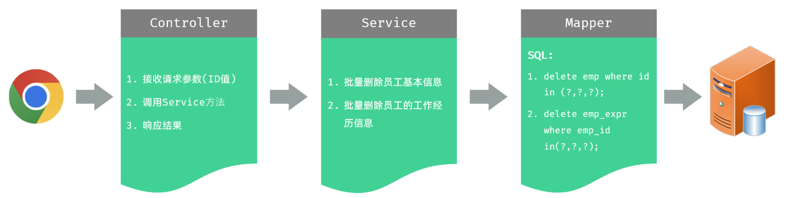

<h1 style="text-align: center;">删除员工</h1>
 
- - -

## 思路分析



## Controller

### 请求参数接收（方法一）

```java
/**
* 批量删除员工
*/
@DeleteMapping
public Result delete(Integer[] ids){
    log.info("批量删除部门: ids={} ", Arrays.asList(ids));
    return Result.success();
}
```

### 请求参数接收（方法二）

> #### 如果要将其<span style="color:red;">封装到一个集合中</span>，需要在集合前面加上 <span style="color:red;">@RequestParam</span> 注解

```java
/**
* 批量删除员工
*/
@DeleteMapping
public Result delete(@RequestParam List<Integer> ids){
    log.info("批量删除部门: ids={} ", ids);
    empService.deleteByIds(ids);
    return Result.success();
}
```

### EmpService

```java
/**
* 批量删除员工
*/
void deleteByIds(List<Integer> ids);
```

### EmpServiceImpl

> #### 员工信息和员工工作经历是绑定的，要么同时成功，要么同时失败，需要使用<span style="color:red;">事务</span>

```java
@Transactional
@Override
public void deleteByIds(List<Integer> ids) {
    //1. 根据ID批量删除员工基本信息
    empMapper.deleteByIds(ids);

    //2. 根据员工的ID批量删除员工的工作经历信息
    empExprMapper.deleteByEmpIds(ids);
}
```

### EmpMapper

```java
/**
* 批量删除员工信息
*/
void deleteByIds(List<Integer> ids);
```

### EmpExprMapper

```java
/**
* 根据员工的ID批量删除工作经历信息
*/
void deleteByEmpIds(List<Integer> empIds);
```

### EmpMapper.xml

```xml
<!--批量删除员工信息-->
<delete id="deleteByIds">
    delete from emp where id in
    <foreach collection="ids" item="id" open="(" close=")" separator=",">
            #{id}
    </foreach>
</delete>
```

### EmpExprMapper.xml

```xml
<!--根据员工的ID批量删除工作经历信息-->
<delete id="deleteByEmpIds">
    delete from emp_expr where emp_id in
    <foreach collection="empIds" item="empId" open="(" close=")" separator=",">
            #{empId}
    </foreach>
</delete>
```
