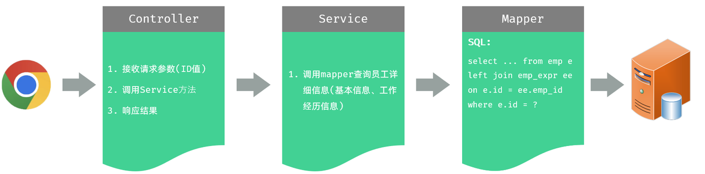
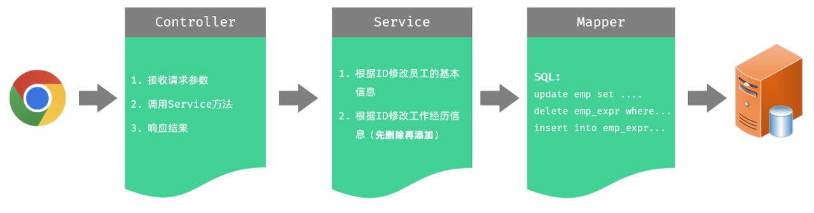

<h1 style="text-align: center;">修改员工</h1>
 
- - -

## 查询回显

### 思路分析



### EmpController

```java
/**
 * 查询回显
 */
@GetMapping("/{id}")
public Result getInfo(@PathVariable Integer id){
    log.info("根据id查询员工的详细信息");
    Emp emp  = empService.getInfo(id);
    return Result.success(emp);
}
```

### EmpService

```java
/**
 * 根据ID查询员工的详细信息
 */
Emp getInfo(Integer id);
```

### EmpServiceImpl

```java
@Override
public Emp getInfo(Integer id) {
    return empMapper.getById(id);
}
```

### EmpMapper

```java
/**
 * 根据ID查询员工详细信息
 */
Emp getById(Integer id);
```

### EmpMapper.xml

```xml
<!--自定义结果集ResultMap-->
<resultMap id="empResultMap" type="com.itheima.pojo.Emp">
    <id column="id" property="id" />
    <result column="username" property="username" />
    <result column="password" property="password" />
    <result column="name" property="name" />
    <result column="gender" property="gender" />
    <result column="phone" property="phone" />
    <result column="job" property="job" />
    <result column="salary" property="salary" />
    <result column="image" property="image" />
    <result column="entry_date" property="entryDate" />
    <result column="dept_id" property="deptId" />
    <result column="create_time" property="createTime" />
    <result column="update_time" property="updateTime" />

    <!--封装exprList-->
    <collection property="exprList" ofType="com.itheima.pojo.EmpExpr">
        <id column="ee_id" property="id"/>
        <result column="ee_company" property="company"/>
        <result column="ee_job" property="job"/>
        <result column="ee_begin" property="begin"/>
        <result column="ee_end" property="end"/>
        <result column="ee_empid" property="empId"/>
    </collection>
</resultMap>

<!--根据ID查询员工的详细信息-->
<select id="getById" resultMap="empResultMap">
    select e.*,
        ee.id ee_id,
        ee.emp_id ee_empid,
        ee.begin ee_begin,
        ee.end ee_end,
        ee.company ee_company,
        ee.job ee_job
    from emp e left join emp_expr ee on e.id = ee.emp_id
    where e.id = #{id}
</select>
```

## 修改员工

### 思路分析



### EmpController

```java
/**
* 更新员工信息
*/
@PutMapping
public Result update(@RequestBody Emp emp){
    log.info("修改员工信息, {}", emp);
    empService.update(emp);
    return Result.success();
}
```

### EmpService

```java
/**
* 更新员工信息
* @param emp
*/
void update(Emp emp);
```

### EmpServiceImpl

> #### 修改的思路是<span style="color:red;">先删后改</span>，需要开启<span style="color:red;">事务</span>，要么同时成功，要么同时失败

```java
@Transactional
@Override
public void update(Emp emp) {
    //1. 根据ID更新员工基本信息
    emp.setUpdateTime(LocalDateTime.now());
    empMapper.updateById(emp);

    //2. 根据员工ID删除员工的工作经历信息 【删除老的】
    empExprMapper.deleteByEmpIds(Arrays.asList(emp.getId()));

    //3. 新增员工的工作经历数据 【新增新的】
    Integer empId = emp.getId();
    List<EmpExpr> exprList = emp.getExprList();
    if(!CollectionUtils.isEmpty(exprList)){
        exprList.forEach(empExpr -> empExpr.setEmpId(empId));
        empExprMapper.insertBatch(exprList);
    }
}
```

### EmpMapper

```java
/**
* 更新员工基本信息
*/
void updateById(Emp emp);
```

### EmpMapper.xml

```xml
<!--根据ID更新员工信息-->
<update id="updateById">
    update emp
    <set>
        <if test="username != null and username != ''">username = #{username},</if>
        <if test="password != null and password != ''">password = #{password},</if>
        <if test="name != null and name != ''">name = #{name},</if>
        <if test="gender != null">gender = #{gender},</if>
        <if test="phone != null and phone != ''">phone = #{phone},</if>
        <if test="job != null">job = #{job},</if>
        <if test="salary != null">salary = #{salary},</if>
        <if test="image != null and image != ''">image = #{image},</if>
        <if test="entryDate != null">entry_date = #{entryDate},</if>
        <if test="deptId != null">dept_id = #{deptId},</if>
        <if test="updateTime != null">update_time = #{updateTime},</if>
    </set>
    where id = #{id}
</update>
```
