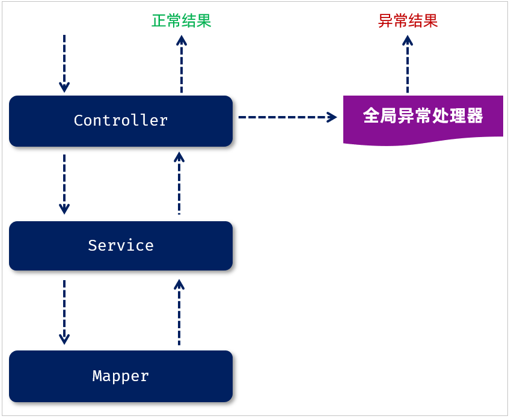

<h1 style="text-align: center;">全局异常处理器</h1>
 
- - -

## 问题分析

> #### 当我们在修改部门数据的时候，如果输入一个在数据库表中已经存在的手机号，点击保存按钮之后，前端提示了错误信息，但是返回的结果并不是统一的响应结果，而是框架默认返回的错误结果
>
> #### 响应回来的数据是一个 JSON 格式的数据。但这种 JSON 格式的数据还是我们开发规范当中所提到的统一响应结果 Result 吗？显然并不是。由于返回的数据不符合开发规范，所以前端并不能解析出响应的 JSON 数据

## 三层架构原始异常处理

> #### （1）Mapper 接口在操作数据库的时候出错了，此时异常会往上抛(谁调用 Mapper 就抛给谁)，会抛给 service
>
> #### （2）service 中也存在异常了，会抛给 controller
>
> #### （3）而在 controller 当中，我们也没有做任何的异常处理，所以最终异常会再往上抛。最终抛给框架之后，框架就会返回一个 JSON 格式的数据，里面封装的就是错误的信息，但是框架返回的 JSON 格式的数据并不符合我们的开发规范

## 相关注解



> #### <span style="color:red;">@RestControllerAdvice</span>：表示当前类为全局异常处理器
>
> #### @RestControllerAdvice = @ControllerAdvice + @ResponseBody
>
> #### <span style="color:red;">@ExceptionHandler</span>：指定可以捕获哪种类型的异常进行处理

## 案例集成：添加重复手机号

> #### 在 java 目录下新建包 exception，新建 GlobalExceptionHandler 类
>
> #### （1）定义全局异常处理器非常简单，就是定义一个类，在类上加上一个注解@RestControllerAdvice，加上这个注解就代表我们定义了一个全局异常处理器
>
> #### （2）在全局异常处理器当中，需要定义一个方法来捕获异常，在这个方法上需要加上注解@ExceptionHandler。通过@ExceptionHandler 注解当中的 value 属性来指定我们要捕获的是哪一类型的异常

```java
package com.jacksonling.exception;

import com.jacksonling.pojo.Result;
import lombok.extern.slf4j.Slf4j;
import org.springframework.dao.DuplicateKeyException;
import org.springframework.web.bind.annotation.ExceptionHandler;
import org.springframework.web.bind.annotation.RestControllerAdvice;

@Slf4j
@RestControllerAdvice
public class GlobalExceptionHandler {
    @ExceptionHandler
    public Result handleException(Exception e){
        log.error("程序出错啦~", e);
        return Result.error("出错啦，请联系管理员~");
    }

    @ExceptionHandler
    public Result handleDuplicateKeyException(DuplicateKeyException e){
        log.error("程序出错啦~", e);
        String message = e.getMessage();
        int i = message.indexOf("Duplicate entry");
        String errMsg = message.substring(i);
        String[] arr = errMsg.split(" ");
        return Result.error(arr[2] + " 已存在");
    }
}
```
