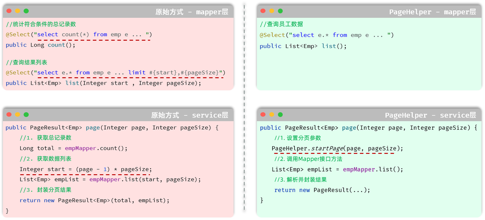
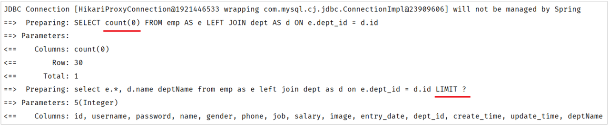
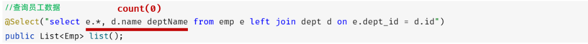
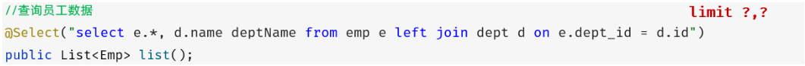

<h1 style="text-align: center;">分页查询</h1>
 
- - -

## PageResult 实体类

> #### 根据前端页面原型分析，可以知道需要响应的数据为 total（总记录数）和 rows（当前页数据列表）

```java
@Data
@NoArgsConstructor
@AllArgsConstructor
public class PageResult {
        private Long total; //总记录数
        private List rows; //当前页数据列表
}
```

## 原始方式

### EmpController

> #### 设置请求参数默认值：@RequestParam（<span style="color:red">defaultValue</span>="默认值"）

```java
@Slf4j
@RequestMapping("/emps")
@RestController
public class EmpController {

    @Autowired
    private EmpService empService;

    @GetMapping
    public Result page(@RequestParam(defaultValue = "1") Integer page ,
                       @RequestParam(defaultValue = "10") Integer pageSize){
        log.info("查询员工信息, page={}, pageSize={}", page, pageSize);
        PageResult pageResult = empService.page(page, pageSize);
        return Result.success(pageResult);
    }

}
```

### EmpService

```java
public interface EmpService {
    /**
     * 分页查询
     * @param page 页码
     * @param pageSize 每页记录数
     */
    PageResult page(Integer page, Integer pageSize);
}
```

### EmpServiceImpl

```java
@Service
public class EmpServiceImpl implements EmpService {

    @Autowired
    private EmpMapper empMapper;

    @Override
    public PageResult page(Integer page, Integer pageSize) {
        //1. 获取总记录数
        Long total = empMapper.count();

        //2. 获取结果列表
        Integer start = (page - 1) * pageSize;
        List<Emp> empList = empMapper.list(start, pageSize);

        //3. 封装结果
        return new PageResult(total, empList);
    }
}
```

### EmpMapper

```java
@Mapper
public interface EmpMapper {

    /**
     * 查询总记录数
     */
    @Select("select count(*) from emp e left join dept d on e.dept_id = d.id ")
    public Long count();

    /**
     * 查询所有的员工及其对应的部门名称
     */
    @Select("select e.*, d.name deptName from emp as e left join dept as d on e.dept_id = d.id limit #{start}, #{pageSize}")
    public List<Emp> list(Integer start , Integer pageSize);

}
```

## PageHelper 分页插件

### 问题引入

#### 前面我们已经完了基础的分页查询，大家会发现：分页查询功能编写起来比较繁琐。 而分页查询的功能是非常常见的，我们查询员工信息需要分页查询，将来在做其他项目时，查询用户信息、订单信息、商品信息等等都是需要进行分页查询的

#### 而分页查询的思路、步骤是比较固定的。 在 Mapper 接口中定义两个方法执行两条不同的 SQL 语句：

> #### （1）查询总记录数
>
> #### （2）指定页码的数据列表

#### 在 Service 当中，调用 Mapper 接口的两个方法，分别获取：总记录数、查询结果列表，然后在将获取的数据结果封装到 PageBean 对象中

#### 思考一个问题

> #### 在未来开发其他项目，只要涉及到分页查询功能(例：订单、用户、支付、商品)，都必须按照以上操作完成功能开发

#### 结论

> #### 原始方式的分页查询，存在着"步骤固定"、"代码频繁"的问题

#### 解决方案

> #### 可以使用一些现成的分页插件完成。对于 Mybatis 来讲现在最主流的就是 PageHelper

### 基本介绍

> #### PageHelper 是第三方提供的 Mybatis 框架中的一款功能强大、方便易用的分页插件，支持任何形式的单标、多表的分页查询
>
> #### 官网：https://pagehelper.github.io/



#### Mapper 接口层

> #### （1）原始的分页查询功能中，我们需要在 Mapper 接口中定义两条 SQL 语句
>
> #### （2）PageHelper 实现分页查询之后，只需要编写一条 SQL 语句，而且不需要考虑分页操作，就是一条正常的查询语句

#### Service 层

> #### （1）需要根据页码、每页展示记录数，手动的计算起始索引
>
> #### （2）无需手动计算起始索引，直接告诉 PageHelper 需要查询那一页的数据，每页展示多少条记录即可

### pom.xml 中引入依赖

```xml
<!--分页插件PageHelper-->
<dependency>
    <groupId>com.github.pagehelper</groupId>
    <artifactId>pagehelper-spring-boot-starter</artifactId>
    <version>1.4.7</version>
</dependency>
```

### EmpMapper

> #### 之前有关分页的操作现都无需考虑，引入 PageHelper 插件后底层会对 SQL 语句进行拼接与替换，实现分页查询

```java
@Mapper
public interface EmpMapper {

    // -------------------原始分页操作，使用 PageHelper 插件后无需分页相关考虑，插件底层做了封装-------------------
//
//    /**
//     * 查询总记录数
//     */
//    @Select("select count(*) from emp e left join dept d on e.dept_id = d.id ")
//    public Long count();
//
//    /**
//     * 查询所有的员工及其对应的部门名称
//     */
//    @Select("select e.*, d.name deptName from emp as e left join dept as d on e.dept_id = d.id limit #{start}, #{pageSize}")
//    public List<Emp> list(Integer start , Integer pageSize);

    /**
     * 查询所有的员工及其对应的部门名称
     * 使用 PageHelper，无需考虑分页相关的操作，在执行时会对 SQL 语句进行拼接与替换
     */
    @Select("select e.*, d.name deptName from emp as e left join dept as d on e.dept_id = d.id")
    public List<Emp> list();
}
```

### EmpServiceImpl

```java
@Override
public PageResult page(Integer page, Integer pageSize) {
    //1. 设置分页参数
    PageHelper.startPage(page,pageSize);

    //2. 执行查询
    List<Emp> empList = empMapper.list();
    Page<Emp> p = (Page<Emp>) empList;

    //3. 封装结果
    return new PageResult(p.getTotal(), p.getResult());
}
```

### 相关方法小结

#### （1）设置分页参数

```java
PageHelper.startPage(page,pageSize);
```

#### （2）PageHelper 中有一个<span style="color:red">封装对象 Page</span>

> #### 可以把返回的集合强转为 Page 对象

#### （3）调用 Page 对象的相关方法返回数据

> #### 获取总记录数：getTotal()
>
> #### 获取当前页数据列表：getResult()

### 实现机制

#### 我们打开 Idea 的控制台，可以看到在进行分页查询时，输出的 SQL 语句

<br/>


#### 我们看到执行了两条 SQL 语句，而这两条 SQL 语句，其实是从我们在 Mapper 接口中定义的 SQL 演变而来的。

#### （1）第一条 SQL 语句，用来查询总记录数。

<br/>


> #### 其实就是将我们编写的 SQL 语句进行的改造增强，将查询返回的<span style="color:red">字段列表替换成了 count(0)</span> 来统计总记录数

#### （2）第二条 SQL 语句，用来进行分页查询，查询指定页码对应 的数据列表

<br/>


> #### 其实就是将我们编写的 SQL 语句进行的改造增强，在 SQL 语句之后<span style="color:red">拼接上了 limit</span> 进行分页查询，而由于测试时查询的是第一页，起始索引是 0，所以简写为 limit？
>
> #### 而 PageHelper 在进行分页查询时，会执行上述两条 SQL 语句，并将查询到的总记录数，与数据列表<span style="color:red">封装到了 Page&lt;Emp&gt; 对象中</span>，我们再获取查询结果时，只需要调用 Page 对象的方法就可以获取

### ⚠️ 注意事项

> #### （1）PageHelper 实现分页查询时，<span style="color:red">SQL 语句的结尾一定一定一定不要加分号（；）</span>
>
> #### （2）PageHelper 只会对紧跟在其后的第一条 SQL 语句进行分页处理
