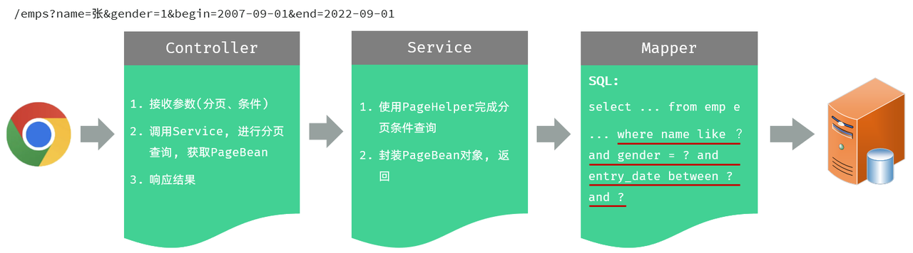
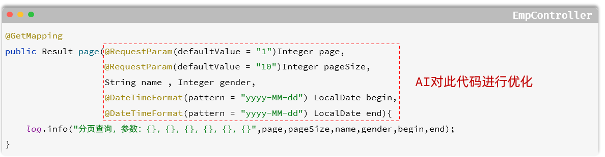
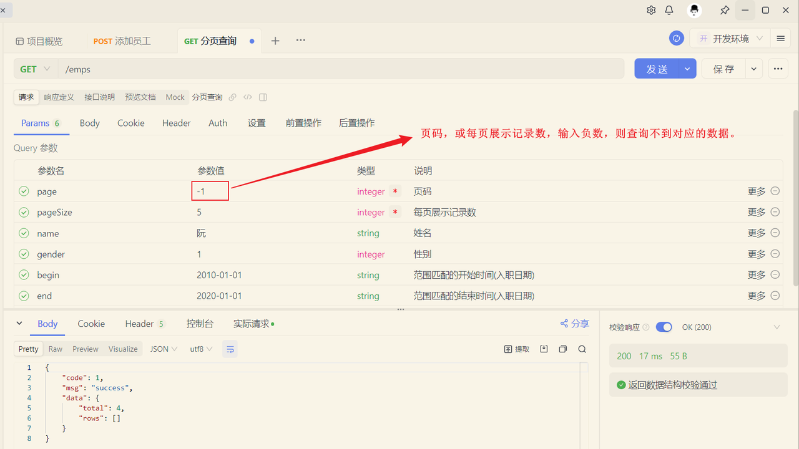

<h1 style="text-align: center;">条件分页查询</h1>
 
- - -

## 需求分析

> #### 通过员工管理的页面原型我们可以看到，员工列表页面的查询，不仅仅需要考虑分页，还需要考虑查询条件。 分页查询我们已经实现了，接下来，我们需要考虑在分页查询的基础上，再加上查询条件

#### 我们看到页面原型及需求中描述，搜索栏的搜索条件有三个，分别是

> #### 姓名：模糊匹配
>
> #### 性别：精确匹配
>
> #### 入职日期：范围匹配

## 思路分析



## ⭐ 相关注解

> #### <span style="color:red">@DateTimeFormat</span>（pattern = "yyyy-MM-dd"）
>
> #### 用于指定前端所传递的数据格式，具体格式需要根据需求文档来定

## EmpController

> #### 在 EmpController 方法中通过多个方法形参，依次接收这几个参数

```java
@Slf4j
@RestController
@RequestMapping("/emps")
public class EmpController {

    @Autowired
    private EmpService empService;

    @GetMapping
    public Result page(@RequestParam(defaultValue = "1") Integer page,
                       @RequestParam(defaultValue = "10") Integer pageSize,
                       String name, Integer gender,
                       @DateTimeFormat(pattern = "yyyy-MM-dd") LocalDate begin,
                       @DateTimeFormat(pattern = "yyyy-MM-dd") LocalDate end) {
        log.info("查询请求参数： {}, {}, {}, {}, {}, {}", page, pageSize, name, gender, begin, end);
        PageResult pageResult = empService.page(page, pageSize, name, gender, begin, end);
        return Result.success(pageResult);
    }
}
```

## EmpService

```java
public interface EmpService {
    /**
     * 分页查询
     */
    PageResult page(Integer page, Integer pageSize, String name, Integer gender, LocalDate begin, LocalDate end);
}
```

## EmpServiceImpl

```java
/**
 * 员工管理
 */
@Service
public class EmpServiceImpl implements EmpService {

    @Autowired
    private EmpMapper empMapper;

    @Override
    public PageResult page(Integer page, Integer pageSize, String name, Integer gender, LocalDate begin, LocalDate end) {
        //1. 设置PageHelper分页参数
        PageHelper.startPage(page, pageSize);
        //2. 执行查询
        List<Emp> empList = empMapper.list(name, gender, begin, end);
        //3. 封装分页结果
        Page<Emp> p = (Page<Emp>) empList;
        return new PageResult(p.getTotal(), p.getResult());
    }
}
```

## EmpMapper

```java
@Mapper
public interface EmpMapper {

    /**
     * 查询所有的员工及其对应的部门名称
     */
    public List<Emp> list(String name, Integer gender, LocalDate begin, LocalDate end);

}
```

## 新增 EmpMapper.xml

> #### 注意需要满足<span style="color:red">同名同包</span>的条件，具体可以看 MyBatis 中 XML 映射配置的笔记
>
> #### 创建目录，使用 " <span style="color:red">/</span> " 实现层级目录，不要使用 " <span style="color:red;font-size:30px">.</span> "
>
> #### 在 MyBaits 中的 <span style="color:red">#{...}</span> 表示<span style="color:red">占位符</span>，在执行时会被替换成问号，占位符不能出现在引号中，被替换后就表示一个字符串
>
> #### 所以在下面代码的中，使用到了 MySQL 中的 <span style="color:red">concat 函数</span>，实现字符串拼接，当然也可以使用 MyBatis 中的 <span style="color:red">${...}</span> 占位符实现字符串拼接，但是<span style="color:red">存在 SQL 注入问题且性能较低，不推荐</span>

```xml
<!--定义Mapper映射文件的约束和基本结构-->
<!DOCTYPE mapper
        PUBLIC "-//mybatis.org//DTD Mapper 3.0//EN"
        "http://mybatis.org/dtd/mybatis-3-mapper.dtd">
<mapper namespace="com.itheima.mapper.EmpMapper">
    <select id="list" resultType="com.itheima.pojo.Emp">
        select e.*, d.name deptName from emp as e left join dept as d on e.dept_id = d.id
        where e.name like concat('%',#{name},'%')
          and e.gender = #{gender}
          and e.entry_date between #{begin} and #{end}
    </select>
</mapper>
```

## 接收请求参数优化

### 问题分析

> #### 在上述分页条件查询中，请求参数比较多，有 6 个，如下所示



> #### 请求参数：/emps?name=张&gender=1&begin=2007-09-01&end=2022-09-01&page=1&pageSize=10
>
> #### 那我们在 controller 层方法中，接收请求参数的时候，直接在 controller 方法中声明这样 6 个参数即可，这样做，功能可以实现，但是不方便维护和管理

### 优化思路

> #### ⭐ 定义一个实体类，来<span style="color:red">封装</span>这几个请求参数
>
> #### ⚠️ 注意点：需要保证，前端传递的<span style="color:red">请求参数</span>和实体类的<span style="color:red">属性名</span>是一样的

### EmpQueryParam 实体类

```java
package com.itheima.pojo;

import lombok.Data;
import org.springframework.format.annotation.DateTimeFormat;
import java.time.LocalDate;

@Data
public class EmpQueryParam {

    private Integer page = 1; //页码
    private Integer pageSize = 10; //每页展示记录数
    private String name; //姓名
    private Integer gender; //性别
    @DateTimeFormat(pattern = "yyyy-MM-dd")
    private LocalDate begin; //入职开始时间
    @DateTimeFormat(pattern = "yyyy-MM-dd")
    private LocalDate end; //入职结束时间

}
```

### 修改 EmpController

```java
@GetMapping
public Result page(EmpQueryParam empQueryParam) {
    log.info("查询请求参数： {}", empQueryParam);
    PageResult pageResult = empService.page(empQueryParam);
    return Result.success(pageResult);
}
```

### 修改 EmpService

```java
public interface EmpService {
    /**
     * 分页查询
     */
    //PageResult page(Integer page, Integer pageSize, String name, Integer gender, LocalDate begin, LocalDate end);
    PageResult page(EmpQueryParam empQueryParam);
}
```

### 修改 EmpServiceImpl

```java
@Service
public class EmpServiceImpl implements EmpService {

    @Autowired
    private EmpMapper empMapper;

    /*@Override
    public PageResult page(Integer page, Integer pageSize, String name, Integer gender, LocalDate begin, LocalDate end) {
        //1. 设置PageHelper分页参数
        PageHelper.startPage(page, pageSize);
        //2. 执行查询
        List<Emp> empList = empMapper.list(name, gender, begin, end);
        //3. 封装分页结果
        Page<Emp> p = (Page<Emp>) empList;
        return new PageResult(p.getTotal(), p.getResult());
    }*/

    public PageResult page(EmpQueryParam empQueryParam) {
        //1. 设置PageHelper分页参数
        PageHelper.startPage(empQueryParam.getPage(), empQueryParam.getPageSize());
        //2. 执行查询
        List<Emp> empList = empMapper.list(empQueryParam);
        //3. 封装分页结果
        Page<Emp> p = (Page<Emp>)empList;
        return new PageResult(p.getTotal(), p.getResult());
    }
}
```

### 修改 EmpMapper

```java
@Mapper
public interface EmpMapper {

    /**
     * 查询所有的员工及其对应的部门名称
     */
//    @Select("select e.*, d.name as deptName from emp e left join dept d on e.dept_id = d.id")
//    public List<Emp> list(String name, Integer gender, LocalDate begin, LocalDate end);

    /**
     * 根据查询条件查询员工
     */
    List<Emp> list(EmpQueryParam empQueryParam);
}
```

### 传递负数页码查询失败

> #### 当我们在测试的时候，页码输入负数，查询是有问题的，查不到对应的数据了



#### 解决方案

> #### 那其实在 PageHelper 中，我们可以通过合理化参数配置，来解决这个问题。直接在 <span style="color:red">application.yml</span> 中，引入如下配置即可

```yml
pagehelper:
  reasonable: true
  helper-dialect: mysql
```

> #### <span style="color:red">reasonable</span>：分页合理化参数，<span style="color:red">默认</span>值为 <span style="color:red">false</span>，会直接根据参数进行查询
>
> #### 当该参数设置为 <span style="color:red">true</span> 时
>
> #### （1）<span style="color:red">pageNum <= 0 时会查询第一页</span>
>
> #### （2）<span style="color:red">pageNum > pages（超过总数时），会查询最后一页</span>

## 动态 SQL 优化

### 需求分析

> #### 当前，我们在查询的时候，Mapper 映射配置文件中的 SQL 语句中，查询条件是写死的。 而我们在员工管理中，根据条件查询员工信息时，<span style="color:red">查询条件是可选的，可以输入也可以不输入</span>

### EmpMapper.xml 实现

```xml
<!--定义Mapper映射文件的约束和基本结构-->
<!DOCTYPE mapper
        PUBLIC "-//mybatis.org//DTD Mapper 3.0//EN"
        "http://mybatis.org/dtd/mybatis-3-mapper.dtd">
<mapper namespace="com.itheima.mapper.EmpMapper">
    <select id="list" resultType="com.itheima.pojo.Emp">
        select e.*, d.name deptName from emp as e left join dept as d on e.dept_id = d.id
        <where>
            <if test="name != null and name != ''">
                e.name like concat('%',#{name},'%')
            </if>
            <if test="gender != null">
                and e.gender = #{gender}
            </if>
            <if test="begin != null and end != null">
                and e.entry_date between #{begin} and #{end}
            </if>
        </where>
    </select>
</mapper>
```

> #### （1）&lt;if&gt;：判断条件是否成立，如果<span style="color:red">条件为 true，则拼接 SQL</span>
>
> #### （2）&lt;where&gt;：根据查询条件，来生成 where 关键字，并会<span style="color:red">自动去除条件前面多余的 and 或 or</span>
