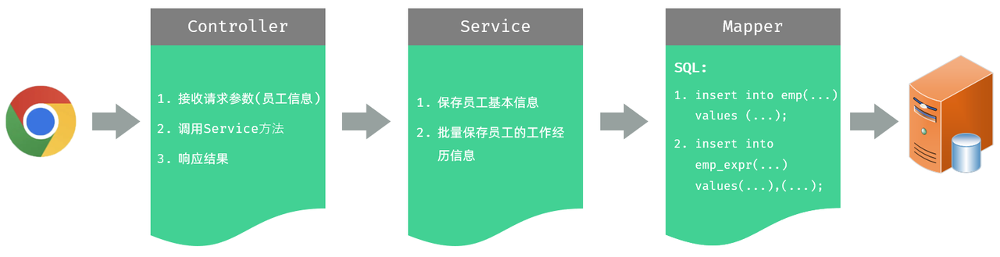
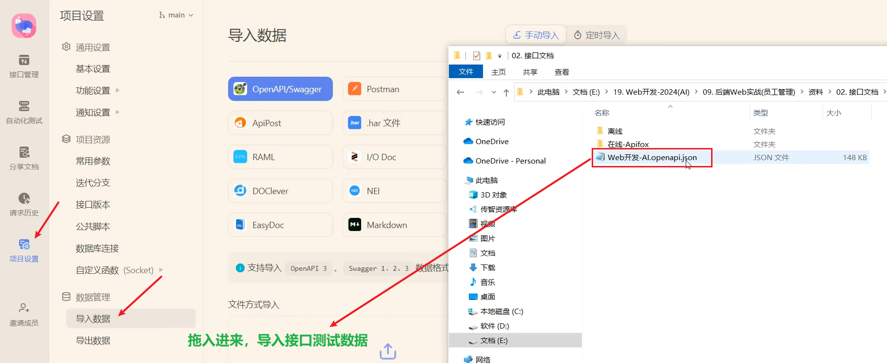
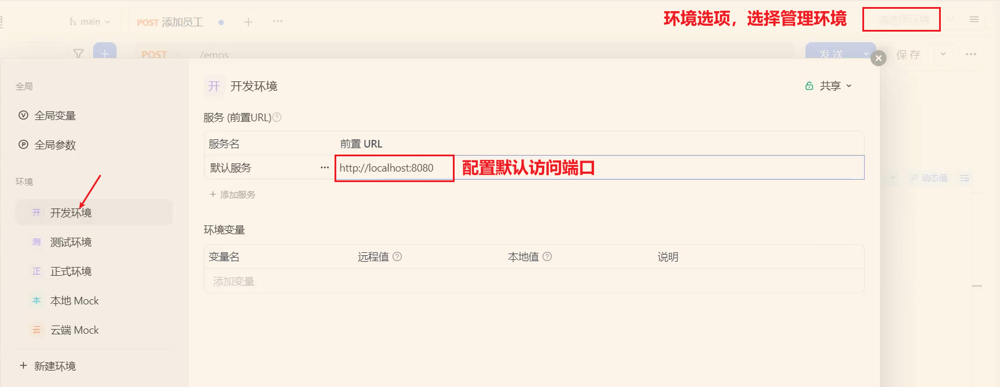

<h1 style="text-align: center;">新增员工</h1>
 
- - -

## 需求分析

> #### 在新增员工的时候，在表单中，我们既要录入员工的基本信息，又要录入员工的工作经历信息。 员工基本信息，对应的表结构是 emp 表，员工工作经历信息，对应的表结构是 emp_expr 表，所以这里我们要操作两张表，往两张表中保存数据

## 思路分析



## 代码准备

### EmpExprMapper

```java
@Mapper
public interface EmpExprMapper {

}
```

### EmpExprMapper.xml

```xml
<?xml version="1.0" encoding="UTF-8" ?>
<!DOCTYPE mapper
        PUBLIC "-//mybatis.org//DTD Mapper 3.0//EN"
        "http://mybatis.org/dtd/mybatis-3-mapper.dtd">
<mapper namespace="com.itheima.mapper.EmpExprMapper">

</mapper>
```

### Emp 实体类

> #### 需要在 Emp 员工实体类中<span style="color:red;">增加属性 exprList 来封装工作经历数据</span>。 最终完整代码如下

```java
@Data
public class Emp {
    private Integer id; //ID,主键
    private String username; //用户名
    private String password; //密码
    private String name; //姓名
    private Integer gender; //性别, 1:男, 2:女
    private String phone; //手机号
    private Integer job; //职位, 1:班主任,2:讲师,3:学工主管,4:教研主管,5:咨询师
    private Integer salary; //薪资
    private String image; //头像
    private LocalDate entryDate; //入职日期
    private Integer deptId; //关联的部门ID
    private LocalDateTime createTime; //创建时间
    private LocalDateTime updateTime; //修改时间

    //封装部门名称数
    private String deptName; //部门名称

    //封装员工工作经历信息
    private List<EmpExpr> exprList;
}
```

## 保存员工基本信息

### EmpController

> #### 在 EmpController 中增加 save 方法

```java
/**
 * 添加员工
 */
@PostMapping
public Result save(@RequestBody Emp emp){
    log.info("请求参数emp: {}", emp);
    empService.save(emp);
    return Result.success();
}
```

### EmpService

> #### 在 EmpService 中增加 save 方法

```java
/**
* 添加员工
* @param emp
*/
void save(Emp emp);
```

### EmpServiceImpl

> #### 在 EmpServiceImpl 中增加 save 方法 , 实现接口中的 save 方法

```java
@Override
public void save(Emp emp) {
    //1.补全基础属性
    emp.setCreateTime(LocalDateTime.now());
    emp.setUpdateTime(LocalDateTime.now());

    //2.保存员工基本信息
    empMapper.insert(emp);

    //3. 保存员工的工作经历信息 - 批量 (稍后完成)

}
```

### EmpMapper

> #### 在 EmpMapper 中增加 insert 方法，新增员工的基本信息

```java
/**
* 新增员工数据
*/
@Options(useGeneratedKeys = true, keyProperty = "id")
@Insert("insert into emp(username, name, gender, phone, job, salary, image, entry_date, dept_id, create_time, update_time) " +
        "values (#{username},#{name},#{gender},#{phone},#{job},#{salary},#{image},#{entryDate},#{deptId},#{createTime},#{updateTime})")
void insert(Emp emp);
```

### ⭐ @Options 注解

> #### <span style="color:red">主键返回注解</span>
>
> #### useGeneratedKeys = true：表示使用数据库生成的主键
>
> #### <span style="color:red">keyProperty</span> = "id"：表示将数据库生成的主键值需要<span style="color:red">往当前对象中的哪个属性值封装</span>

```java
@Options(useGeneratedKeys = true, keyProperty = "id")
```

> #### 由于稍后，我们在保存工作经历信息的时候，需要记录是哪位员工的工作经历。 所以，保存完员工信息之后，是需要获取到员工的 ID 的，那这里就需要通过 Mybatis 中提供的<span style="color:red">主键返回</span>功能来获取

## 批量保存工作经历

### EmpServiceImpl

```java
@Autowired
private EmpExprMapper empExprMapper;

@Override
public void save(Emp emp) {
    //1.补全基础属性
    emp.setCreateTime(LocalDateTime.now());
    emp.setUpdateTime(LocalDateTime.now());
    //2.保存员工基本信息
    empMapper.insert(emp);

    //3. 保存员工的工作经历信息 - 批量
    Integer empId = emp.getId();
    List<EmpExpr> exprList = emp.getExprList();
    if(!CollectionUtils.isEmpty(exprList)){
        // Mapper 中使用了主键返回，封装了 id 属性，这里直接获取即可
        exprList.forEach(empExpr -> empExpr.setEmpId(empId));
        empExprMapper.insertBatch(exprList);
    }
}
```

### EmpExprMapper

```java
@Mapper
public interface EmpExprMapper {

    /**
     * 批量插入员工工作经历信息
     */
    public void insertBatch(List<EmpExpr> exprList);
}
```

### EmpExprMapper.xml

```xml
<?xml version="1.0" encoding="UTF-8" ?>
<!DOCTYPE mapper
        PUBLIC "-//mybatis.org//DTD Mapper 3.0//EN"
        "http://mybatis.org/dtd/mybatis-3-mapper.dtd">
<mapper namespace="com.itheima.mapper.EmpExprMapper">

    <!--批量插入员工工作经历信息-->
    <insert id="insertBatch">
        insert into emp_expr (emp_id, begin, end, company, job) values
        <foreach collection="exprList" item="expr" separator=",">
            (#{expr.empId}, #{expr.begin}, #{expr.end}, #{expr.company}, #{expr.job})
        </foreach>
    </insert>

</mapper>
```

> #### 这里用到 Mybatis 中的动态 SQL 里提供的 &lt;foreach&gt; 标签
>
> #### 该标签的作用：用来遍历循环，常见的属性说明如下
>
> #### （1）collection：集合名称
>
> #### （2）item：集合遍历出来的元素/项
>
> #### （3）separator：每一次遍历使用的分隔符
>
> #### （4）open：遍历开始前拼接的片段
>
> #### （5）close：遍历结束后拼接的片段
>
> #### 上述的属性，是可选的，并不是所有的都是必须的。 可以自己根据实际需求，来指定对应的属性。

## 导入接口测试数据

### 导入数据

<br/>


### 配置默认访问端口

<br/>

