<h1 style="text-align: center;">会话技术</h1>
 
- - -

## 基本介绍

> #### 在 web 开发当中，会话指的就是<span style="color: red;">浏览器与服务器之间的一次连接，我们就称为一次会话</span>
>
> #### 在用户打开浏览器第一次访问服务器的时候，这个会话就建立了，直到有任何一方断开连接，此时会话就结束了。在一次会话当中，是可以包含多次请求和响应的
>
> #### 比如：打开了浏览器来访问 web 服务器上的资源（浏览器不能关闭、服务器不能断开）
>
> #### 第 1 次：访问的是登录的接口，完成登录操作
>
> #### 第 2 次：访问的是部门管理接口，查询所有部门数据
>
> #### 第 3 次：访问的是员工管理接口，查询员工数据
>
> #### 只要浏览器和服务器都没有关闭，以上 3 次请求都属于一次会话当中完成的

#### 需要注意的是：会话是和浏览器关联的，当有三个浏览器客户端和服务器建立了连接时，就会有三个会话。同一个浏览器在未关闭之前请求了多次服务器，这多次请求是属于同一个会话。比如：1、2、3 这三个请求都是属于同一个会话。当我们关闭浏览器之后，这次会话就结束了。而如果我们是直接把 web 服务器关了，那么所有的会话就都结束了

<br/>
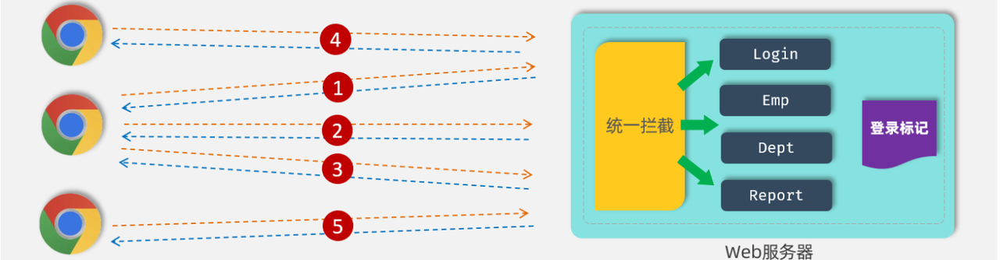

## 会话跟踪技术

> #### 一种维护浏览器状态的方法，服务器需要识别多次请求是否来自于同一浏览器，以便在同一次会话的多次请求间共享数据
>
> #### 服务器会接收很多的请求，但是服务器是需要识别出这些请求是不是同一个浏览器发出来的。比如：1 和 2 这两个请求是不是同一个浏览器发出来的，3 和 5 这两个请求不是同一个浏览器发出来的。如果是同一个浏览器发出来的，就说明是同一个会话。如果是不同的浏览器发出来的，就说明是不同的会话。而识别多次请求是否来自于同一浏览器的过程，我们就称为会话跟踪

#### 我们使用会话跟踪技术就是要完成在同一个会话中，多个请求之间进行共享数据

> #### 为什么要共享数据呢？
>
> #### 由于 HTTP 是无状态协议，在后面请求中怎么拿到前一次请求生成的数据呢？此时就需要在一次会话的<span style="color: red;">多次请求之间进行数据共享</span>

## Cookie

### 基本介绍

#### cookie 是客户端会话跟踪技术，它是存储在客户端浏览器的，我们使用 cookie 来跟踪会话，我们就可以在浏览器第一次发起请求来请求服务器的时候，我们在服务器端来设置一个 cookie

#### 比如第一次请求了登录接口，登录接口执行完成之后，我们就可以设置一个 cookie，在 cookie 当中我们就可以来存储用户相关的一些数据信息。比如我可以在 cookie 当中来存储当前登录用户的用户名，用户的 ID

#### 服务器端在给客户端在响应数据的时候，会自动的将 cookie 响应给浏览器，浏览器接收到响应回来的 cookie 之后，会自动的将 cookie 的值存储在浏览器本地。接下来在后续的每一次请求当中，都会将浏览器本地所存储的 cookie 自动地携带到服务端

<br/>
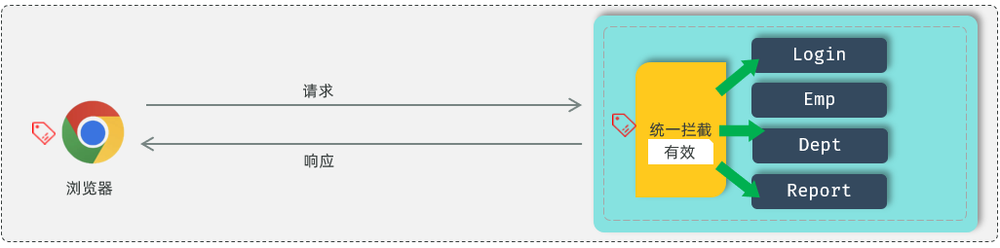

#### 接下来在服务端我们就可以获取到 cookie 的值。我们可以去判断一下这个 cookie 的值是否存在，如果不存在这个 cookie，就说明客户端之前是没有访问登录接口的；如果存在 cookie 的值，就说明客户端之前已经登录完成了。这样我们就可以基于 cookie 在同一次会话的不同请求之间来共享数据

### 三个自动

> #### （1）服务器会<span style="color: red;">自动</span>的将 cookie 响应给浏览器
>
> #### （2）浏览器接收到响应回来的数据之后，会<span style="color: red;">自动</span>的将 cookie 存储在浏览器本地
>
> #### （3）在后续的请求当中，浏览器会<span style="color: red;">自动</span>的将 cookie 携带到服务器端

#### 为什么这一切都是自动化进行的？

> #### 是因为 cookie 它是 HTP 协议当中所支持的技术，而各大浏览器厂商都支持了这一标准。在 HTTP 协议官方给我们提供了一个响应头和请求头
>
> #### 响应头 Set-Cookie ：设置 Cookie 数据的
>
> #### 请求头 Cookie：携带 Cookie 数据的

<br/>
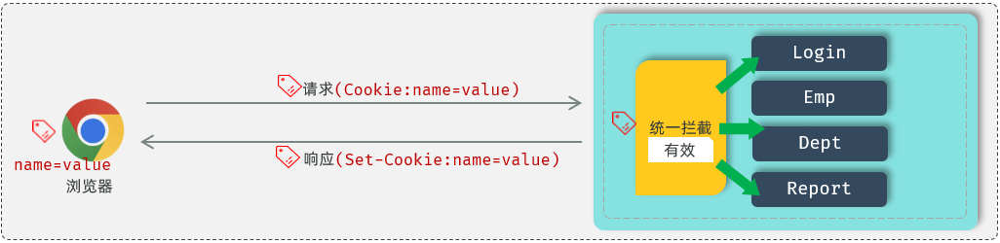

### 测试代码

```java
@Slf4j
@RestController
public class SessionController {

    //设置Cookie
    @GetMapping("/c1")
    public Result cookie1(HttpServletResponse response){
        response.addCookie(new Cookie("login_username","itheima")); //设置Cookie/响应Cookie
        return Result.success();
    }

    //获取Cookie
    @GetMapping("/c2")
    public Result cookie2(HttpServletRequest request){
        Cookie[] cookies = request.getCookies();
        for (Cookie cookie : cookies) {
            if(cookie.getName().equals("login_username")){
                System.out.println("login_username: "+cookie.getValue()); //输出name为login_username的cookie
            }
        }
        return Result.success();
    }
}
```

> #### （1）访问 c1 接口，设置 Cookie，`http://localhost:8080/c1`，我们可以看到，设置的 cookie，通过响应头 Set-Cookie 响应给浏览器，并且浏览器会将 Cookie，存储在浏览器端（F12，找到应用程序，点击 Cookies）
>
> #### （2）访问 c2 接口，获取 Cookie，`http://localhost:8080/c2`，我们可以看到，c2 接口获取到了 c1 接口设置的 cookie，是通过请求头 Cookie，携带的

### 优缺点

#### 优点

> #### HTTP 协议中支持的技术（像 Set-Cookie 响应头的解析以及 Cookie 请求头数据的携带，都是浏览器自动进行的，是无需我们手动操作的）

#### 缺点

> #### 移动端 APP(Android、IOS)中无法使用 Cookie
>
> #### 不安全，用户可以自己禁用 Cookie
>
> #### Cookie 不能跨域

### 跨域介绍

<br/>
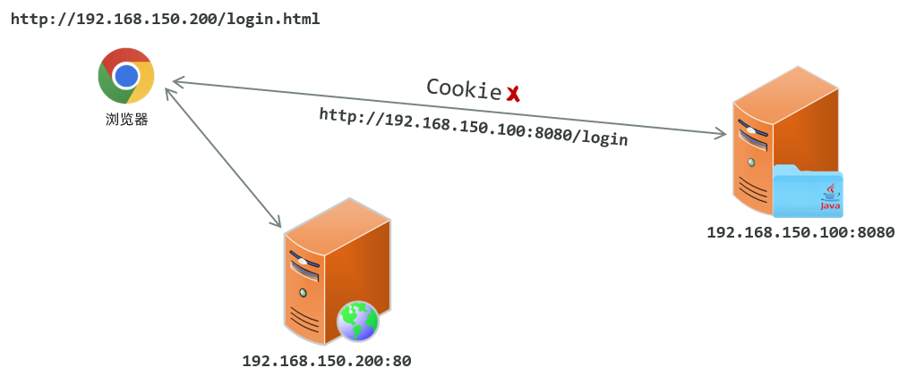

> #### 现在的项目，大部分都是前后端分离的，前后端最终也会分开部署，前端部署在服务器 192.168.150.200 上，端口 80，后端部署在 192.168.150.100 上，端口 8080
>
> #### 我们打开浏览器直接访问前端工程，访问 url：`http://192.168.150.200/login.html`
>
> #### 然后在该页面发起请求到服务端，而服务端所在地址不再是 localhost，而是服务器的 IP 地址 192.168.150.100，假设访问接口地址为：`http://192.168.150.100:8080/login`
>
> #### 那此时就存在跨域操作了，因为我们是在 `http://192.168.150.200/login.html` 这个页面上访问了 `http://192.168.150.100:8080/login` 接口
>
> #### 此时如果服务器设置了一个 Cookie，这个 Cookie 是不能使用的，因为 Cookie 无法跨域

#### 区分跨域的维度（三个维度有任何一个维度不同，那就是跨域操作）

> #### 协议
>
> #### IP / 协议
>
> #### 端口

### 跨域举例

> #### `http://192.168.150.200/login.html` ----------> `https://192.168.150.200/login` [协议不同，跨域]
>
> #### `http://192.168.150.200/login.html` ----------> `http://192.168.150.100/login` [IP 不同，跨域]
>
> #### `http://192.168.150.200/login.html` ----------> `http://192.168.150.200:8080/login` [端口不同，跨域]
>
> #### `http://192.168.150.200/login.html` ----------> `http://192.168.150.200/login` [不跨域]

## Seesion

### 获取 Session

<br/>
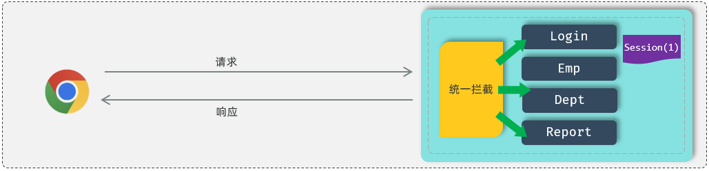

> #### 如果我们现在要基于 Session 来进行会话跟踪，浏览器在第一次请求服务器的时候，我们就可以直接在服务器当中来获取到会话对象 Session。如果是第一次请求 Session ，会话对象是不存在的，这个时候服务器会自动的创建一个会话对象 Session 。而每一个会话对象 Session ，它都有一个 ID（示意图中 Session 后面括号中的 1，就表示 ID），我们称之为 Session 的 ID

### 响应 Cookie

<br/>
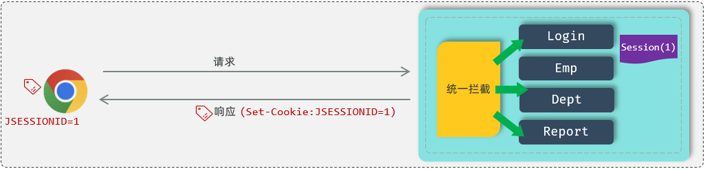

> #### 接下来，服务器端在给浏览器响应数据的时候，它会将 Session 的 ID 通过 Cookie 响应给浏览器。其实在响应头当中增加了一个 Set-Cookie 响应头。这个 Set-Cookie 响应头对应的值是不是 cookie？ cookie 的名字是固定的 JSESSIONID 代表的服务器端会话对象 Session 的 ID。浏览器会自动识别这个响应头，然后自动将 Cookie 存储在浏览器本地

### 查找 Session

<br/>
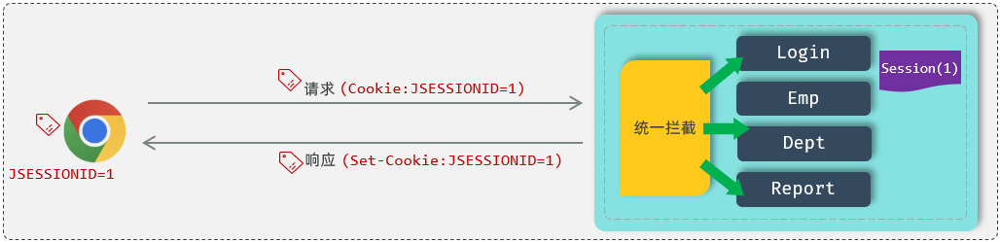

> #### 接下来，在后续的每一次请求当中，都会将 Cookie 的数据获取出来，并且携带到服务端。接下来服务器拿到 <span style="color:red;">JSESSIONID</span> 这个 Cookie 的值，也就是 Session 的 ID。拿到 ID 之后，就会从众多的 Session 当中来找到当前请求对应的会话对象 Session
>
> #### 这样我们是不是就可以通过 Session 会话对象在同一次会话的多次请求之间来共享数据了？好，这就是基于 Session 进行会话跟踪的流程

### 测试代码

```java
@Slf4j
@RestController
public class SessionController {

    @GetMapping("/s1")
    public Result session1(HttpSession session){
        log.info("HttpSession-s1: {}", session.hashCode());

        session.setAttribute("loginUser", "tom"); //往session中存储数据
        return Result.success();
    }

    @GetMapping("/s2")
    public Result session2(HttpServletRequest request){
        HttpSession session = request.getSession();
        log.info("HttpSession-s2: {}", session.hashCode());

        Object loginUser = session.getAttribute("loginUser"); //从session中获取数据
        log.info("loginUser: {}", loginUser);
        return Result.success(loginUser);
    }
}
```

> #### （1）访问 s1 接口，`http://localhost:8080/s1`，请求完成之后，在响应头中，就会看到有一个 Set-Cookie 的响应头，里面响应回来了一个 Cookie，就是 JSESSIONID，这个就是服务端会话对象 Session 的 ID
>
> #### （2） 访问 s2 接口，`http://localhost:8080/s2`，接下来，在后续的每次请求时，都会将 Cookie 的值，携带到服务端，那服务端呢，接收到 Cookie 之后，会自动的根据 JSESSIONID 的值，找到对应的会话对象 Session
>
> #### （3）通过控制台日志输出可以知道，两次请求，获取到的 Session 会话对象的 hashcode 是一样的，就说明是同一个会话对象。而且，第一次请求时，往 Session 会话对象中存储的值，第二次请求时，也获取到了。 那这样，我们就可以通过 Session 会话对象，在同一个会话的多次请求之间来进行数据共享了。

### 优缺点

#### 优点

> #### Session 是存储在服务端的，安全

#### 缺点

> #### 服务器集群环境下无法直接使用 Session
>
> #### 移动端 APP(Android、IOS)中无法使用 Cookie
>
> #### 用户可以自己禁用 Cookie
>
> #### Cookie 不能跨域

#### ⚠️ 注意点

> #### Session 底层是基于 Cookie 实现的会话跟踪，如果 Cookie 不可用，则该方案，也就失效了

### Session 无法应用于集群

#### 首先第一点，我们现在所开发的项目，一般都不会只部署在一台服务器上，因为一台服务器会存在一个很大的问题，就是单点故障。所谓单点故障，指的就是一旦这台服务器挂了，整个应用都没法访问了

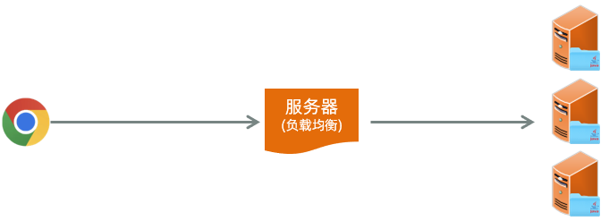

> #### 所以在现在的企业项目开发当中，最终部署的时候都是以集群的形式来进行部署，也就是同一个项目它会部署多份。比如这个项目我们现在就部署了 3 份
>
> #### 而用户在访问的时候，到底访问这三台其中的哪一台？其实用户在访问的时候，他会访问一台前置的服务器，我们叫负载均衡服务器，我们在后面项目当中会详细讲解。目前大家先有一个印象负载均衡服务器，它的作用就是将前端发起的请求均匀的分发给后面的这三台服务器

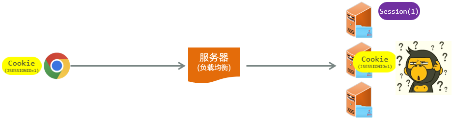

> #### 此时假如我们通过 session 来进行会话跟踪，可能就会存在这样一个问题。用户打开浏览器要进行登录操作，此时会发起登录请求。登录请求到达负载均衡服务器，将这个请求转给了第一台 Tomcat 服务器
>
> #### Tomcat 服务器接收到请求之后，要获取到会话对象 session。获取到会话对象 session 之后，要给浏览器响应数据，最终在给浏览器响应数据的时候，就会携带这么一个 cookie 的名字，就是 JSESSIONID ，下一次再请求的时候，是不是又会将 Cookie 携带到服务端？
>
> #### 好。此时假如又执行了一次查询操作，要查询部门的数据。这次请求到达负载均衡服务器之后，负载均衡服务器将这次请求转给了第二台 Tomcat 服务器，此时他就要到第二台 Tomcat 服务器当中。根据 JSESSIONID 也就是对应的 session 的 ID 值，要找对应的 session 会话对象
>
> #### 我想请问在第二台服务器当中有没有这个 ID 的会话对象 Session， 是没有的。此时是不是就出现问题了？我同一个浏览器发起了 2 次请求，结果获取到的不是同一个会话对象，这就是 Session 这种会话跟踪方案它的缺点，在服务器集群环境下无法直接使用 Session

## JWT 令牌技术

### 基本介绍

> #### 这里我们所提到的令牌，其实它就是一个用户身份的标识，看似很高大上，很神秘，其实<span style="color:red">本质</span>就是一个<span style="color:red">字符串</span>

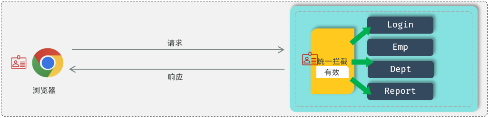

> #### 如果通过令牌技术来跟踪会话，我们就可以在浏览器发起请求。在请求登录接口的时候，如果登录成功，我就可以生成一个令牌，令牌就是用户的合法身份凭证。接下来我在响应数据的时候，我就可以直接将令牌响应给前端
>
> #### 接下来我们在前端程序当中接收到令牌之后，就需要将这个令牌存储起来。这个存储可以存储在 cookie 当中，也可以存储在其他的存储空间(比如：localStorage)当中
>
> #### 接下来，在后续的每一次请求当中，都需要将令牌携带到服务端。携带到服务端之后，接下来我们就需要来校验令牌的有效性。如果<span style="color:red">令牌是有效性的</span>，就说明用户已经执行了登录操作，如果令牌是无效的，就说明用户之前并未执行登录操作
>
> #### 此时，如果是在同一次会话的多次请求之间，我们想共享数据，我们就可以<span style="color:red">将共享的数据存储在令牌当中</span>就可以了

### 优缺点

#### 优点

> #### 支持 PC 端、移动端
>
> #### 解决集群环境下的认证问题
>
> #### 减轻服务器的存储压力（无需在服务器端存储）

#### 缺点

> #### 需要自己实现（包括令牌的生成、令牌的传递、令牌的校验）

### 应用场景

<br/>
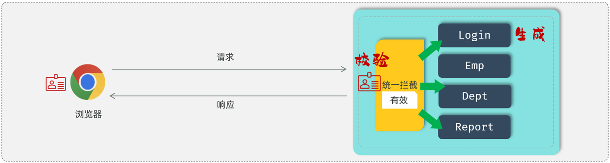

#### JWT 令牌最典型的应用场景就是登录认证

> #### 在浏览器发起请求来执行登录操作，此时会访问登录的接口，如果登录成功之后，我们需要生成一个 jwt 令牌，将生成的 jwt 令牌返回给前端
>
> #### 前端拿到 jwt 令牌之后，会将 jwt 令牌存储起来。在后续的每一次请求中都会将 jwt 令牌携带到服务端
>
> #### 服务端统一拦截请求之后，先来判断一下这次请求有没有把令牌带过来，如果没有带过来，直接拒绝访问，如果带过来了，还要校验一下令牌是否是有效。如果有效，就直接放行进行请求的处理

#### 在 JWT 登录认证的场景中我们发现，整个流程当中涉及到两步操作

> #### 1. 在登录成功之后，要生成令牌
>
> #### 2. 每一次请求当中，要接收令牌并对令牌进行校验
