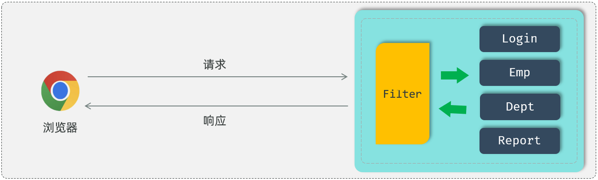
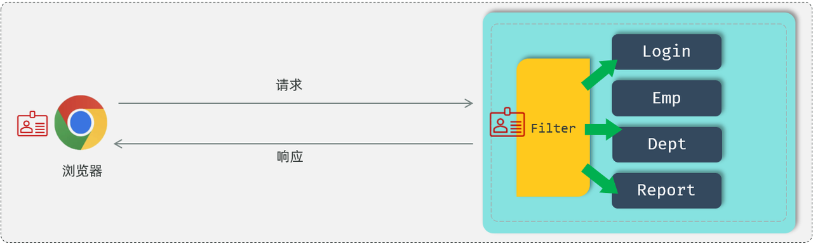
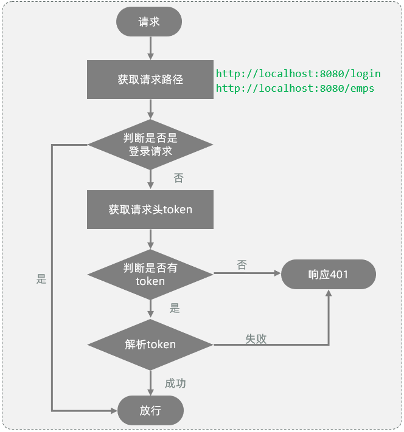
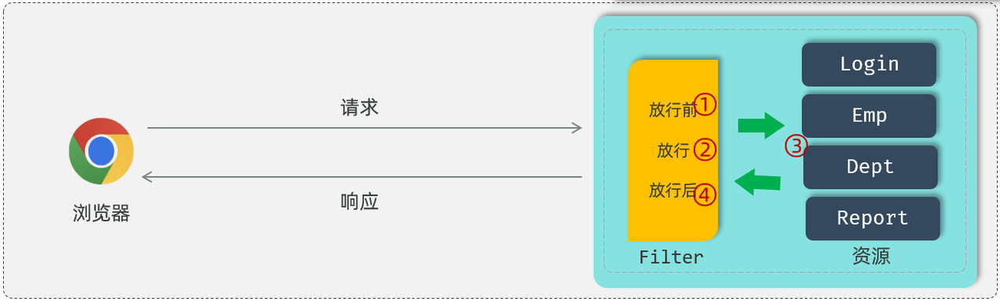
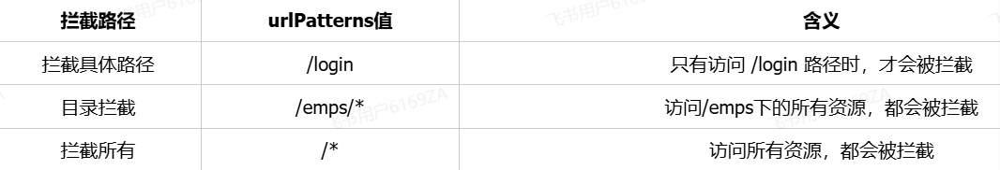
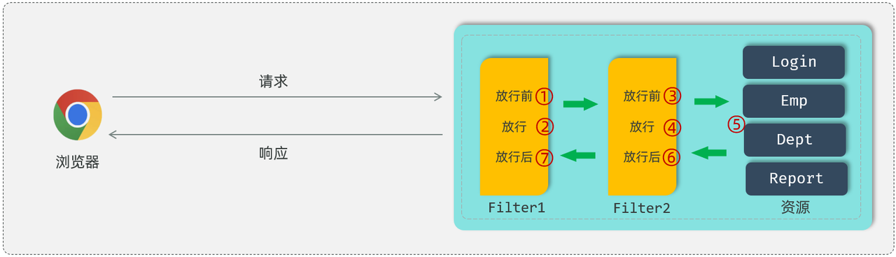

<h1 style="text-align: center;">过滤器 Filter</h1>
 
- - -

## 需求引入

> #### 刚才通过浏览器的开发者工具，我们可以看到在后续的请求当中，都会在请求头中携带 JWT 令牌到服务端，而服务端需要<span style="color:red;">统一拦截所有的请求</span>，从而判断是否携带的有合法的 JWT 令牌

## 基本介绍

#### （1）Filter 表示过滤器，是 JavaWeb 三大组件(Servlet、Filter、Listener)之一

#### （2）过滤器可以把对资源的请求拦截下来，从而实现一些特殊的功能

> #### 使用了过滤器之后，要想访问 web 服务器上的资源，必须先经过滤器，过滤器处理完毕之后，才可以访问对应的资源

#### （3）过滤器一般完成一些通用的操作，比如：登录校验、统一编码处理、敏感字符处理等

<br/>


## Filter 入门

### 相关方法

> #### init 方法：过滤器的初始化方法。在 web 服务器启动的时候会自动的创建 Filter 过滤器对象，在创建过滤器对象的时候会自动调用 init 初始化方法，这个方法只会被调用一次
>
> #### doFilter 方法：这个方法是在每一次拦截到请求之后都会被调用，所以这个方法是会被调用多次的，每拦截到一次请求就会调用一次 doFilter()方法
>
> #### destroy 方法： 是销毁的方法。当我们关闭服务器的时候，它会自动的调用销毁方法 destroy，而这个销毁方法也只会被调用一次

### 相关注解

> #### <span style="color:red;">@WebFilter(urlPatterns = "/\*")</span>：配置过滤器要拦截的请求路径（ `/*` 表示拦截浏览器的所有请求 ）
>
> #### <span style="color:red;">@ServletComponentScan</span>：开启对 Servlet 组件的支持

### 代码实现

> #### 在定义完 Filter 之后，Filter 其实并不会生效，还需要完成 Filter 的配置，Filter 的配置非常简单，只需要在 Filter 类上添加一个注解：<span style="color:red;">@WebFilter</span>，并指定属性 urlPatterns，通过这个属性指定过滤器要拦截哪些请求

```java
@WebFilter(urlPatterns = "/*") //配置过滤器要拦截的请求路径（ /* 表示拦截浏览器的所有请求 ）
public class DemoFilter implements Filter {
    //初始化方法, web服务器启动, 创建Filter实例时调用, 只调用一次
    public void init(FilterConfig filterConfig) throws ServletException {
        System.out.println("init ...");
    }

    //拦截到请求时,调用该方法,可以调用多次
    public void doFilter(ServletRequest servletRequest, ServletResponse servletResponse, FilterChain chain) throws IOException, ServletException {
        System.out.println("拦截到了请求...");
    }

    //销毁方法, web服务器关闭时调用, 只调用一次
    public void destroy() {
        System.out.println("destroy ... ");
    }
}
```

> #### 当我们在 Filter 类上面加了@WebFilter 注解之后，接下来我们还需要在启动类上面加上一个注解<span style="color:red;">@ServletComponentScan</span>，通过这个@ServletComponentScan 注解来开启 SpringBoot 项目对于 Servlet 组件的支持

```java
@ServletComponentScan //开启对Servlet组件的支持
@SpringBootApplication
public class TliasManagementApplication {
    public static void main(String[] args) {
        SpringApplication.run(TliasManagementApplication.class, args);
    }
}
```

### ⭐ 放行操作

> #### 在过滤器 Filter 中，如果不执行放行操作，将无法访问后面的资源。，需要放行

```java
chain.doFilter(request, response);
```

## 登录校验过滤器

### 需求分析

<br/>


#### 我们先来回顾下前面分析过的登录校验的基本流程

> #### 要进入到后台管理系统，我们必须先完成登录操作，此时就需要访问登录接口 login
>
> #### 登录成功之后，我们会在服务端生成一个 JWT 令牌，并且把 JWT 令牌返回给前端，前端会将 JWT 令牌存储下来
>
> #### 在后续的每一次请求当中，都会将 JWT 令牌携带到服务端，请求到达服务端之后，要想去访问对应的业务功能，此时我们必须先要校验令牌的有效性
>
> #### 对于校验令牌的这一块操作，我们使用登录校验的过滤器，在过滤器当中来校验令牌的有效性。如果令牌是无效的，就响应一个错误的信息，也不会再去放行访问对应的资源了。如果令牌存在，并且它是有效的，此时就会放行去访问对应的 web 资源，执行相应的业务操作

#### 所有的请求，拦截到了之后，都需要校验令牌吗 ？

> #### 答案：登录请求例外

#### 拦截到请求后，什么情况下才可以放行，执行业务操作 ？

> #### 答案：有令牌，且令牌校验通过(合法)；否则都返回未登录错误结果

### 实现流程

<br/>


> #### （1）获取请求 url
>
> #### （2）判断请求 url 中是否包含 login，如果包含，说明是登录操作，放行
>
> #### （3）获取请求头中的令牌（token）
>
> #### （4）判断令牌是否存在，如果不存在，响应 401
>
> #### （5）解析 token，如果解析失败，响应 401
>
> #### （6）放行

### TokenFilter

> #### 新建包 filter，创建 TokenFilter 类

```java
package com.itheima.filter;

import com.itheima.utils.JwtUtils;
import jakarta.servlet.*;
import jakarta.servlet.annotation.WebFilter;
import jakarta.servlet.http.HttpServletRequest;
import jakarta.servlet.http.HttpServletResponse;
import lombok.extern.slf4j.Slf4j;
import org.apache.http.HttpStatus;
import org.springframework.util.StringUtils;
import java.io.IOException;

/**
 * 令牌校验过滤器
 */
@Slf4j
@WebFilter(urlPatterns = "/*")
public class TokenFilter implements Filter {

    @Override
    public void doFilter(ServletRequest req, ServletResponse resp, FilterChain chain) throws IOException, ServletException {
        HttpServletRequest request = (HttpServletRequest) req;
        HttpServletResponse response = (HttpServletResponse) resp;
        //1. 获取请求url。
        String url = request.getRequestURL().toString();

        //2. 判断请求url中是否包含login，如果包含，说明是登录操作，放行。
        if(url.contains("login")){ //登录请求
            log.info("登录请求 , 直接放行");
            chain.doFilter(request, response);
            return;
        }

        //3. 获取请求头中的令牌（token）。
        String jwt = request.getHeader("token");

        //4. 判断令牌是否存在，如果不存在，返回错误结果（未登录）。
        if(!StringUtils.hasLength(jwt)){ //jwt为空
            log.info("获取到jwt令牌为空, 返回错误结果");
            response.setStatus(HttpStatus.SC_UNAUTHORIZED); // 返回 401 状态码，表示未登录
            return;
        }

        //5. 解析token，如果解析失败，返回错误结果（未登录）。
        try {
            JwtUtils.parseJWT(jwt);
        } catch (Exception e) {
            e.printStackTrace();
            log.info("解析令牌失败, 返回错误结果");
            response.setStatus(HttpStatus.SC_UNAUTHORIZED);
            return;
        }

        //6. 放行。
        log.info("令牌合法, 放行");
        chain.doFilter(request , response);
    }

}
```

## Filter 详解

### 拦截流程

<br/>


> #### 过滤器当中我们拦截到了请求之后，如果希望继续访问后面的 web 资源，就要执行放行操作，放行就是调用 FilterChain 对象当中的 doFilter()方法，在调用 doFilter()这个方法之前所编写的代码属于放行之前的逻辑
>
> #### 在放行后访问完 web 资源之后还会回到过滤器当中，回到过滤器之后如有需求还可以执行放行之后的逻辑，放行之后的逻辑我们写在 doFilter()这行代码之后

### ⭐ 拦截路径

<br/>


### 过滤器链

<br/>


> #### 比如：在我们 web 服务器当中，定义了两个过滤器，这两个过滤器就形成了一个过滤器链
>
> #### 而这个链上的过滤器在执行的时候会一个一个的执行，会先执行第一个 Filter，放行之后再来执行第二个 Filter，如果执行到了最后一个过滤器放行之后，才会访问对应的 web 资源
>
> #### 访问完 web 资源之后，按照我们刚才所介绍的过滤器的执行流程，还会回到过滤器当中来执行过滤器放行后的逻辑，而在执行放行后的逻辑的时候，顺序是反着的
>
> #### 先要执行过滤器 2 放行之后的逻辑，再来执行过滤器 1 放行之后的逻辑，最后在给浏览器响应数据

::: tip <span style="font-size: 18px;">执行顺序</span>

#### 过滤器链上过滤器的执行顺序：注解配置的 Filter，优先级是按照过滤器类名（字符串）的自然排序。 比如：

#### （1）AbcFilter

#### （2）DemoFilter

#### 这两个过滤器来说，<span style="color:red;">AbcFilter 会先执行，DemoFilter 会后执行</span>

:::
