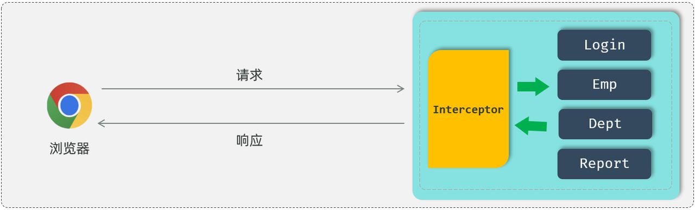
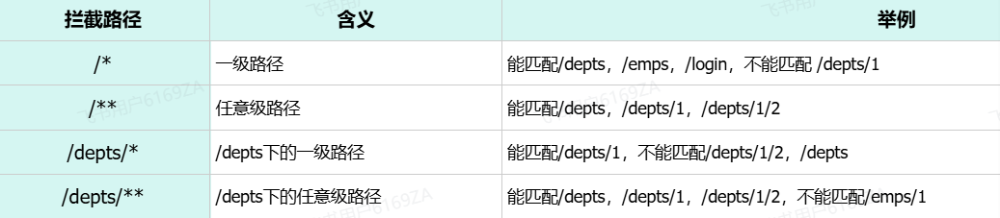
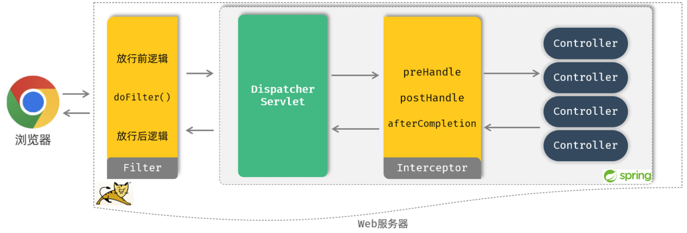

<h1 style="text-align: center;">拦截器 Interceptor</h1>
 
- - -

## 基本介绍

#### 什么是拦截器？

> #### 是一种动态拦截方法调用的机制，类似于过滤器
>
> #### 拦截器是 Spring 框架中提供的，用来动态拦截控制器方法的执行
>
> #### 拦截器的作用：拦截请求，在指定方法调用前后，根据业务需要执行预先设定的代码



> #### 在拦截器当中，我们通常也是做一些通用性的操作，比如：我们可以通过拦截器来拦截前端发起的请求，将登录校验的逻辑全部编写在拦截器当中。在校验的过程当中，如发现用户登录了(携带 JWT 令牌且是合法令牌)，就可以直接放行，去访问 spring 当中的资源。如果校验时发现并没有登录或是非法令牌，就可以直接给前端响应未登录的错误信息

## 快速入门

### 自定义拦截器

> #### 实现 HandlerInterceptor 接口，并重写其所有方法

```java
//自定义拦截器
@Component
public class DemoInterceptor implements HandlerInterceptor {
    //目标资源方法执行前执行。 返回true：放行    返回false：不放行
    @Override
    public boolean preHandle(HttpServletRequest request, HttpServletResponse response, Object handler) throws Exception {
        System.out.println("preHandle .... ");

        return true; //true表示放行
    }

    //目标资源方法执行后执行
    @Override
    public void postHandle(HttpServletRequest request, HttpServletResponse response, Object handler, ModelAndView modelAndView) throws Exception {
        System.out.println("postHandle ... ");
    }

    //视图渲染完毕后执行，最后执行
    @Override
    public void afterCompletion(HttpServletRequest request, HttpServletResponse response, Object handler, Exception ex) throws Exception {
        System.out.println("afterCompletion .... ");
    }
}
```

### 相关方法

> #### preHandle 方法：目标资源方法执行前执行。 <span style="color:red;">返回 true：放行，返回 false：不放行</span>
>
> #### postHandle 方法：目标资源方法执行后执行
>
> #### afterCompletion 方法：视图渲染完毕后执行，最后执行

### 注册配置拦截器

> #### 在 com.itheima 下创建一个包 config，然后创建一个配置类 WebConfig， 实现 WebMvcConfigurer 接口，并重写 addInterceptors 方法，加上 <span style="color:red">@Configuration 注解</span> 表示这是是一个<span style="color:red;">配置类</span>

```java
@Configuration
public class WebConfig implements WebMvcConfigurer {

    //自定义的拦截器对象
    @Autowired
    private DemoInterceptor demoInterceptor;


    @Override
    public void addInterceptors(InterceptorRegistry registry) {
       //注册自定义拦截器对象
        registry.addInterceptor(demoInterceptor).addPathPatterns("/**");//设置拦截器拦截的请求路径（ /** 表示拦截所有请求）
    }
}
```

## 令牌校验 Interceptor

### 基本介绍

> #### 登录校验的业务逻辑以及操作步骤我们前面已经分析过了，和登录校验 Filter 过滤器当中的逻辑是完全一致的。现在我们只需要把这个技术方案由原来的过滤器换成拦截器 interceptor 就可以了

### TokenInterceptor

> #### 在 com.itheima.interceptor 包下创建 TokenInterceptor

```java
@Slf4j
@Component
public class TokenInterceptor implements HandlerInterceptor {
    @Override
    public boolean preHandle(HttpServletRequest request, HttpServletResponse response, Object handler) throws Exception {
        //1. 获取请求url。
        String url = request.getRequestURL().toString();

        //2. 判断请求url中是否包含login，如果包含，说明是登录操作，放行。
        if(url.contains("login")){ //登录请求
            log.info("登录请求 , 直接放行");
            return true;
        }

        //3. 获取请求头中的令牌（token）。
        String jwt = request.getHeader("token");

        //4. 判断令牌是否存在，如果不存在，返回错误结果（未登录）。
        if(!StringUtils.hasLength(jwt)){ //jwt为空
            log.info("获取到jwt令牌为空, 返回错误结果");
            response.setStatus(HttpStatus.SC_UNAUTHORIZED);
            return false;
        }

        //5. 解析token，如果解析失败，返回错误结果（未登录）。
        try {
            JwtUtils.parseJWT(jwt);
        } catch (Exception e) {
            e.printStackTrace();
            log.info("解析令牌失败, 返回错误结果");
            response.setStatus(HttpStatus.SC_UNAUTHORIZED);
            return false;
        }

        //6. 放行。
        log.info("令牌合法, 放行");
        return true;
    }

}
```

### WebConfig

> #### 在 com.itheima 下创建一个包 config，然后创建一个配置类 WebConfig， 实现 WebMvcConfigurer 接口，并重写 addInterceptors 方法

```java
@Configuration
public class WebConfig implements WebMvcConfigurer {
    //拦截器对象
    @Autowired
    private TokenInterceptor tokenInterceptor;

    @Override
    public void addInterceptors(InterceptorRegistry registry) {
       //注册自定义拦截器对象
        registry.addInterceptor(tokenInterceptor).addPathPatterns("/**");
    }
}
```

### 拦截路径

<br/>


> #### 首先我们先来看拦截器的拦截路径的配置，在注册配置拦截器的时候，我们要指定拦截器的拦截路径，通过 <span style="color:red;">addPathPatterns("要拦截路径")</span> 方法，就可以指定要拦截哪些资源
>
> #### 在入门程序中我们配置的是/\*\*，表示拦截所有资源，而在配置拦截器时，不仅可以指定要拦截哪些资源，还可以指定不拦截哪些资源，只需要调用 <span style="color:red;">excludePathPatterns("不拦截路径")</span> 方法，指定哪些资源不需要拦截

```java
@Configuration
public class WebConfig implements WebMvcConfigurer {

    //拦截器对象
    @Autowired
    private DemoInterceptor demoInterceptor;

    @Override
    public void addInterceptors(InterceptorRegistry registry) {
        //注册自定义拦截器对象
        registry.addInterceptor(demoInterceptor)
                .addPathPatterns("/**")//设置拦截器拦截的请求路径（ /** 表示拦截所有请求）
                .excludePathPatterns("/login");//设置不拦截的请求路径
    }
}
```

### 执行流程

<br/>


> #### 当我们打开浏览器来访问部署在 web 服务器当中的 web 应用时，此时我们所定义的过滤器会拦截到这次请求。拦截到这次请求之后，它会先执行放行前的逻辑，然后再执行放行操作。而由于我们当前是基于 springboot 开发的，所以放行之后是进入到了 spring 的环境当中，也就是要来访问我们所定义的 controller 当中的接口方法
>
> #### Tomcat 并不识别所编写的 Controller 程序，但是它识别 Servlet 程序，所以在 Spring 的 Web 环境中提供了一个非常核心的 Servlet：DispatcherServlet（前端控制器），所有请求都会先进行到 DispatcherServlet，再将请求转给 Controller
>
> #### 当我们定义了拦截器后，会在执行 Controller 的方法之前，请求被拦截器拦截住。执行 <span style="color:red">preHandle()</span> 方法，这个方法执行完成后需要返回一个布尔类型的值，如果返回 true，就表示放行本次操作，才会继续访问 controller 中的方法；如果返回 false，则不会放行（controller 中的方法也不会执行）
>
> #### 在 controller 当中的方法执行完毕之后，再回过来执行 <span style="color:red">postHandle()</span >这个方法以及 <span style="color:red">afterCompletion()</span> 方法，然后再返回给 DispatcherServlet，最终再来执行过滤器当中放行后的这一部分逻辑的逻辑。执行完毕之后，最终给浏览器响应数据

### 对比 Filter

> #### 接口规范不同：过滤器需要实现 <span style="color:red">Filter</span> 接口，而拦截器需要实现 <span style="color:red">HandlerInterceptor</span> 接口
>
> #### 拦截范围不同：过滤器 <span style="color:red">Filter</span> 会<span style="color:red">拦截所有</span>的资源，而 <span style="color:red">Interceptor 只会拦截 Spring 环境中的资源</span>

## 该项目使用哪个？

> <h3> 本项目使用过滤器 <span style="color:red">filter</span></h3>
