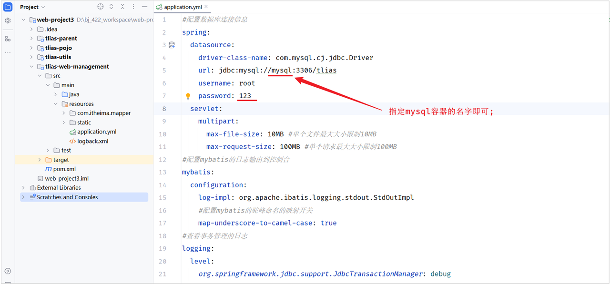
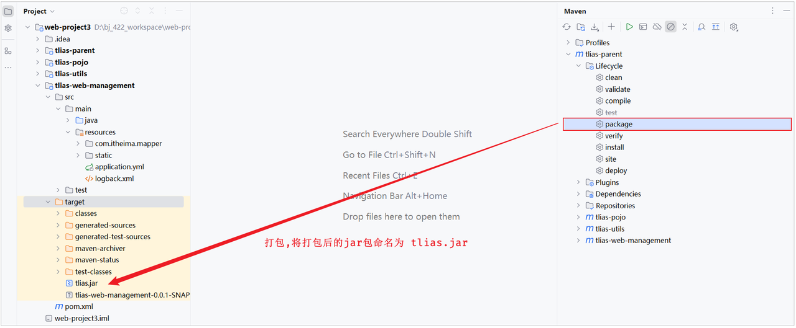

<h1 style="text-align: center;">后端部署</h1>

---

## 思路分析

### 需求

> #### 将我们开发的 tlias-web-management 项目打包为镜像，并部署

### 步骤

> #### （1）修改项目的配置文件，修改数据库服务地址（打包 package）
>
> #### （2）编写 Dockerfile 文件（AI 辅助）
>
> #### （3）构建 Docker 镜像，部署 Docker 容器，运行测试

## 具体实现

#### （1）修改项目的配置文件，修改数据库服务地址（打包 package）

<br/>


#### 然后，执行 maven 中的 package 生命周期，进行打包(跳过测试)，并将打包后的 jar 包命名为 tlias.jar

<br/>


#### （2）编写 Dockerfile 文件（AI 辅助）

> #### 文件名 Dockerfile:

```bash
# 使用 CentOS 7 作为基础镜像
FROM centos:7

# 添加 JDK 到镜像中
COPY jdk17.tar.gz /usr/local/
RUN tar -xzf /usr/local/jdk17.tar.gz -C /usr/local/ &&  rm /usr/local/jdk17.tar.gz

# 设置环境变量
ENV JAVA_HOME=/usr/local/jdk-17.0.10
ENV PATH=$JAVA_HOME/bin:$PATH

# 阿里云OSS环境变量
ENV OSS_ACCESS_KEY_ID=自己的密钥
ENV OSS_ACCESS_KEY_SECRET=自己的密钥

#统一编码
ENV LANG=en_US.UTF-8
ENV LANGUAGE=en_US:en
ENV LC_ALL=en_US.UTF-8

# 创建应用目录
RUN mkdir -p /tlias
WORKDIR /tlias

# 复制应用 JAR 文件到容器
COPY  tlias.jar  tlias.jar

# 暴露端口
EXPOSE 8080

# 运行命令
ENTRYPOINT ["java","-jar","/tlias/tlias.jar"]
```

> #### 由于项目要运行，需要依赖 jdk 的环境，所以这里我们需要将 tlias.jar，jdk17.tar.gz，Dockerfile 三个文件，上传到 Linux 服务器的 /root/tlias 目录下（如果没有这个目录，提前创建好）

#### （3）构建 Docker 镜像，部署 Docker 容器，运行测试

> #### 构建 Docker 镜像

```bash
docker build -t tlias:1.0 .
```

> #### 部署 Docker 容器

```bash
docker run -d --name tlias-server --network itheima -p 8080:8080  tlias:1.0
```

#### TIP 提示

> #### （1）--network itheima ：将创建的容器，加入到 itheima 网络，就可以和 itheima 网络中的容器通信了
>
> #### （2）通过 docker logs -f 容器名，就可以查看容器的运行日志
