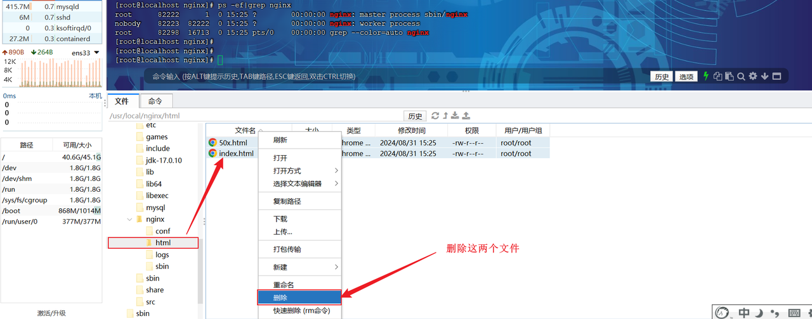
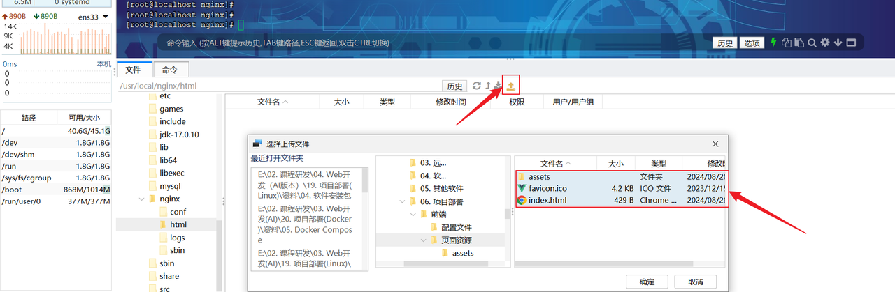
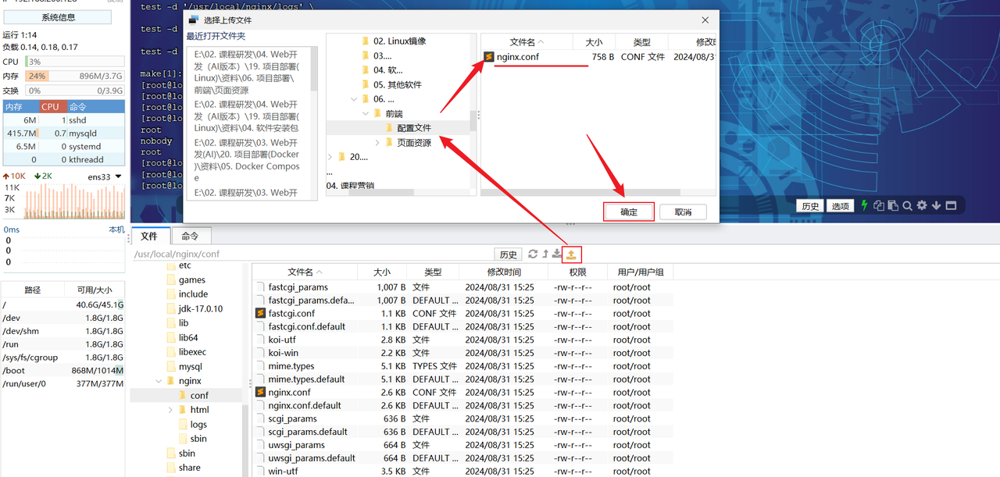

<h1 style="text-align: center;">前端部署</h1>

---

## 部署步骤

#### （1）将 nginx 的安装目录的 html 中的静态资源文件先删除掉

<br/>


#### （2）将资料中提供的 "资料/06. 项目部署/前端/页面资源" 目录下的静态资源文件，全部上传到 nginx 安装目录下的 html 目录中

<br/>


#### （3）修改资料中提供的 nginx.conf 配置文件，将其上传到 nginx 安装目录下的 conf 目录中

<br/>


#### （4）进入 usr / local / nginx 目录，重新加载 nginx 服务的配置文件

```bash
#重新加载配置文件
sbin/nginx -s reload
```
