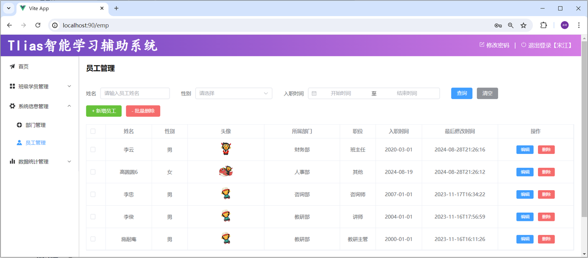
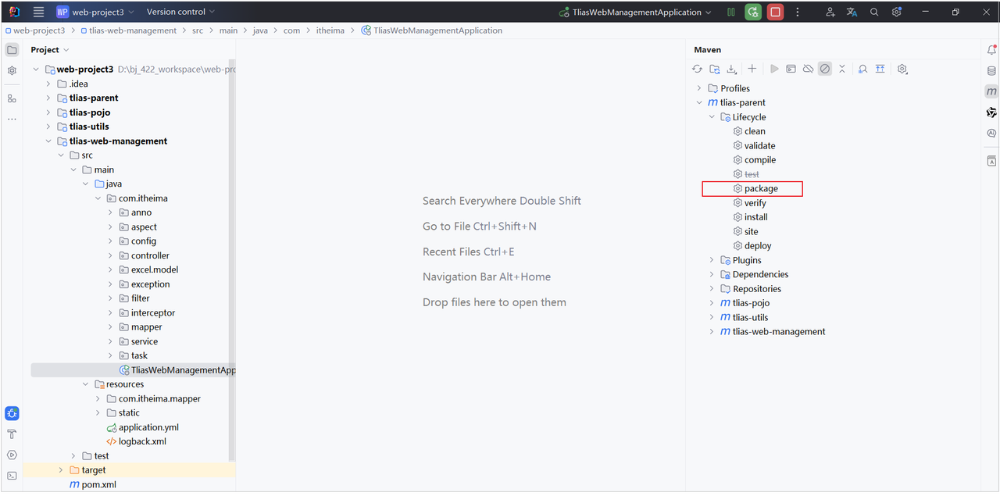

<h1 style="text-align: center;">后端部署</h1>

---

## application.uml

> #### MySQL 的端口需要改为 Linux 服务器中 MySQL 的端口号

```yml
#配置数据库连接信息
spring:
  datasource:
    driver-class-name: com.mysql.cj.jdbc.Driver
    url: jdbc:mysql://192.168.100.128:3306/tlias
    username: root
    password: 1234
  servlet:
    multipart:
      max-file-size: 10MB #单个文件最大大小限制10MB
      max-request-size: 100MB #单个请求最大大小限制100MB

#配置mybatis的日志输出到控制台
mybatis:
  configuration:
    log-impl: org.apache.ibatis.logging.stdout.StdOutImpl
    #配置mybatis的驼峰命名的映射开关
    map-underscore-to-camel-case: true
#查看事务管理的日志
logging:
  level:
    org.springframework.jdbc.support.JdbcTransactionManager: debug

#阿里云oss配置
aliyun:
  oss:
    endpoint: https://oss-cn-beijing.aliyuncs.com
    bucketName: java422-web-ai
```

#### 改造完毕之后，可以在本地的 idea 中先启动当前项目，然后访问一下，看看工程是否正常访问

<br/>


## 打包部署

#### （1）执行 package 指令，进行打包操作，将当前的 springboot 项目，打成一个 jar 包（跳过测试）

<br/>


#### （2）在 Linux 服务器上创建一个目录，将 jar 包上传到服务器

```bash
mkdir -p /usr/local/app
```

#### （3）通过 java 命令，启动项目

```bash
#进入目录/usr/local/app
cd /usr/local/app

#运行jar包
java -jar tlias-web-management.jar
```

## 阿里云 OSS 密钥配置

#### 由于在开发的时候，我们将访问阿里云 OSS 的 AccessKeyId，AccessKeySecret 都配置在了系统的环境变量中了。那现在项目部署到了 Linux 服务器中，调用阿里云 OSS 进行文件上传时，程序就会获取 Linux 系统中的环境变量。所以此时，我们需要将 AccessKeyId，AccessKeySecret 配置为 Linux 系统的环境变量

#### （1）查看 Windows 系统之前配置的环境变量

```bash
echo %OSS_ACCESS_KEY_ID%

echo %OSS_ACCESS_KEY_SECRET%
```

#### 我们将上述自己的 AccessKeyId 与 AccessKeySecret 复制出来，然后在 linux 系统中配置环境变量

#### （2）执行如下指令

> #### 相关的 Key 替换成自己的
>
> #### 执行完毕后，将 finalShell 的窗口关闭掉，重新打开一个新窗口（让环境变量生效），重新运行项目测试

```bash
echo "export OSS_ACCESS_KEY_ID=自己的密钥" >> /etc/profile

echo "export OSS_ACCESS_KEY_SECRET=自己的密钥" >> /etc/profile

source /etc/profile
```

## 后台运行

### 问题分析

#### （1）线上程序不会采用控制台霸屏的形式运行程序，而是将程序在后台运行

#### （2）线上程序不会将日志输出到控制台，而是输出到日志文件，方便运维查阅信息

#### （3）要解决上述这两个问题，我们就可以通过 <span style="color:red">nohup 指令</span>让程序在后台运行

### 后台运行指令

```bash
nohup java -jar tlias-web-management.jar &> tlias.log &
```

### 停止服务指令

```bash
#查看服务的进程信息
ps -ef|grep tlias

#杀掉进程
kill -9 xxxxx
```

### nohup 指令

#### （1）nohup 命令：英文全称 no hang up（不挂起），用于不挂断地运行指定命令，退出终端不会影响程序的运行

#### （2）语法格式： nohup command [ args … ] [&]

#### （3）参数说明

> #### command：要执行的命令
>
> #### args：一些参数，可以指定输出文件
>
> #### &：让命令在后台运行

#### （4）举例

> #### nohup java -jar boot 工程.jar &> hello.log &
>
> #### 上述指令的含义为： 后台运行 java -jar 命令，并将日志输出到 hello.log 文件
