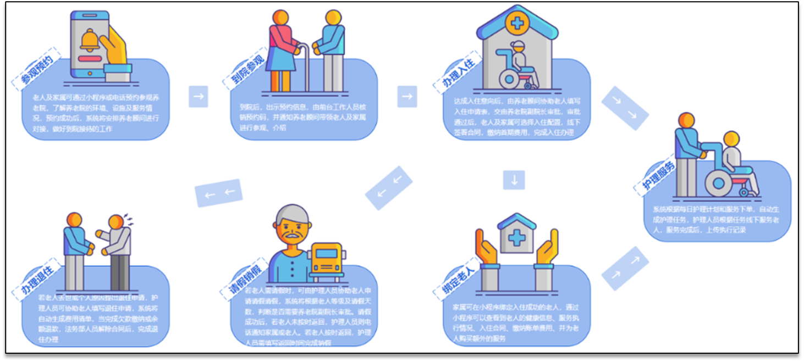
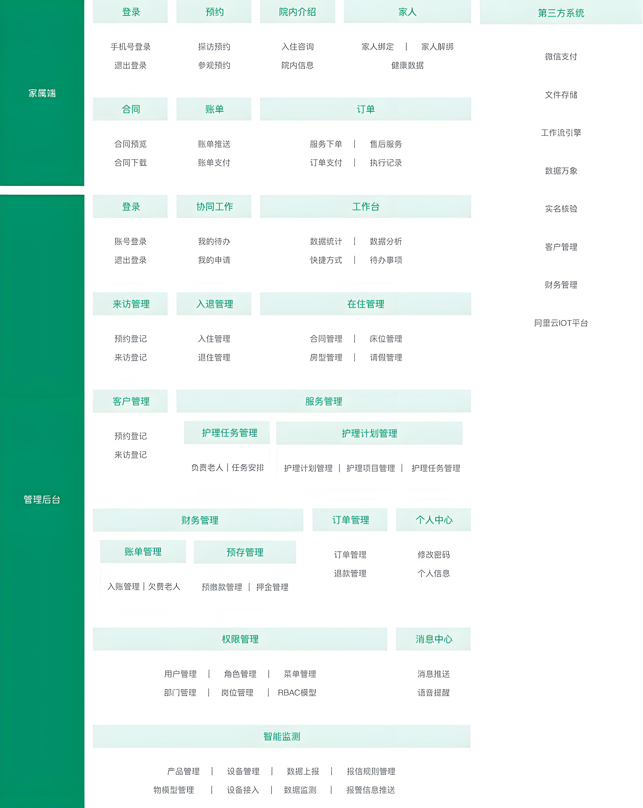
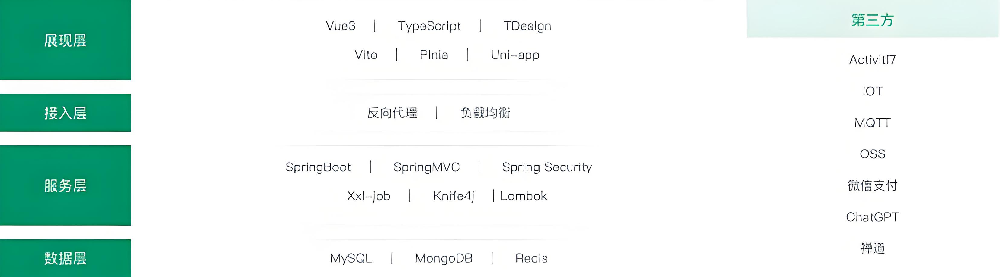
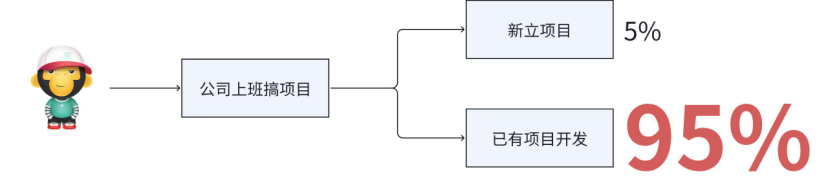
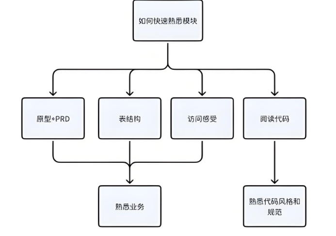

<h1 style="text-align: center;">项目介绍</h1>

---

### 项目演示及原型

#### （1）项目演示地址：https://zhyl-admin.itheima.net/

> #### 默认账号：admin@qq.comm 密码：132itheima.CN032@.当天日期

#### （2）项目原型地址：https://rp-java.itheima.net/zhyl/

## 项目介绍

#### 中州养老系统为养老院量身定制开发专业的养老管理软件产品；涵盖来访管理、入退管理、在住管理、服务管理、财务管理等功能模块，涉及从来访参观到退住办理的完整流程

 

#### 中州养老项目分为两端，一个是管理后台，另外一个是家属端

> #### 管理后台：养老院员工使用，入住、退住，给老人服务记录等等
>
> #### 家属端：养老院的老人家属使用，查看老人信息，缴费，下订单等等

### 整体业务流程

 

### 技术架构

 

#### （1）前端主要使用的 Vue3+TS

#### （2）后端主要使用的是 Springboot 作为基础架构，当然后端也集成了很多其他的技术，比如有 Mybatis、Swagger、Spring cache、Spring Security、Xxl-job、Activiti7

#### （2）数据存储主要使用到了 MySQL 和 Redis

#### （3）使用了 nginx 来作为反向代理和前端的静态服务器

#### （4）其他技术：华为物联网平台 IOT、对象存储 OSS、微信登录、AI 工具辅助开发等

## 什么是 1-2 项目？

#### 通常小伙伴入职一家新公司之后，接手的项目有两种情况，第一个是新项目，第二个是老项目继续开发，根据已毕业学员的调研结果说明，95%的学员会在老项目的基础上进行继续开发新的功能。这个就是 1-2 的项目，简单说就是，项目已经开发了一部分，我们需要在已有的项目中进行再次开发

 

#### 所以，训练大家在已有项目中进行开发是一个非常有必要的能力，那么，我们如何在老项目中进行开发呢？

> #### 其实，别管是什么项目，我们有两个问题需要先解决
>
> #### （1）如何快速完成新项目的环境搭建
>
> #### （2）如何快速熟悉一个新的项目

## 如何熟悉项目的一个模块

#### 在一开始，我们可以找到项目中的一个模块来进行熟悉，也就说先找到一个切入口。那么熟悉项目的方式有很多种渠道，我们需要通过各个渠道来深入了解。下面列了一些比较常见的熟悉项目的方式

> #### （1）阅读原型文档+需求文档 PRD（Product Requirements Document）
>
> #### （2）阅读表结构
>
> #### （3）页面点击访问感受
>
> #### （4）阅读对应模块代码，熟悉代码风格和规范

 

