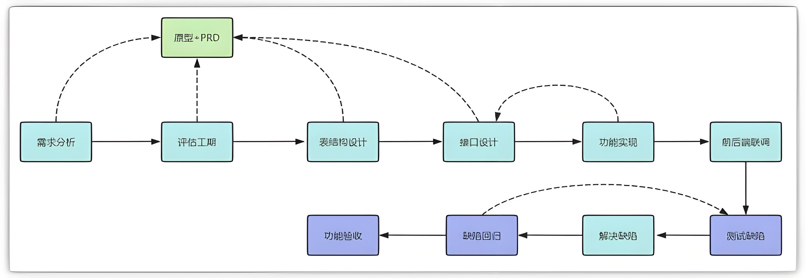

<h1 style="text-align: center;">接口开发流程</h1>

---

## 如何在项目中开发一个接口

### 问题引入

#### 在已有的代码的基础上，我们来开发几个功能接口，我们这次涉及到的是房间模块中的床位相关的接口，在我们开发之前，我们现在需要搞清楚几个问题

> #### （1）在前后端项目开发中，后端的开发流程是什么
>
> #### （2）如何设计一个接口，有哪些规则或规范
>
> #### （3）开发过程中会产生什么样的问题
>
> #### （4）开发完成的接口如何测试

### 后端开发流程

 

> #### 需求分析（基于原型和 PRD）
>
> #### 开发计划（工期评估）
>
> #### 表结构设计（基于原型和 PRD）
>
> #### 接口设计（基于原型和 PRD）
>
> #### 功能实现（基于接口设计 + 原型 + PRD）
>
> #### 前后端联调
>
> #### 测试提 bug
>
> #### 前后端优化，再联调
>
> #### 测试回归 bug
>
> #### 功能验收

### 接口设计规范

#### （1）请求路径命名：以模块名称进行区分（英文）

#### （2）请求方式（需要符合 restFul 风格）

> #### 查询 GET
>
> #### 新增 POST
>
> #### 修改 PUT
>
> #### 删除 DELETE

#### （3）接口入参

#### 路径参数

> #### 问号传参---->后端形参接收
>
> #### path 传参---->后端 PathVariable 注解接收

#### 请求体参数

> #### 前端：json 对象
>
> #### 后端：对象接收，DTO

#### （4）接口出参

> #### 统一格式 { code:200,msg:"成功",data:{ } }
>
> #### 数据封装，一般为 VO
>
> #### （1）敏感数据过滤
>
> #### （2） 整合数据

## Day 1 任务

> #### 根据 Day1 提供的资料，完成代码的导入，实现创建床位，根据 id 查询床位，更新床位，删除床位的接口功能开发
