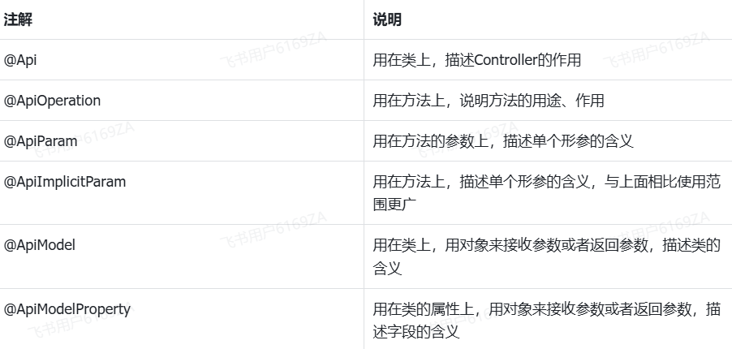

<h1 style="text-align: center;">Swagger</h1>

---

## 官网

> #### https://swagger.io/autolink

## 基本介绍

> #### Swagger 是一个规范和完整的框架，用于生成、描述、调用和可视化 RESTful 风格的 Web 服务

#### 主要作用

#### （1）使得前后端分离开发更加方便，有利于团队协作

#### （2）接口的文档在线自动生成，降低后端开发人员编写接口文档的负担

#### （3）功能测试

> #### Spring 已经将 Swagger 纳入自身的标准，建立了 Spring-swagger 项目，现在叫 Springfox，通过在项目中引入 Springfox，即可非常简单快捷的使用 Swagger
>
> #### knife4j 是为 Java MVC 框架集成 Swagger 生成 Api 文档的增强解决方案，前身是 swagger-bootstrap-ui，取名 knife4j 是希望它能像一把匕首一样小巧、轻量、并且功能强悍!目前，一般都使用 knife4j 框架

## 引入依赖

```xml
<dependency>
    <groupId>com.github.xiaoymin</groupId>
    <artifactId>knife4j-spring-boot-starter</artifactId>
</dependency>
```

## 配置类

#### 在配置类中加入 knife4j 相关配置，可以使 knife4j 在全局生效，目的就是项目中的所有接口都生成在线接口文档，在 zzyl-framework 工程中的 config 包下（无需大家编写，固定工具类，直接拷贝即可）

```java
package com.zzyl.config;

import com.github.xiaoymin.knife4j.spring.annotations.EnableKnife4j;
import com.zzyl.properties.SwaggerConfigProperties;
import org.springframework.beans.factory.annotation.Autowired;
import org.springframework.boot.actuate.autoconfigure.endpoint.web.CorsEndpointProperties;
import org.springframework.boot.actuate.autoconfigure.endpoint.web.WebEndpointProperties;
import org.springframework.boot.actuate.autoconfigure.web.server.ManagementPortType;
import org.springframework.boot.actuate.endpoint.ExposableEndpoint;
import org.springframework.boot.actuate.endpoint.web.*;
import org.springframework.boot.actuate.endpoint.web.annotation.ControllerEndpointsSupplier;
import org.springframework.boot.actuate.endpoint.web.annotation.ServletEndpointsSupplier;
import org.springframework.boot.actuate.endpoint.web.servlet.WebMvcEndpointHandlerMapping;
import org.springframework.boot.autoconfigure.condition.ConditionalOnClass;
import org.springframework.boot.context.properties.EnableConfigurationProperties;
import org.springframework.context.annotation.Bean;
import org.springframework.context.annotation.Configuration;
import org.springframework.context.annotation.Import;
import org.springframework.core.env.Environment;
import org.springframework.util.StringUtils;
import springfox.bean.validators.configuration.BeanValidatorPluginsConfiguration;
import springfox.documentation.builders.ApiInfoBuilder;
import springfox.documentation.builders.PathSelectors;
import springfox.documentation.builders.RequestHandlerSelectors;
import springfox.documentation.service.Contact;
import springfox.documentation.spi.DocumentationType;
import springfox.documentation.spring.web.plugins.Docket;

import java.util.ArrayList;
import java.util.Collection;
import java.util.List;

@Configuration
@EnableConfigurationProperties(SwaggerConfigProperties.class)
@EnableKnife4j
@Import(BeanValidatorPluginsConfiguration.class)
public class SwaggerConfig {

    @Autowired
    SwaggerConfigProperties swaggerConfigProperties;

    @Bean(value = "defaultApi2")
    @ConditionalOnClass(SwaggerConfigProperties.class)
    public Docket defaultApi2() {
        // 构建API文档  文档类型为swagger2
        return new Docket(DocumentationType.SWAGGER_2)
            .select()
            // 配置 api扫描路径
            .apis(RequestHandlerSelectors.basePackage(swaggerConfigProperties.getSwaggerPath()))
            // 指定路径的设置  any代表所有路径
            .paths(PathSelectors.any())
            // api的基本信息
            .build().apiInfo(new ApiInfoBuilder()
                // api文档名称
                .title(swaggerConfigProperties.getTitle())
                // api文档描述
                .description(swaggerConfigProperties.getDescription())
                // api文档版本
                .version("1.0") // 版本
                // api作者信息
                .contact(new Contact(
                    swaggerConfigProperties.getContactName(),
                    swaggerConfigProperties.getContactUrl(),
                    swaggerConfigProperties.getContactEmail()))
                .build());
    }

    /**
     * 增加如下配置可解决Spring Boot 6.x 与Swagger 3.0.0 不兼容问题
     **/
    @Bean
    public WebMvcEndpointHandlerMapping webEndpointServletHandlerMapping(WebEndpointsSupplier webEndpointsSupplier,
                                                                         ServletEndpointsSupplier servletEndpointsSupplier,
                                                                         ControllerEndpointsSupplier controllerEndpointsSupplier,
                                                                         EndpointMediaTypes endpointMediaTypes,
                                                                         CorsEndpointProperties corsProperties,
                                                                         WebEndpointProperties webEndpointProperties,
                                                                         Environment environment) {
        List<ExposableEndpoint<?>> allEndpoints = new ArrayList();
        Collection<ExposableWebEndpoint> webEndpoints = webEndpointsSupplier.getEndpoints();
        allEndpoints.addAll(webEndpoints);
        allEndpoints.addAll(servletEndpointsSupplier.getEndpoints());
        allEndpoints.addAll(controllerEndpointsSupplier.getEndpoints());
        String basePath = webEndpointProperties.getBasePath();
        EndpointMapping endpointMapping = new EndpointMapping(basePath);
        boolean shouldRegisterLinksMapping = this.shouldRegisterLinksMapping(webEndpointProperties, environment, basePath);
        return new WebMvcEndpointHandlerMapping(endpointMapping, webEndpoints, endpointMediaTypes, corsProperties.toCorsConfiguration(),
                new EndpointLinksResolver(allEndpoints, basePath), shouldRegisterLinksMapping, null);
    }
    private boolean shouldRegisterLinksMapping(WebEndpointProperties webEndpointProperties, Environment environment, String basePath) {
        return webEndpointProperties.getDiscovery().isEnabled() && (StringUtils.hasText(basePath) || ManagementPortType.get(environment).equals(ManagementPortType.DIFFERENT));
    }
}
```

#### 在上述代码中引用了一个配置，用来定制项目中的一些特殊信息，比如扫描的包、项目相关信息等

```java
@Setter
@Getter
@NoArgsConstructor
@ToString
@ConfigurationProperties(prefix = "zzyl.framework.swagger")
public class SwaggerConfigProperties implements Serializable {

    /**
     * 扫描的路径，哪些接口需要使用在线文档
     */
    public String swaggerPath;

    /**
     * 项目名称
     */
    public String title;

    /**
     * 具体描述
     */
    public String description;

    /**
     * 组织名称
     */
    public String contactName;

    /**
     * 联系网址
     */
    public String contactUrl;

    /**
     * 联系邮箱
     */
    public String contactEmail;
}
```

#### 所以上述代码具体的配置，是在 application.yml 文件中来定义

```yaml
spring:
  mvc:
    pathmatch:
      matching-strategy: ant_path_matcher
zzyl:
  framework:
    swagger:
      swagger-path: com.zzyl.controller
      title: 智慧养老服务
      description: 智慧养老
      contact-name: 黑马研究院
      contact-url: www.itheima.com
      contact-email: itheima@itcast.cn
```

#### 注意，在使用 swagger 时候，需要使用 ant 的方式进行匹配路径，需要设置为 <span style="color:red">ant_path_matcher</span>

#### Ant 是一种风格，简单匹配规则如下：

> #### ？ 匹配一个字符
>
> #### \*\* 匹配 0 个或多个目录

## 设置静态资源映射

#### 如果想要 swagger 生效，还需要设置静态资源映射，否则接口文档页面无法访问

#### 找到配置类为：WebMvcConfig，添加如下代码

```java
@Override
public void addResourceHandlers(ResourceHandlerRegistry registry) {
    //支持webjars
    registry.addResourceHandler("/webjars/**")
            .addResourceLocations("classpath:/META-INF/resources/webjars/");
    //支持swagger
    registry.addResourceHandler("swagger-ui.html")
            .addResourceLocations("classpath:/META-INF/resources/");
    //支持小刀
    registry.addResourceHandler("doc.html")
            .addResourceLocations("classpath:/META-INF/resources/");
}
```

## 常用注解

<br/>

