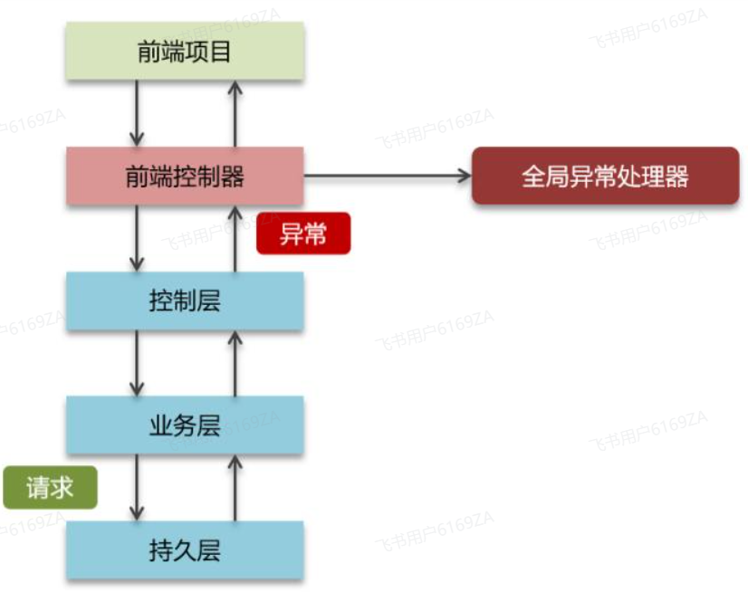
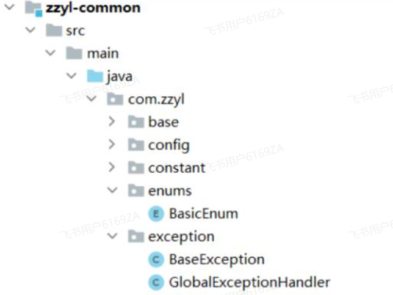

<h1 style="text-align: center;">全局异常处理器</h1>

---

## 全局异常处理器逻辑

#### 一般项目开发有两种异常

> #### 预期异常（程序员手动抛出）
>
> #### 运行时异常

<br/>


#### 在目前的项目中已经提供了全局异常处理器

<br/>


#### BaseException 基础异常，如果业务中需要手动抛出异常，则需要抛出该异常

```java
package com.zzyl.exception;


import com.zzyl.enums.BasicEnum;
import lombok.Getter;
import lombok.Setter;

/**
 * BaseException
 * @author itheima
 **/
@Getter
@Setter
public class BaseException extends RuntimeException {

    private BasicEnum basicEnum;

    public BaseException(BasicEnum basicEnum) {
        this.basicEnum = basicEnum;
    }
}
```

#### 其中 BaseException 中的参数为一个枚举，可以在 BasicEnum 自定义业务中涉及到的异常

```java
package com.zzyl.enums;

import com.zzyl.base.IBasicEnum;
import lombok.AllArgsConstructor;
import lombok.Getter;

/**
 * 基础枚举
 *
 * @author itcast
 */
@Getter
@AllArgsConstructor
public enum BasicEnum implements IBasicEnum {

    SUCCEED(200, "操作成功"),
    SECURITY_ACCESSDENIED_FAIL(401, "权限不足!"),
    LOGIN_FAIL(401, "用户登录失败"),
    LOGIN_LOSE_EFFICACY(401, "登录状态失效，请重新登录"),
    SYSYTEM_FAIL(500, "系统运行异常"),


    //权限相关异常：1400-1499
    DEPT_DEPTH_UPPER_LIMIT(1400, "部门最多4级"),
    PARENT_DEPT_DISABLE(1401, "父级部门为禁用状态,不允许启用"),
    DEPT_NULL_EXCEPTION(1402, "部门不能为空"),
    POSITION_DISTRIBUTED(1403, "职位已分配，不允许禁用"),
    MENU_NAME_DUPLICATE_EXCEPTION(1404, "菜单路由重复"),


    //业务相关异常：1500-1599
    WEBSOCKET_PUSH_MSG_ERROR(1500, "websocket推送消息失败"),
    CLOSE_BALANCE_ERROR(1501, "关闭余额账户失败"),
    MONTH_BILL_DUPLICATE_EXCEPTION(1502, "该老人的月度账单已生成，不可重复生成"),
    MONTH_OUT_CHECKIN_TERM(1503, "该月不在费用期限内");

    /**
     * 编码
     */
    public final int code;
    /**
     * 信息
     */
    public final String msg;
}
```

#### GlobalExceptionHandler 全局异常处理器

## 项目中集成

### 程序员手动抛出业务异常

> #### 当床位新增失败的时候，可以直接抛出 BaseException

```java
@Override
public void addBed(BedDto bedDto) {
    Bed bed = BeanUtil.toBean(bedDto, Bed.class);
    bed.setCreateTime(LocalDateTime.now());
    bed.setCreateBy(1L);
    bed.setBedStatus(0);
    try {
        bedMapper.addBed(bed);
    } catch (Exception e) {
        throw new BaseException(BasicEnum.BED_INSERT_FAIL);
    }
}
```

#### 测试：当重复录入床位编号的时候，则会抛出：床位新增失败，而此时的执行逻辑就是走了全局异常处理器

### 不可知异常处理

> #### 比如，在文件上传的接口中，如果上传文件失败，则可以抛出 RuntimeException 异常，由于 RuntimeException 异常不是自定义异常，一旦触发就是走全局异常处理器的未知异常

```java
/**
 * 文件上传
 *
 * @param file 文件
 * @return 上传结果
 * @throws Exception 异常
 */
@PostMapping("/upload")
@ApiOperation("文件上传")
public ResponseResult<String> upload(
        @ApiParam(value = "上传的文件", required = true)
        @RequestPart("file") MultipartFile file) throws Exception {

    // 校验是否为图片文件
    try {
        BufferedImage bufferedImage = ImageIO.read(file.getInputStream());
    } catch (Exception e) {
        throw new RuntimeException("上传图片失败");
    }

    if (file.getSize() == 0) {
        throw new RuntimeException("上传图片不能为空");
    }

    // 获得原始文件名
    String originalFilename = file.getOriginalFilename();
    // 获得文件扩展名
    String extension = originalFilename.substring(originalFilename.lastIndexOf("."));
    String fileName = UUID.randomUUID().toString() + extension;

    String filePath = fileStorageService.store(fileName, file.getInputStream());

    return ResponseResult.success(filePath);
}
```

#### 结论

> #### 一旦文件上传失败，则会走全局异常处理器的未知异常
>
> #### 如果系统抛出了其他异常，非 BaseException，都会走未知异常
