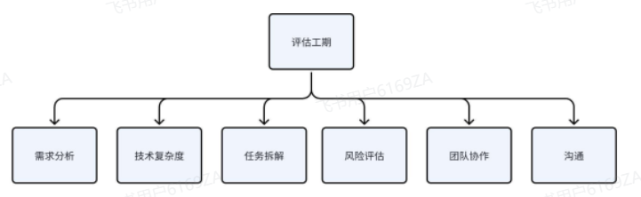

<h1 style="text-align: center;">如何评估工期</h1>

---

## 工期评估方向

## 需求分析

> #### 首先需要对需求进行充分的分析和理解，包括功能、性能、安全等方面的需求。确保对需求的理解准确，避免后期需求变更导致工期延误

## 技术复杂度

> #### 评估所涉及的技术栈和相关技术难点，包括数据库设计、性能优化、安全防护等方面的复杂度。技术复杂度高的项目通常需要更多的时间来完成，如果个人之前没有涉及过，还需要花时间去学习

## 任务分解

> #### 将整体任务分解为具体的模块或功能点，对每个模块进行评估，估算每个模块的开发工期

## 风险评估

> #### 评估项目中可能出现的风险和问题，如第三方依赖、需求变更、人力资源等方面的风险，合理考虑这些风险对工期的影响

## 团队协作

> #### 评估模块完成需要团队其他人来共同协助开发，比如模块间有依赖关系，接口需要联调、功能需要测试等等

## 沟通

> #### 提前沟通、经常沟通，了解彼此的日程和需求变更，团队内信息要及时同步与更新
