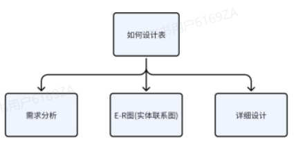
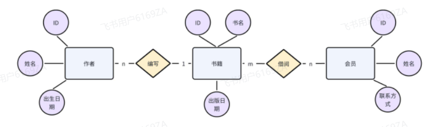

<h1 style="text-align: center;">如何设计数据库表</h1>

---

## 表设计考虑方向

## E-R 图

> #### E-R 图也称实体-联系图(Entity Relationship Diagram)，提供了表示实体类型、属性和联系的方法，用来描述现实世界的概念模型

#### 一个例子

> #### 假设我们要设计一个简单的图书馆数据库系统。我们可以使用 E-R 图来描述这个系统的数据模型我们可能会有以下实体（Entities）：• 书籍（Book）• 作者（Author）• 图书馆成员（Library Member）然后，我们可以描述它们之间的关系（Relationships）：• 一本书可以由一个或多个作者编写，这是一个“一对多”的关系。• 图书馆成员可以借阅多本书，而每本书也可以被多个图书馆成员借阅，这是一个“多对多”的关系。最后，我们可以添加一些属性（Attributes）：• 书籍实体可能包括书名、ISBN 号、出版日期等属性。• 作者实体可能包括姓名、国籍、出生日期等属性。• 图书馆成员实体可能包括会员号、姓名、联系信息等属性。通过 E-R 图，我们可以清晰地展示这些实体之间的关系和它们的属性，从而更好地理解图书馆数据库系统的数据模型

## 详细设计

#### （1）命名（见名之意）： 参考阿里开发手册

#### （2）数据类型

#### （3）基本准则

> #### 可靠性：考虑字段存储的内容长度，尽可能的合适
>
> #### 存储空间：在考虑可靠性的前提下，再次考虑存储空间

#### （4）常见数据类型 MySQL 常见数据类型

> #### https://heuqqdmbyk.feishu.cn/wiki/Re9TwPZeciddMuksNFtcZPASnLf

#### （5）主键（必须存在）

> #### 自增
>
> #### UUID
>
> #### 雪花算法
>
> #### 冗余字段

#### （6）创建时间

#### （7）修改时间

#### （8）创建人

#### （9）修改人

#### （10）备注

## 四大类型字段

> #### 基础字段：主键、创建时间、修改时间、创建人、修改人、备注
>
> #### 业务字段：通过原型图分析
>
> #### 冗余字段：减少连表查询
>
> #### 关联字段：多表关联
