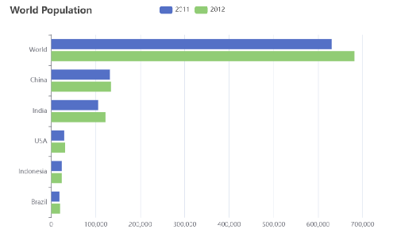
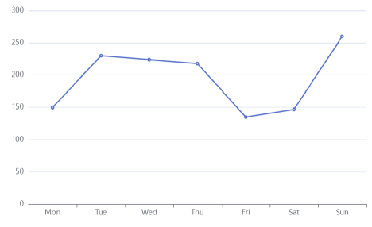
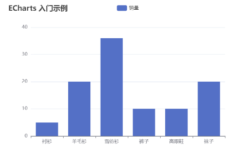

# <center>Apache Echarts</center>

---

## 基本介绍

> #### 官网地址：https://echarts.apache.org/zh/index.html
>
> #### Apache ECharts 是一款基于 Javascript 的数据可视化图表库，提供直观，生动，可交互，可个性化定制的数据可视化图表

## 常见图表

### 柱状图

<br/>


### 饼形图

<br/>


### 折线图

<br/>


#### 总结：不管是哪种形式的图形，最本质的东西实际上是数据，它其实是对数据的一种可视化展示

## 快速入门

### 官方文档

> #### Apache Echarts 官方提供的快速入门：https://echarts.apache.org/handbook/zh/get-started

### 实现步骤

<br/>


> #### （1）引入 echarts.js 文件（当天资料已提供）
>
> #### （2）为 ECharts 准备一个设置宽高的 DOM
>
> #### （3）初始化 echarts 实例
>
> #### （4）指定图表的配置项和数据
>
> #### （5）使用指定的配置项和数据显示图表

### 示例代码

```html
<!DOCTYPE html>
<html>
  <head>
    <meta charset="utf-8" />
    <title>ECharts</title>
    <!-- 引入刚刚下载的 ECharts 文件 -->
    <script src="echarts.js"></script>
  </head>
  <body>
    <!-- 为 ECharts 准备一个定义了宽高的 DOM -->
    <div id="main" style="width: 600px;height:400px;"></div>
    <script type="text/javascript">
      // 基于准备好的dom，初始化echarts实例
      var myChart = echarts.init(document.getElementById("main"));

      // 指定图表的配置项和数据
      var option = {
        title: {
          text: "ECharts 入门示例",
        },
        tooltip: {},
        legend: {
          data: ["销量"],
        },
        xAxis: {
          data: ["衬衫", "羊毛衫", "雪纺衫", "裤子", "高跟鞋", "袜子"],
        },
        yAxis: {},
        series: [
          {
            name: "销量",
            type: "bar",
            data: [5, 20, 36, 10, 10, 20],
          },
        ],
      };

      // 使用刚指定的配置项和数据显示图表。
      myChart.setOption(option);
    </script>
  </body>
</html>
```
