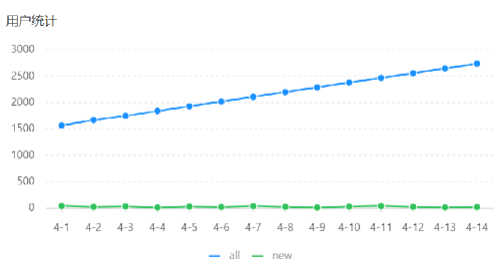

# <center>用户统计</center>

---

## 需求分析

> #### 所谓用户统计，实际上统计的是用户的数量。通过折线图来展示，上面这根蓝色线代表的是用户总量，下边这根绿色线代表的是新增用户数量，是具体到每一天。所以说用户统计主要统计<span style="color: red">两个数据</span>，一个是<span style="color: red">总的用户数量</span>，另外一个是<span style="color: red">新增用户数量</span>

#### 原型图



#### 业务规则

> #### 基于可视化报表的折线图展示用户数据，X 轴为日期，Y 轴为用户数
>
> #### 根据时间选择区间，展示每天的用户总量和新增用户量数据

## Controller 层

### ReportController

> #### 根据接口定义，在 ReportController 中创建 userStatistics 方法

```java
/**
     * 用户数据统计
     * @param begin
     * @param end
     * @return
     */
    @GetMapping("/userStatistics")
    @ApiOperation("用户数据统计")
    public Result<UserReportVO> userStatistics(
            @DateTimeFormat(pattern = "yyyy-MM-dd") LocalDate begin,
            @DateTimeFormat(pattern = "yyyy-MM-dd") LocalDate end){

        return Result.success(reportService.getUserStatistics(begin,end));
}
```

## Service 层

### ReportService

> #### 在 ReportService 接口中声明 getUserStatistics 方法

```java
/**
 * 根据时间区间统计用户数量
 * @param begin
 * @param end
 * @return
 */
UserReportVO getUserStatistics(LocalDate begin, LocalDate end);
```

### ReportServiceImpl

#### （1）在 ReportServiceImpl 实现类中实现 getUserStatistics 方法

```java
@Override
public UserReportVO getUserStatistics(LocalDate begin, LocalDate end) {
    List<LocalDate> dateList = new ArrayList<>();
    dateList.add(begin);

    while (!begin.equals(end)){
        begin = begin.plusDays(1);
        dateList.add(begin);
    }
    List<Integer> newUserList = new ArrayList<>(); //新增用户数
    List<Integer> totalUserList = new ArrayList<>(); //总用户数

    for (LocalDate date : dateList) {
        LocalDateTime beginTime = LocalDateTime.of(date, LocalTime.MIN);
        LocalDateTime endTime = LocalDateTime.of(date, LocalTime.MAX);
        //新增用户数量 select count(id) from user where create_time > ? and create_time < ?
        Integer newUser = getUserCount(beginTime, endTime);
        //总用户数量 select count(id) from user where  create_time < ?
        Integer totalUser = getUserCount(null, endTime);

        newUserList.add(newUser);
        totalUserList.add(totalUser);
    }

    return UserReportVO.builder()
            .dateList(StringUtils.join(dateList,","))
            .newUserList(StringUtils.join(newUserList,","))
            .totalUserList(StringUtils.join(totalUserList,","))
            .build();
}
```

#### （2）在 ReportServiceImpl 实现类中创建私有方法 getUserCount

```java
/**
 * 根据时间区间统计用户数量
 * @param beginTime
 * @param endTime
 * @return
 */
private Integer getUserCount(LocalDateTime beginTime, LocalDateTime endTime) {
    Map map = new HashMap();
    map.put("begin",beginTime);
    map.put("end", endTime);
    return userMapper.countByMap(map);
}
```

## Mapper 层

### UserMapper

> #### 在 UserMapper 接口中声明 countByMap 方法

```java
/**
 * 根据动态条件统计用户数量
 * @param map
 * @return
 */
Integer countByMap(Map map);
```

### UserMapper.xml

> #### 在 UserMapper.xml 文件中编写动态 SQL

```java
<select id="countByMap" resultType="java.lang.Integer">
        select count(id) from user
        <where>
            <if test="begin != null">
                and create_time &gt;= #{begin}
            </if>
            <if test="end != null">
                and create_time &lt;= #{end}
            </if>
        </where>
</select>
```
