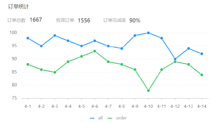

# <center>订单统计</center>

---

## 需求分析

> #### 订单统计通过一个折现图来展现，折线图上有两根线，这根蓝色的线代表的是订单总数，而下边这根绿色的线代表的是有效订单数，指的就是状态是已完成的订单就属于有效订单，分别反映的是每一天的数据。上面还有 3 个数字，分别是订单总数、有效订单、订单完成率，它指的是整个时间区间之内总的数据

#### 原型图



#### 业务规则

> #### 有效订单指状态为 “已完成” 的订单
>
> #### 基于可视化报表的折线图展示订单数据，X 轴为日期，Y 轴为订单数量
>
> #### 根据时间选择区间，展示每天的订单总数和有效订单数
>
> #### 展示所选时间区间内的有效订单数、总订单数、订单完成率，订单完成率 = 有效订单数 / 总订单数 \* 100%

## Controller 层

### ReportController

> #### 在 ReportController 中根据订单统计接口创建 orderStatistics 方法

```java
/**
 * 订单数据统计
 * @param begin
 * @param end
 * @return
 */
@GetMapping("/ordersStatistics")
@ApiOperation("用户数据统计")
public Result<OrderReportVO> orderStatistics(
        @DateTimeFormat(pattern = "yyyy-MM-dd")
                LocalDate begin,
        @DateTimeFormat(pattern = "yyyy-MM-dd")
                LocalDate end){

    return Result.success(reportService.getOrderStatistics(begin,end));
}
```

## Service 层

### ReportService

#### （1）在 ReportService 接口中声明 getOrderStatistics 方法

```java
/**
* 根据时间区间统计订单数量
* @param begin
* @param end
* @return
*/
OrderReportVO getOrderStatistics(LocalDate begin, LocalDate end);
```

#### （2）在 ReportServiceImpl 实现类中实现 getOrderStatistics 方法

```java
/**
* 根据时间区间统计订单数量
* @param begin
* @param end
* @return
*/
public OrderReportVO getOrderStatistics(LocalDate begin, LocalDate end){
	List<LocalDate> dateList = new ArrayList<>();
    dateList.add(begin);

    while (!begin.equals(end)){
          begin = begin.plusDays(1);
          dateList.add(begin);
     }
    //每天订单总数集合
     List<Integer> orderCountList = new ArrayList<>();
    //每天有效订单数集合
    List<Integer> validOrderCountList = new ArrayList<>();
    for (LocalDate date : dateList) {
         LocalDateTime beginTime = LocalDateTime.of(date, LocalTime.MIN);
         LocalDateTime endTime = LocalDateTime.of(date, LocalTime.MAX);
   //查询每天的总订单数 select count(id) from orders where order_time > ? and order_time < ?
         Integer orderCount = getOrderCount(beginTime, endTime, null);

  //查询每天的有效订单数 select count(id) from orders where order_time > ? and order_time < ? and status = ?
         Integer validOrderCount = getOrderCount(beginTime, endTime, Orders.COMPLETED);

         orderCountList.add(orderCount);
         validOrderCountList.add(validOrderCount);
        }

    //时间区间内的总订单数
    Integer totalOrderCount = orderCountList.stream().reduce(Integer::sum).get();
    //时间区间内的总有效订单数
    Integer validOrderCount = validOrderCountList.stream().reduce(Integer::sum).get();
    //订单完成率
    Double orderCompletionRate = 0.0;
    if(totalOrderCount != 0){
         orderCompletionRate = validOrderCount.doubleValue() / totalOrderCount;
     }
    return OrderReportVO.builder()
                .dateList(StringUtils.join(dateList, ","))
                .orderCountList(StringUtils.join(orderCountList, ","))
                .validOrderCountList(StringUtils.join(validOrderCountList, ","))
                .totalOrderCount(totalOrderCount)
                .validOrderCount(validOrderCount)
                .orderCompletionRate(orderCompletionRate)
                .build();

}
```

### ReportServiceImpl

> #### 在 ReportServiceImpl 实现类中提供私有方法 getOrderCount

```java
/**
* 根据时间区间统计指定状态的订单数量
* @param beginTime
* @param endTime
* @param status
* @return
*/
private Integer getOrderCount(LocalDateTime beginTime, LocalDateTime endTime, Integer status) {
	Map map = new HashMap();
	map.put("status", status);
	map.put("begin",beginTime);
	map.put("end", endTime);
	return orderMapper.countByMap(map);
}
```

## Mapper 层

### OrderMapper

> #### 在 OrderMapper 接口中声明 countByMap 方法

```java
/**
*根据动态条件统计订单数量
* @param map
*/
Integer countByMap(Map map);
```

### OrderMapper.xml

> #### 在 OrderMapper.xml 文件中编写动态 SQL

```java
<select id="countByMap" resultType="java.lang.Integer">
        select count(id) from orders
        <where>
            <if test="status != null">
                and status = #{status}
            </if>
            <if test="begin != null">
                and order_time &gt;= #{begin}
            </if>
            <if test="end != null">
                and order_time &lt;= #{end}
            </if>
        </where>
</select>
```
