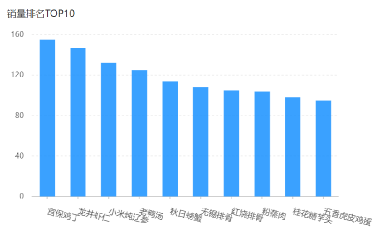

# <center>销量排名 Top10</center>

---

## 需求分析

> #### 所谓销量排名，销量指的是商品销售的数量。项目当中的商品主要包含两类：一个是<span style="color:red">套餐</span>，一个是<span style="color:red">菜品</span>，所以销量排名其实指的就是菜品和套餐销售的数量排名，通过柱形图来展示销量排名，这些销量是按照降序来排列，并且只需要统计销量排名前十的商品

#### 原型图



#### 业务规则

> #### 根据时间选择区间，展示销量前 10 的商品（包括菜品和套餐）
>
> #### 基于可视化报表的柱状图降序展示商品销量
>
> #### 此处的销量为商品销售的份数

## Controller 层

### ReportController

> #### 在 ReportController 中根据销量排名接口创建 top10 方法

```java
/**
* 销量排名统计
* @param begin
* @param end
* @return
*/
@GetMapping("/top10")
@ApiOperation("销量排名统计")
public Result<SalesTop10ReportVO> top10(
    @DateTimeFormat(pattern = "yyyy-MM-dd") LocalDate begin,
    @DateTimeFormat(pattern = "yyyy-MM-dd") LocalDate end){
	return Result.success(reportService.getSalesTop10(begin,end));
}
```

## Service 层

### ReportService

> #### 在 ReportService 接口中声明 getSalesTop10 方法

```java
/**
* 查询指定时间区间内的销量排名top10
* @param begin
* @param end
* @return
*/
SalesTop10ReportVO getSalesTop10(LocalDate begin, LocalDate end);
```

### ReportServiceImpl

> #### 在 ReportServiceImpl 实现类中实现 getSalesTop10 方法

```java
/**
 * 查询指定时间区间内的销量排名top10
 * @param begin
 * @param end
 * @return
 * */
public SalesTop10ReportVO getSalesTop10(LocalDate begin, LocalDate end){
    LocalDateTime beginTime = LocalDateTime.of(begin, LocalTime.MIN);
    LocalDateTime endTime = LocalDateTime.of(end, LocalTime.MAX);
    List<GoodsSalesDTO> goodsSalesDTOList = orderMapper.getSalesTop10(beginTime, endTime);

    String nameList = StringUtils.join(goodsSalesDTOList.stream().map(GoodsSalesDTO::getName).collect(Collectors.toList()),",");
    String numberList = StringUtils.join(goodsSalesDTOList.stream().map(GoodsSalesDTO::getNumber).collect(Collectors.toList()),",");

    return SalesTop10ReportVO.builder()
            .nameList(nameList)
            .numberList(numberList)
            .build();
}
```

## Mapper 层

### OrderMapper

> #### 在 OrderMapper 接口中声明 getSalesTop10 方法

```java
/**
* 查询商品销量排名
* @param begin
* @param end
*/
List<GoodsSalesDTO> getSalesTop10(LocalDateTime begin, LocalDateTime end);
```

### OrderMapper.xml

> #### 在 OrderMapper.xml 文件中编写动态 SQL

```xml
<select id="getSalesTop10" resultType="com.sky.dto.GoodsSalesDTO">
        select od.name name,sum(od.number) number from order_detail od ,orders o
        where od.order_id = o.id
            and o.status = 5
            <if test="begin != null">
                and order_time &gt;= #{begin}
            </if>
            <if test="end != null">
                and order_time &lt;= #{end}
            </if>
        group by name
        order by number desc
        limit 0, 10
</select>
```
