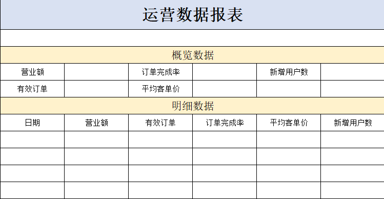

# <center>导出运营数据 Excel 报表</center>

---

## Excel 报表模板

<br/>


## 思路分析

> #### （1）设计 Excel 模板文件
>
> #### （2）查询近 30 天的运营数据
>
> #### （3）将查询到的运营数据写入模板文件
>
> #### （4）通过输出流将 Excel 文件下载到客户端浏览器

## ReportController

> #### 根据接口定义，在 ReportController 中创建 export 方法

```java
/**
 * 导出运营数据报表
 * @param response
 */
@GetMapping("/export")
@ApiOperation("导出运营数据报表")
public void export(HttpServletResponse response){
    reportService.exportBusinessData(response);
}
```

## ReportService

> #### 在 ReportService 接口中声明导出运营数据报表的方法

```java
/**
 * 导出近30天的运营数据报表
 * @param response
 **/
void exportBusinessData(HttpServletResponse response);
```

## ReportServiceImpl

> #### 在 ReportServiceImpl 实现类中实现导出运营数据报表的方法
>
> #### 提前将资料中的<span style="color:red">运营数据报表模板.xlsx</span>拷贝到项目的<span style="color:red">resources / template</span>目录中

```java
/**导出近30天的运营数据报表
 * @param response
 **/
public void exportBusinessData(HttpServletResponse response) {
    LocalDate begin = LocalDate.now().minusDays(30);
    LocalDate end = LocalDate.now().minusDays(1);
    //查询概览运营数据，提供给Excel模板文件
    BusinessDataVO businessData = workspaceService.getBusinessData(LocalDateTime.of(begin,LocalTime.MIN), LocalDateTime.of(end, LocalTime.MAX));
    InputStream inputStream = this.getClass().getClassLoader().getResourceAsStream("template/运营数据报表模板.xlsx");
    try {
        //基于提供好的模板文件创建一个新的Excel表格对象
        XSSFWorkbook excel = new XSSFWorkbook(inputStream);
        //获得Excel文件中的一个Sheet页
        XSSFSheet sheet = excel.getSheet("Sheet1");

        sheet.getRow(1).getCell(1).setCellValue(begin + "至" + end);
        //获得第4行
        XSSFRow row = sheet.getRow(3);
        //获取单元格
        row.getCell(2).setCellValue(businessData.getTurnover());
        row.getCell(4).setCellValue(businessData.getOrderCompletionRate());
        row.getCell(6).setCellValue(businessData.getNewUsers());
        row = sheet.getRow(4);
        row.getCell(2).setCellValue(businessData.getValidOrderCount());
        row.getCell(4).setCellValue(businessData.getUnitPrice());
        for (int i = 0; i < 30; i++) {
            LocalDate date = begin.plusDays(i);
            //准备明细数据
            businessData = workspaceService.getBusinessData(LocalDateTime.of(date,LocalTime.MIN), LocalDateTime.of(date, LocalTime.MAX));
            row = sheet.getRow(7 + i);
            row.getCell(1).setCellValue(date.toString());
            row.getCell(2).setCellValue(businessData.getTurnover());
            row.getCell(3).setCellValue(businessData.getValidOrderCount());
            row.getCell(4).setCellValue(businessData.getOrderCompletionRate());
            row.getCell(5).setCellValue(businessData.getUnitPrice());
            row.getCell(6).setCellValue(businessData.getNewUsers());
        }
        //通过输出流将文件下载到客户端浏览器中
        ServletOutputStream out = response.getOutputStream();
        excel.write(out);
        //关闭资源
        out.flush();
        out.close();
        excel.close();

    }catch (IOException e){
        e.printStackTrace();
    }
}
```
