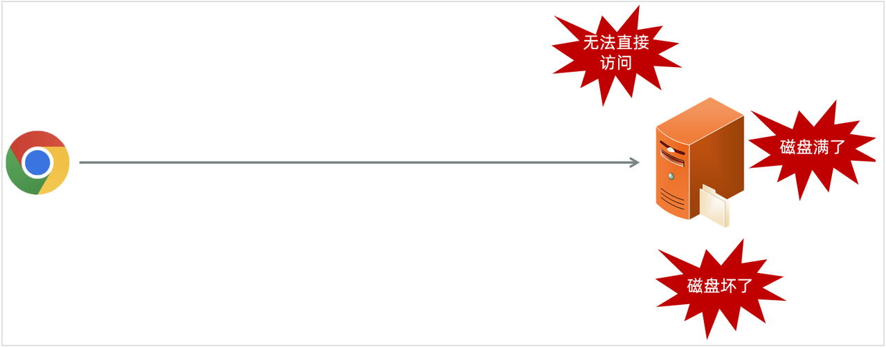

<h1 style="text-align: center;">新增菜品</h1>

---

## 本地存储

### 代码示例

```java
package com.itheima.controller;

import com.itheima.pojo.Result;
import lombok.extern.slf4j.Slf4j;
import org.springframework.web.bind.annotation.PostMapping;
import org.springframework.web.bind.annotation.RestController;
import org.springframework.web.multipart.MultipartFile;
import java.io.File;
import java.util.UUID;

@Slf4j
@RestController
public class UploadController {

    private static final String UPLOAD_DIR = "D:/images/";
    /**
     * 上传文件 - 参数名file
     */
    @PostMapping("/upload")
    public Result upload(MultipartFile file) throws Exception {
        log.info("上传文件：{}, {}, {}", username, age, file);
        if (!file.isEmpty()) {
            // 生成唯一文件名
            String originalFilename = file.getOriginalFilename();
            String extName = originalFilename.substring(originalFilename.lastIndexOf("."));
            String uniqueFileName = UUID.randomUUID().toString().replace("-", "") + extName;
            // 拼接完整的文件路径
            File targetFile = new File(UPLOAD_DIR + uniqueFileName);

            // 如果目标目录不存在，则创建它
            if (!targetFile.getParentFile().exists()) {
                targetFile.getParentFile().mkdirs();
            }
            // 保存文件
            file.transferTo(targetFile);
        }
        return Result.success();
    }
}
```

### 取消文件上传大小限制

> #### 在 <span style="color:red">SpringBoot</span> 中，文件上传时<span style="color:red">默认</span>单个文件最大大小为 <span style="color:red">1M</span>
>
> #### 那么如果需要上传大文件，可以在 <span style="color:red">application.properties</span> 进行如下配置

```yml
spring：
  servlet:
    multipart:
      max-file-size: 10MB
      max-request-size: 100MB
```

### 本地存储缺陷



#### 如果直接存储在服务器的磁盘目录中，存在以下缺点

> #### 不安全：磁盘如果损坏，所有的文件就会丢失
>
> #### 容量有限：如果存储大量的图片，磁盘空间有限（磁盘不可能无限制扩容）
>
> #### 无法直接访问

#### 为了解决上述问题呢，通常有两种解决方案

> #### 自己搭建存储服务器，如：fastDFS 、MinIO
>
> #### 使用现成的云服务，如：阿里云，腾讯云，华为云

## 阿里云 OSS

### 定义 OSS 相关配置

> #### 在 sky-server 模块定义如下代码

#### （1）application-dev.yml

> #### ⚠️ 注意：相关配置信息需要修改为自己的

```yaml
sky:
  alioss:
    endpoint: oss-cn-hangzhou.aliyuncs.com
    access-key-id: 自己的密钥
    access-key-secret: 自己的密钥
    bucket-name: sky-take-out
```

#### （2）application.yml

```yaml
spring:
  profiles:
    active: dev #设置环境
sky:
  alioss:
    endpoint: ${sky.alioss.endpoint}
    access-key-id: ${sky.alioss.access-key-id}
    access-key-secret: ${sky.alioss.access-key-secret}
    bucket-name: ${sky.alioss.bucket-name}
```

### 读取 OSS 配置

> #### 在 sky-common 模块中，已定义

```java
package com.sky.properties;

import lombok.Data;
import org.springframework.boot.context.properties.ConfigurationProperties;
import org.springframework.stereotype.Component;

@Component
@ConfigurationProperties(prefix = "sky.alioss")
@Data
public class AliOssProperties {

    private String endpoint;
    private String accessKeyId;
    private String accessKeySecret;
    private String bucketName;

}
```

### 生成 OSS 工具类对象

> #### 在 sky-server 模块，定义如下代码
>
> #### 在导入的初始工程代码中，AliOssUtil.java 已在 sky-common 模块中定义

```java
package com.sky.config;

import com.sky.properties.AliOssProperties;
import com.sky.utils.AliOssUtil;
import lombok.extern.slf4j.Slf4j;
import org.springframework.boot.autoconfigure.condition.ConditionalOnMissingBean;
import org.springframework.context.annotation.Bean;
import org.springframework.context.annotation.Configuration;

/**
 * 配置类，用于创建AliOssUtil对象
 */
@Configuration
@Slf4j
public class OssConfiguration {

    @Bean
    @ConditionalOnMissingBean
    public AliOssUtil aliOssUtil(AliOssProperties aliOssProperties){
        log.info("开始创建阿里云文件上传工具类对象：{}",aliOssProperties);
        return new AliOssUtil(aliOssProperties.getEndpoint(),
                aliOssProperties.getAccessKeyId(),
                aliOssProperties.getAccessKeySecret(),
                aliOssProperties.getBucketName());
    }
}
```

### AliOssUtil . java

```java
package com.sky.utils;

import com.aliyun.oss.ClientException;
import com.aliyun.oss.OSS;
import com.aliyun.oss.OSSClientBuilder;
import com.aliyun.oss.OSSException;
import lombok.AllArgsConstructor;
import lombok.Data;
import lombok.extern.slf4j.Slf4j;
import java.io.ByteArrayInputStream;

@Data
@AllArgsConstructor
@Slf4j
public class AliOssUtil {

    private String endpoint;
    private String accessKeyId;
    private String accessKeySecret;
    private String bucketName;

    /**
     * 文件上传
     *
     * @param bytes
     * @param objectName
     * @return
     */
    public String upload(byte[] bytes, String objectName) {

        // 创建OSSClient实例。
        OSS ossClient = new OSSClientBuilder().build(endpoint, accessKeyId, accessKeySecret);

        try {
            // 创建PutObject请求。
            ossClient.putObject(bucketName, objectName, new ByteArrayInputStream(bytes));
        } catch (OSSException oe) {
            System.out.println("Caught an OSSException, which means your request made it to OSS, "
                    + "but was rejected with an error response for some reason.");
            System.out.println("Error Message:" + oe.getErrorMessage());
            System.out.println("Error Code:" + oe.getErrorCode());
            System.out.println("Request ID:" + oe.getRequestId());
            System.out.println("Host ID:" + oe.getHostId());
        } catch (ClientException ce) {
            System.out.println("Caught an ClientException, which means the client encountered "
                    + "a serious internal problem while trying to communicate with OSS, "
                    + "such as not being able to access the network.");
            System.out.println("Error Message:" + ce.getMessage());
        } finally {
            if (ossClient != null) {
                ossClient.shutdown();
            }
        }

        //文件访问路径规则 https://BucketName.Endpoint/ObjectName
        StringBuilder stringBuilder = new StringBuilder("https://");
        stringBuilder
                .append(bucketName)
                .append(".")
                .append(endpoint)
                .append("/")
                .append(objectName);

        log.info("文件上传到:{}", stringBuilder.toString());

        return stringBuilder.toString();
    }
}
```

### 定义文件上传接口

> #### 在 sky-server 模块中定义接口

```java
package com.sky.controller.admin;

import com.sky.constant.MessageConstant;
import com.sky.result.Result;
import com.sky.utils.AliOssUtil;
import io.swagger.annotations.Api;
import io.swagger.annotations.ApiOperation;
import lombok.extern.slf4j.Slf4j;
import org.springframework.beans.factory.annotation.Autowired;
import org.springframework.web.bind.annotation.PostMapping;
import org.springframework.web.bind.annotation.RequestMapping;
import org.springframework.web.bind.annotation.RestController;
import org.springframework.web.multipart.MultipartFile;
import java.io.IOException;
import java.util.UUID;

/**
 * 通用接口
 */
@RestController
@RequestMapping("/admin/common")
@Api(tags = "通用接口")
@Slf4j
public class CommonController {

    @Autowired
    private AliOssUtil aliOssUtil;

    /**
     * 文件上传
     * @param file
     * @return
     */
    @PostMapping("/upload")
    @ApiOperation("文件上传")
    public Result<String> upload(MultipartFile file){
        log.info("文件上传：{}",file);

        try {
            //原始文件名
            String originalFilename = file.getOriginalFilename();
            //截取原始文件名的后缀   dfdfdf.png
            String extension = originalFilename.substring(originalFilename.lastIndexOf("."));
            //构造新文件名称
            String objectName = UUID.randomUUID().toString() + extension;

            //文件的请求路径
            String filePath = aliOssUtil.upload(file.getBytes(), objectName);
            return Result.success(filePath);
        } catch (IOException e) {
            log.error("文件上传失败：{}", e);
        }

        return Result.error(MessageConstant.UPLOAD_FAILED);
    }
}
```

## 新增菜品

### 需求分析

> #### 菜品包含口味，新增菜品信息的同时需要保存菜品对应的口味信息

#### 接口设计

> #### （1）根据类型查询分类（已完成）
>
> #### （2）文件上传
>
> #### （3）新增菜品

### DishController

```java
package com.sky.controller.admin;

import com.sky.dto.DishDTO;
import com.sky.dto.DishPageQueryDTO;
import com.sky.entity.Dish;
import com.sky.result.PageResult;
import com.sky.result.Result;
import com.sky.service.DishService;
import com.sky.vo.DishVO;
import io.swagger.annotations.Api;
import io.swagger.annotations.ApiOperation;
import lombok.extern.slf4j.Slf4j;
import org.springframework.beans.factory.annotation.Autowired;
import org.springframework.web.bind.annotation.*;
import java.util.List;
import java.util.Set;

/**
 * 菜品管理
 */
@RestController
@RequestMapping("/admin/dish")
@Api(tags = "菜品相关接口")
@Slf4j
public class DishController {

    @Autowired
    private DishService dishService;

    /**
     * 新增菜品
     *
     * @param dishDTO
     * @return
     */
    @PostMapping
    @ApiOperation("新增菜品")
    public Result save(@RequestBody DishDTO dishDTO) {
        log.info("新增菜品：{}", dishDTO);
        dishService.saveWithFlavor(dishDTO);//后绪步骤开发
        return Result.success();
    }
}
```

### DishService

```java
package com.sky.service;

import com.sky.dto.DishDTO;
import com.sky.entity.Dish;

public interface DishService {

    /**
     * 新增菜品和对应的口味
     *
     * @param dishDTO
     */
    public void saveWithFlavor(DishDTO dishDTO);

}
```

### DishServiceImpl

```java
package com.sky.service.impl;


@Service
@Slf4j
public class DishServiceImpl implements DishService {

    @Autowired
    private DishMapper dishMapper;
    @Autowired
    private DishFlavorMapper dishFlavorMapper;

    /**
     * 新增菜品和对应的口味
     *
     * @param dishDTO
     */
    @Transactional
    public void saveWithFlavor(DishDTO dishDTO) {

        Dish dish = new Dish();
        BeanUtils.copyProperties(dishDTO, dish);

        //向菜品表插入1条数据
        dishMapper.insert(dish);//后绪步骤实现

        //获取insert语句生成的主键值
        Long dishId = dish.getId();

        List<DishFlavor> flavors = dishDTO.getFlavors();
        if (flavors != null && flavors.size() > 0) {
            flavors.forEach(dishFlavor -> {
                dishFlavor.setDishId(dishId);
            });
            //向口味表插入n条数据
            dishFlavorMapper.insertBatch(flavors);//后绪步骤实现
        }
    }

}
```

### DishMapper

```java
/**
 * 插入菜品数据
 *
 * @param dish
 */
@AutoFill(value = OperationType.INSERT)
void insert(Dish dish);
```

### DishMapper.xml

```xml
<?xml version="1.0" encoding="UTF-8" ?>
<!DOCTYPE mapper PUBLIC "-//mybatis.org//DTD Mapper 3.0//EN"
        "http://mybatis.org/dtd/mybatis-3-mapper.dtd" >
<mapper namespace="com.sky.mapper.DishMapper">

    <insert id="insert" useGeneratedKeys="true" keyProperty="id">
        insert into dish (name, category_id, price, image, description, create_time, update_time, create_user,update_user, status)
        values (#{name}, #{categoryId}, #{price}, #{image}, #{description}, #{createTime}, #{updateTime}, #{createUser}, #{updateUser}, #{status})
    </insert>
</mapper>
```

### DishFlavorMapper

```java
package com.sky.mapper;

import com.sky.entity.DishFlavor;
import java.util.List;

@Mapper
public interface DishFlavorMapper {
    /**
     * 批量插入口味数据
     * @param flavors
     */
    void insertBatch(List<DishFlavor> flavors);

}
```

### DishFlavorMapper.xml

```xml
<?xml version="1.0" encoding="UTF-8" ?>
<!DOCTYPE mapper PUBLIC "-//mybatis.org//DTD Mapper 3.0//EN"
        "http://mybatis.org/dtd/mybatis-3-mapper.dtd" >
<mapper namespace="com.sky.mapper.DishFlavorMapper">
    <insert id="insertBatch">
        insert into dish_flavor (dish_id, name, value) VALUES
        <foreach collection="flavors" item="df" separator=",">
            (#{df.dishId},#{df.name},#{df.value})
        </foreach>
    </insert>
</mapper>
```
