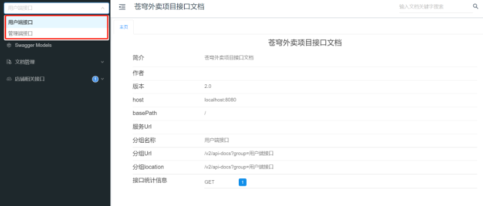

<h1 style="text-align: center;">Swagger 配置优化</h1>
 
- - -

## 需求分析

> #### 我们要实现管理端和用户端接口进行区分

## 实现步骤

> #### 在 WebMvcConfiguration.java 中，分别扫描 com.sky.controller.admin 和 com.sky.controller.user 这两个包

```java
@Bean
public Docket docket1(){
    log.info("准备生成接口文档...");
    ApiInfo apiInfo = new ApiInfoBuilder()
            .title("苍穹外卖项目接口文档")
            .version("2.0")
            .description("苍穹外卖项目接口文档")
            .build();

    Docket docket = new Docket(DocumentationType.SWAGGER_2)
            .groupName("管理端接口")
            .apiInfo(apiInfo)
            .select()
            //指定生成接口需要扫描的包
            .apis(RequestHandlerSelectors.basePackage("com.sky.controller.admin"))
            .paths(PathSelectors.any())
            .build();

    return docket;
}

@Bean
public Docket docket2(){
    log.info("准备生成接口文档...");
    ApiInfo apiInfo = new ApiInfoBuilder()
            .title("苍穹外卖项目接口文档")
            .version("2.0")
            .description("苍穹外卖项目接口文档")
            .build();

    Docket docket = new Docket(DocumentationType.SWAGGER_2)
            .groupName("用户端接口")
            .apiInfo(apiInfo)
            .select()
            //指定生成接口需要扫描的包
            .apis(RequestHandlerSelectors.basePackage("com.sky.controller.user"))
            .paths(PathSelectors.any())
            .build();

    return docket;
}
```

#### 重启服务器，再次访问 `http://localhost:8080/swagger-ui.html`，即可看到管理端和用户端接口进行了区分

<br/>

