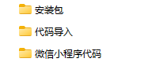
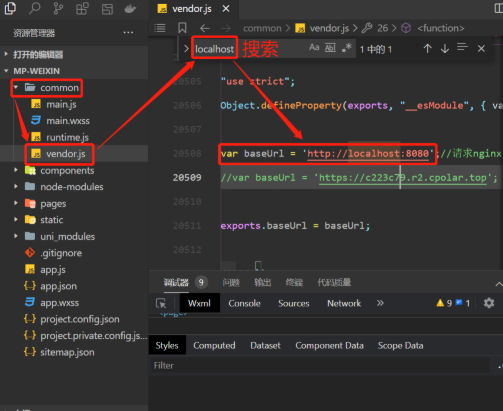
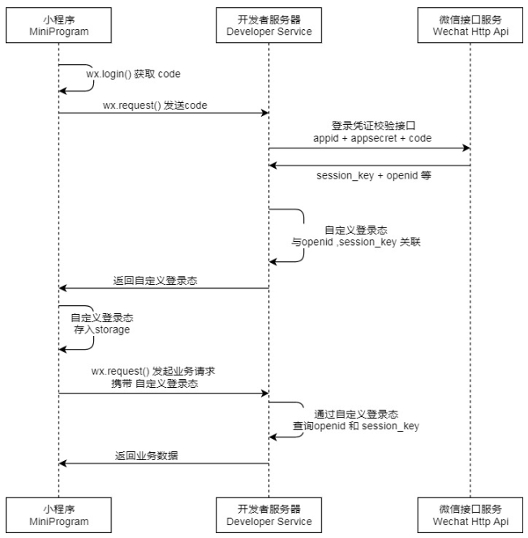
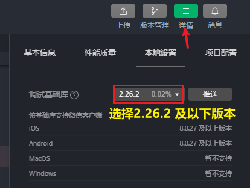

<h1 style="text-align: center;">微信登录</h1>
 
- - -

## 准备工作

### 代码导入

> #### 找到当天的资料，导入微信小程序代码

<br/>


### 修改配置

> #### 因为小程序要请求后端服务，需要修改为自己后端服务的 ip 地址和端口号（默认不需要修改）
>
> #### common --> vendor.js --> 搜索 （ctrl+f） --> baseUri

<br/>


## 微信登录流程

### 基本介绍

> #### 微信登录：https://developers.weixin.qq.com/miniprogram/dev/framework/open-ability/login.html

<br/>


#### 步骤分析

> #### （1）小程序端，调用 wx.login()获取 code，就是授权码
>
> #### （2）小程序端，调用 wx.request()发送请求并携带 code，请求开发者服务器(自己编写的后端服务)
>
> #### （3）开发者服务端，通过 HttpClient 向微信接口服务发送请求，并携带 appId+appsecret+code 三个参数
>
> #### （4）开发者服务端，接收微信接口服务返回的数据，session_key+opendId 等。opendId 是微信用户的唯一标识
>
> #### （5）开发者服务端，自定义登录态，生成令牌(token)和 openid 等数据返回给小程序端，方便后绪请求身份校验
>
> #### （6）小程序端，收到自定义登录态，存储 storage
>
> #### （7）小程序端，后绪通过 wx.request()发起业务请求时，携带 token
>
> #### （8）开发者服务端，收到请求后，通过携带的 token，解析当前登录用户的 id
>
> #### （9）开发者服务端，身份校验通过后，继续相关的业务逻辑处理，最终返回业务数据

### 说明

#### （1）调用 [wx.login()](https://developers.weixin.qq.com/miniprogram/dev/api/open-api/login/wx.login.html) 获取<span style="color:red;">临时登录凭证 code</span>，并回传到开发者服务器

#### （2）调用 [auth.code2Session](https://developers.weixin.qq.com/miniprogram/dev/api-backend/open-api/login/auth.code2Session.html) 接口，换取用户<span style="color:red;">唯一标识 OpenID</span>、用户在微信开放平台帐号下的唯一标识 UnionID（若当前小程序已绑定到微信开放平台帐号）和<span style="color:red;">会话密钥 session_key</span>

> #### 之后开发者服务器可以根据用户标识来生成自定义登录态，用于后续业务逻辑中前后端交互时识别用户身份

## 代码实现

### 定义相关配置

#### （1）配置微信登录所需配置项

> #### application-dev.yml

```yaml
sky:
  wechat:
    appid: wxffb3637a228223b8
    secret: 84311df9199ecacdf4f12d27b6b9522d
```

> #### application.yml

```yaml
sky:
  wechat:
    appid: ${sky.wechat.appid}
    secret: ${sky.wechat.secret}
```

#### （2）配置为微信用户生成 jwt 令牌时使用的配置项

> #### application.yml

```yaml
sky:
  jwt:
    # 设置jwt签名加密时使用的秘钥
    admin-secret-key: itcast
    # 设置jwt过期时间
    admin-ttl: 7200000
    # 设置前端传递过来的令牌名称
    admin-token-name: token
    user-secret-key: itheima
    user-ttl: 7200000
    user-token-name: authentication
```

### UserController

```java
package com.sky.controller.user;

import com.sky.constant.JwtClaimsConstant;
import com.sky.dto.UserLoginDTO;
import com.sky.entity.User;
import com.sky.properties.JwtProperties;
import com.sky.result.Result;
import com.sky.service.UserService;
import com.sky.utils.JwtUtil;
import com.sky.vo.UserLoginVO;
import io.swagger.annotations.Api;
import io.swagger.annotations.ApiOperation;
import lombok.extern.slf4j.Slf4j;
import org.springframework.beans.factory.annotation.Autowired;
import org.springframework.web.bind.annotation.PostMapping;
import org.springframework.web.bind.annotation.RequestBody;
import org.springframework.web.bind.annotation.RequestMapping;
import org.springframework.web.bind.annotation.RestController;
import java.util.HashMap;
import java.util.Map;

@RestController
@RequestMapping("/user/user")
@Api(tags = "C端用户相关接口")
@Slf4j
public class UserController {

    @Autowired
    private UserService userService;
    @Autowired
    private JwtProperties jwtProperties;

    /**
     * 微信登录
     * @param userLoginDTO
     * @return
     */
    @PostMapping("/login")
    @ApiOperation("微信登录")
    public Result<UserLoginVO> login(@RequestBody UserLoginDTO userLoginDTO){
        log.info("微信用户登录：{}",userLoginDTO.getCode());

        //微信登录
        User user = userService.wxLogin(userLoginDTO);//后绪步骤实现

        //为微信用户生成jwt令牌
        Map<String, Object> claims = new HashMap<>();
        claims.put(JwtClaimsConstant.USER_ID,user.getId());
        String token = JwtUtil.createJWT(jwtProperties.getUserSecretKey(), jwtProperties.getUserTtl(), claims);

        UserLoginVO userLoginVO = UserLoginVO.builder()
                .id(user.getId())
                .openid(user.getOpenid())
                .token(token)
                .build();
        return Result.success(userLoginVO);
    }
}
```

### UserService

```java
package com.sky.service;

import com.sky.dto.UserLoginDTO;
import com.sky.entity.User;

public interface UserService {

    /**
     * 微信登录
     * @param userLoginDTO
     * @return
     */
    User wxLogin(UserLoginDTO userLoginDTO);
}
```

### UserServiceImpl

```java
package com.sky.service.impl;

import com.alibaba.fastjson.JSON;
import com.alibaba.fastjson.JSONObject;
import com.sky.constant.MessageConstant;
import com.sky.dto.UserLoginDTO;
import com.sky.entity.User;
import com.sky.exception.LoginFailedException;
import com.sky.mapper.UserMapper;
import com.sky.properties.WeChatProperties;
import com.sky.service.UserService;
import com.sky.utils.HttpClientUtil;
import lombok.extern.slf4j.Slf4j;
import org.springframework.beans.factory.annotation.Autowired;
import org.springframework.stereotype.Service;

import java.time.LocalDateTime;
import java.util.HashMap;
import java.util.Map;

@Service
@Slf4j
public class UserServiceImpl implements UserService {

    //微信服务接口地址
    public static final String WX_LOGIN = "https://api.weixin.qq.com/sns/jscode2session";

    @Autowired
    private WeChatProperties weChatProperties;
    @Autowired
    private UserMapper userMapper;

    /**
     * 微信登录
     * @param userLoginDTO
     * @return
     */
    public User wxLogin(UserLoginDTO userLoginDTO) {
        String openid = getOpenid(userLoginDTO.getCode());

        //判断openid是否为空，如果为空表示登录失败，抛出业务异常
        if(openid == null){
            throw new LoginFailedException(MessageConstant.LOGIN_FAILED);
        }

        //判断当前用户是否为新用户
        User user = userMapper.getByOpenid(openid);

        //如果是新用户，自动完成注册
        if(user == null){
            user = User.builder()
                    .openid(openid)
                    .createTime(LocalDateTime.now())
                    .build();
            userMapper.insert(user);//后绪步骤实现
        }

        //返回这个用户对象
        return user;
    }

    /**
     * 调用微信接口服务，获取微信用户的openid
     * @param code
     * @return
     */
    private String getOpenid(String code){
        //调用微信接口服务，获得当前微信用户的openid
        Map<String, String> map = new HashMap<>();
        map.put("appid",weChatProperties.getAppid());
        map.put("secret",weChatProperties.getSecret());
        map.put("js_code",code);
        map.put("grant_type","authorization_code");
        String json = HttpClientUtil.doGet(WX_LOGIN, map);

        JSONObject jsonObject = JSON.parseObject(json);
        String openid = jsonObject.getString("openid");
        return openid;
    }
}
```

### UserMapper

```java
package com.sky.mapper;

import com.sky.entity.User;
import org.apache.ibatis.annotations.Mapper;
import org.apache.ibatis.annotations.Select;

@Mapper
public interface UserMapper {

    /**
     * 根据openid查询用户
     * @param openid
     * @return
     */
    @Select("select * from user where openid = #{openid}")
    User getByOpenid(String openid);

    /**
     * 插入数据
     * @param user
     */
    void insert(User user);
}
```

### UserMapper.xml

```xml
<?xml version="1.0" encoding="UTF-8" ?>
<!DOCTYPE mapper PUBLIC "-//mybatis.org//DTD Mapper 3.0//EN"
        "http://mybatis.org/dtd/mybatis-3-mapper.dtd" >
<mapper namespace="com.sky.mapper.UserMapper">

    <insert id="insert" useGeneratedKeys="true" keyProperty="id">
        insert into user (openid, name, phone, sex, id_number, avatar, create_time)
        values (#{openid}, #{name}, #{phone}, #{sex}, #{idNumber}, #{avatar}, #{createTime})
    </insert>

</mapper>
```

### 编写拦截器

> #### 编写拦截器 JwtTokenUserInterceptor，统一拦截用户端发送的请求并进行 jwt 校验

```java
package com.sky.interceptor;

import com.sky.constant.JwtClaimsConstant;
import com.sky.context.BaseContext;
import com.sky.properties.JwtProperties;
import com.sky.utils.JwtUtil;
import io.jsonwebtoken.Claims;
import lombok.extern.slf4j.Slf4j;
import org.springframework.beans.factory.annotation.Autowired;
import org.springframework.stereotype.Component;
import org.springframework.web.method.HandlerMethod;
import org.springframework.web.servlet.HandlerInterceptor;

import javax.servlet.http.HttpServletRequest;
import javax.servlet.http.HttpServletResponse;

/**
 * jwt令牌校验的拦截器
 */
@Component
@Slf4j
public class JwtTokenUserInterceptor implements HandlerInterceptor {

    @Autowired
    private JwtProperties jwtProperties;

    /**
     * 校验jwt
     *
     * @param request
     * @param response
     * @param handler
     * @return
     * @throws Exception
     */
    public boolean preHandle(HttpServletRequest request, HttpServletResponse response, Object handler) throws Exception {
        //判断当前拦截到的是Controller的方法还是其他资源
        if (!(handler instanceof HandlerMethod)) {
            //当前拦截到的不是动态方法，直接放行
            return true;
        }

        //1、从请求头中获取令牌
        String token = request.getHeader(jwtProperties.getUserTokenName());

        //2、校验令牌
        try {
            log.info("jwt校验:{}", token);
            Claims claims = JwtUtil.parseJWT(jwtProperties.getUserSecretKey(), token);
            Long userId = Long.valueOf(claims.get(JwtClaimsConstant.USER_ID).toString());
            log.info("当前用户的id：", userId);
            BaseContext.setCurrentId(userId);
            //3、通过，放行
            return true;
        } catch (Exception ex) {
            //4、不通过，响应401状态码
            response.setStatus(401);
            return false;
        }
    }
}
```

**在 WebMvcConfiguration 配置类中注册拦截器：**

```java
	@Autowired
    private JwtTokenUserInterceptor jwtTokenUserInterceptor;
	/**
     * 注册自定义拦截器
     * @param registry
     */
    protected void addInterceptors(InterceptorRegistry registry) {
        log.info("开始注册自定义拦截器...");
        //.........

        registry.addInterceptor(jwtTokenUserInterceptor)
                .addPathPatterns("/user/**")
                .excludePathPatterns("/user/user/login")
                .excludePathPatterns("/user/shop/status");
    }
```

## ⚠️ 登录无弹验证窗问题


