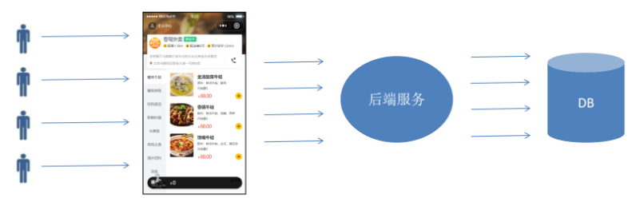
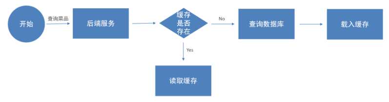
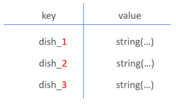

<h1 style="text-align: center;">缓存菜品</h1>
 
- - -

## 需求分析

### 问题引入

> #### 用户端小程序展示的菜品数据都是通过查询数据库获得，如果用户端访问量比较大，数据库访问压力随之增大，导致系统响应慢、用户体验差



### 解决思路

> #### 通过 <span style="color:red;">Redis</span> 来缓存菜品数据，减少数据库查询操作



### 缓存逻辑分析



> #### 每个分类下的菜品保存一份缓存数据
>
> #### 数据库中菜品数据有变更时清理缓存数据

### 需要优化的地方

> #### 新增菜品
>
> #### 修改菜品
>
> #### 批量删除菜品
>
> #### 起售、停售菜品

## 用户端 DishController

```java
@Autowired
private RedisTemplate redisTemplate;
/**
 * 根据分类id查询菜品
 *
 * @param categoryId
 * @return
 */
@GetMapping("/list")
@ApiOperation("根据分类id查询菜品")
public Result<List<DishVO>> list(Long categoryId) {

    //构造redis中的key，规则：dish_分类id
    String key = "dish_" + categoryId;

    //查询redis中是否存在菜品数据
    List<DishVO> list = (List<DishVO>) redisTemplate.opsForValue().get(key);
    if(list != null && list.size() > 0){
        //如果存在，直接返回，无须查询数据库
        return Result.success(list);
    }
    ////////////////////////////////////////////////////////
    Dish dish = new Dish();
    dish.setCategoryId(categoryId);
    dish.setStatus(StatusConstant.ENABLE);//查询起售中的菜品

    //如果不存在，查询数据库，将查询到的数据放入redis中
    list = dishService.listWithFlavor(dish);
    ////////////////////////////////////////////////////////
    redisTemplate.opsForValue().set(key, list);

    return Result.success(list);
}
```

## 管理端 DishController

### 抽取清理缓存的方法

> #### 在管理端 DishController 中添加

```java
@Autowired
private RedisTemplate redisTemplate;
/**
 * 清理缓存数据
 * @param pattern
 */
private void cleanCache(String pattern){
    Set keys = redisTemplate.keys(pattern);
    redisTemplate.delete(keys);
}
```

### 新增菜品优化

```java
/**
 * 新增菜品
 *
 * @param dishDTO
 * @return
 */
@PostMapping
@ApiOperation("新增菜品")
public Result save(@RequestBody DishDTO dishDTO) {
    log.info("新增菜品：{}", dishDTO);
    dishService.saveWithFlavor(dishDTO);

    //清理缓存数据
    String key = "dish_" + dishDTO.getCategoryId();
    cleanCache(key);
    return Result.success();
}
```

### 菜品批量删除优化

```java
/**
 * 菜品批量删除
 *
 * @param ids
 * @return
 */
@DeleteMapping
@ApiOperation("菜品批量删除")
public Result delete(@RequestParam List<Long> ids) {
    log.info("菜品批量删除：{}", ids);
    dishService.deleteBatch(ids);

    //将所有的菜品缓存数据清理掉，所有以dish_开头的key
    cleanCache("dish_*");

    return Result.success();
}
```

### 修改菜品优化

```java
/**
 * 修改菜品
 *
 * @param dishDTO
 * @return
 */
@PutMapping
@ApiOperation("修改菜品")
public Result update(@RequestBody DishDTO dishDTO) {
    log.info("修改菜品：{}", dishDTO);
    dishService.updateWithFlavor(dishDTO);

    //将所有的菜品缓存数据清理掉，所有以dish_开头的key
    cleanCache("dish_*");

    return Result.success();
}
```

### 菜品起售停售优化

```java
/**
 * 菜品起售停售
 *
 * @param status
 * @param id
 * @return
 */
@PostMapping("/status/{status}")
@ApiOperation("菜品起售停售")
public Result<String> startOrStop(@PathVariable Integer status, Long id) {
    dishService.startOrStop(status, id);

    //将所有的菜品缓存数据清理掉，所有以dish_开头的key
    cleanCache("dish_*");

    return Result.success();
}
```
