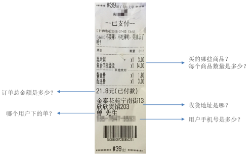
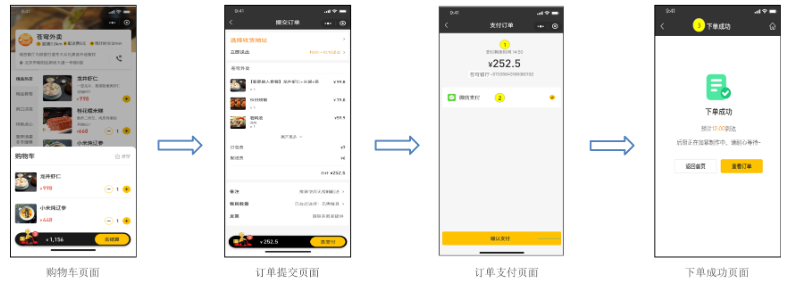

<h1 style="text-align: center;">用户下单</h1>
 
- - -

## 需求分析

### 产品分析

#### （1）用户下单业务说明

> #### 在电商系统中，用户是通过下单的方式通知商家，用户已经购买了商品，需要商家进行备货和发货
>
> #### 用户下单后会产生订单相关数据，订单数据需要能够体现如下信息



#### （2）用户将菜品或者套餐加入购物车后，可以点击购物车中的 "去结算" 按钮，页面跳转到订单确认页面，点击 "去支付" 按钮则完成下单操作

> #### 用户点餐业务流程（效果图）

<br/>


### 表设计

> #### 用户下单业务对应的数据表为 orders 表和 order_detail 表（一对多关系，一个订单关联多个订单明细）

| 表名         | 含义       | 说明                                                                           |
| ------------ | ---------- | ------------------------------------------------------------------------------ |
| orders       | 订单表     | 主要存储订单的基本信息(如: 订单号、状态、金额、支付方式、下单用户、收件地址等) |
| order_detail | 订单明细表 | 主要存储订单详情信息(如: 该订单关联的套餐及菜品的信息)                         |

#### （1）orders 订单表

| **字段名**              | **数据类型**  | **说明**     | **备注**                                              |
| ----------------------- | ------------- | ------------ | ----------------------------------------------------- |
| id                      | bigint        | 主键         | 自增                                                  |
| number                  | varchar(50)   | 订单号       |                                                       |
| status                  | int           | 订单状态     | 1 待付款 2 待接单 3 已接单 4 派送中 5 已完成 6 已取消 |
| user_id                 | bigint        | 用户 id      | 逻辑外键                                              |
| address_book_id         | bigint        | 地址 id      | 逻辑外键                                              |
| order_time              | datetime      | 下单时间     |                                                       |
| checkout_time           | datetime      | 付款时间     |                                                       |
| pay_method              | int           | 支付方式     | 1 微信支付 2 支付宝支付                               |
| pay_status              | tinyint       | 支付状态     | 0 未支付 1 已支付 2 退款                              |
| amount                  | decimal(10,2) | 订单金额     |                                                       |
| remark                  | varchar(100)  | 备注信息     |                                                       |
| phone                   | varchar(11)   | 手机号       | 冗余字段                                              |
| address                 | varchar(255)  | 详细地址信息 | 冗余字段                                              |
| consignee               | varchar(32)   | 收货人       | 冗余字段                                              |
| cancel_reason           | varchar(255)  | 订单取消原因 |                                                       |
| rejection_reason        | varchar(255)  | 拒单原因     |                                                       |
| cancel_time             | datetime      | 订单取消时间 |                                                       |
| estimated_delivery_time | datetime      | 预计送达时间 |                                                       |
| delivery_status         | tinyint       | 配送状态     | 1 立即送出 0 选择具体时间                             |
| delivery_time           | datetime      | 送达时间     |                                                       |
| pack_amount             | int           | 打包费       |                                                       |
| tableware_number        | int           | 餐具数量     |                                                       |
| tableware_status        | tinyint       | 餐具数量状态 | 1 按餐量提供 0 选择具体数量                           |

#### （2）order_detail 订单明细表

| **字段名**  | **数据类型**  | **说明**     | **备注** |
| ----------- | ------------- | ------------ | -------- |
| id          | bigint        | 主键         | 自增     |
| name        | varchar(32)   | 商品名称     | 冗余字段 |
| image       | varchar(255)  | 商品图片路径 | 冗余字段 |
| order_id    | bigint        | 订单 id      | 逻辑外键 |
| dish_id     | bigint        | 菜品 id      | 逻辑外键 |
| setmeal_id  | bigint        | 套餐 id      | 逻辑外键 |
| dish_flavor | varchar(50)   | 菜品口味     |          |
| number      | int           | 商品数量     |          |
| amount      | decimal(10,2) | 商品单价     |          |

> #### 说明：用户提交订单时，需要往订单表 orders 中插入一条记录，并且需要往 order_detail 中插入一条或多条记录

## OrderController

> #### 创建 OrderController 并提供用户下单方法

```java
package com.sky.controller.user;

import com.sky.dto.OrdersPaymentDTO;
import com.sky.dto.OrdersSubmitDTO;
import com.sky.result.PageResult;
import com.sky.result.Result;
import com.sky.service.OrderService;
import com.sky.vo.OrderPaymentVO;
import com.sky.vo.OrderSubmitVO;
import com.sky.vo.OrderVO;
import io.swagger.annotations.Api;
import io.swagger.annotations.ApiOperation;
import lombok.extern.slf4j.Slf4j;
import org.springframework.beans.factory.annotation.Autowired;
import org.springframework.web.bind.annotation.*;

/**
 * 订单
 */
@RestController("userOrderController")
@RequestMapping("/user/order")
@Slf4j
@Api(tags = "C端-订单接口")
public class OrderController {

    @Autowired
    private OrderService orderService;

    /**
     * 用户下单
     *
     * @param ordersSubmitDTO
     * @return
     */
    @PostMapping("/submit")
    @ApiOperation("用户下单")
    public Result<OrderSubmitVO> submit(@RequestBody OrdersSubmitDTO ordersSubmitDTO) {
        log.info("用户下单：{}", ordersSubmitDTO);
        OrderSubmitVO orderSubmitVO = orderService.submitOrder(ordersSubmitDTO);
        return Result.success(orderSubmitVO);
    }

}
```

## OrderService

> #### 创建 OrderService 接口，并声明用户下单方法

```java
package com.sky.service;

import com.sky.dto.*;
import com.sky.vo.OrderSubmitVO;

public interface OrderService {

    /**
     * 用户下单
     * @param ordersSubmitDTO
     * @return
     */
    OrderSubmitVO submitOrder(OrdersSubmitDTO ordersSubmitDTO);
}
```

## OrderServiceImpl

> #### 创建 OrderServiceImpl 实现 OrderService 接口

```java
package com.sky.service.impl;

/**
 * 订单
 */
@Service
@Slf4j
public class OrderServiceImpl implements OrderService {
    @Autowired
    private OrderMapper orderMapper;
    @Autowired
    private OrderDetailMapper orderDetailMapper;
    @Autowired
    private ShoppingCartMapper shoppingCartMapper;
    @Autowired
    private AddressBookMapper addressBookMapper;


    /**
     * 用户下单
     *
     * @param ordersSubmitDTO
     * @return
     */
    @Transactional
    public OrderSubmitVO submitOrder(OrdersSubmitDTO ordersSubmitDTO) {
        //异常情况的处理（收货地址为空、超出配送范围、购物车为空）
        AddressBook addressBook = addressBookMapper.getById(ordersSubmitDTO.getAddressBookId());
        if (addressBook == null) {
            throw new AddressBookBusinessException(MessageConstant.ADDRESS_BOOK_IS_NULL);
        }

        Long userId = BaseContext.getCurrentId();
        ShoppingCart shoppingCart = new ShoppingCart();
        shoppingCart.setUserId(userId);

        //查询当前用户的购物车数据
        List<ShoppingCart> shoppingCartList = shoppingCartMapper.list(shoppingCart);
        if (shoppingCartList == null || shoppingCartList.size() == 0) {
            throw new ShoppingCartBusinessException(MessageConstant.SHOPPING_CART_IS_NULL);
        }

        //构造订单数据
        Orders order = new Orders();
        BeanUtils.copyProperties(ordersSubmitDTO,order);
        order.setPhone(addressBook.getPhone());
        order.setAddress(addressBook.getDetail());
        order.setConsignee(addressBook.getConsignee());
        order.setNumber(String.valueOf(System.currentTimeMillis()));
        order.setUserId(userId);
        order.setStatus(Orders.PENDING_PAYMENT);
        order.setPayStatus(Orders.UN_PAID);
        order.setOrderTime(LocalDateTime.now());

        //向订单表插入1条数据
        orderMapper.insert(order);

        //订单明细数据
        List<OrderDetail> orderDetailList = new ArrayList<>();
        for (ShoppingCart cart : shoppingCartList) {
            OrderDetail orderDetail = new OrderDetail();
            BeanUtils.copyProperties(cart, orderDetail);
            orderDetail.setOrderId(order.getId());
            orderDetailList.add(orderDetail);
        }

        //向明细表插入n条数据
        orderDetailMapper.insertBatch(orderDetailList);

        //清理购物车中的数据
        shoppingCartMapper.deleteByUserId(userId);

        //封装返回结果
        OrderSubmitVO orderSubmitVO = OrderSubmitVO.builder()
                .id(order.getId())
                .orderNumber(order.getNumber())
                .orderAmount(order.getAmount())
                .orderTime(order.getOrderTime())
                .build();

        return orderSubmitVO;
    }

}
```

## OrderMapper

> #### 创建 OrderMapper 接口和对应的 xml 映射文件

```java
package com.sky.mapper;

@Mapper
public interface OrderMapper {
    /**
     * 插入订单数据
     * @param order
     */
    void insert(Orders order);
}

```

## OrderMapper.xml

```xml
<?xml version="1.0" encoding="UTF-8" ?>
<!DOCTYPE mapper PUBLIC "-//mybatis.org//DTD Mapper 3.0//EN" "http://mybatis.org/dtd/mybatis-3-mapper.dtd" >
<mapper namespace="com.sky.mapper.OrderMapper">

    <insert id="insert" parameterType="Orders" useGeneratedKeys="true" keyProperty="id">
        insert into orders
        (number, status, user_id, address_book_id, order_time, checkout_time, pay_method, pay_status, amount, remark,
         phone, address, consignee, estimated_delivery_time, delivery_status, pack_amount, tableware_number,
         tableware_status)
        values (#{number}, #{status}, #{userId}, #{addressBookId}, #{orderTime}, #{checkoutTime}, #{payMethod},
                #{payStatus}, #{amount}, #{remark}, #{phone}, #{address}, #{consignee},
                #{estimatedDeliveryTime}, #{deliveryStatus}, #{packAmount}, #{tablewareNumber}, #{tablewareStatus})
    </insert>
</mapper>

```

## OrderDetailMapper

> #### 创建 OrderDetailMapper 接口和对应的 xml 映射文件

```java
package com.sky.mapper;

import com.sky.entity.OrderDetail;
import java.util.List;

@Mapper
public interface OrderDetailMapper {

    /**
     * 批量插入订单明细数据
     * @param orderDetails
     */
    void insertBatch(List<OrderDetail> orderDetails);

}
```

## OrderDetailMapper.xml

```xml
<?xml version="1.0" encoding="UTF-8" ?>
<!DOCTYPE mapper PUBLIC "-//mybatis.org//DTD Mapper 3.0//EN" "http://mybatis.org/dtd/mybatis-3-mapper.dtd" >
<mapper namespace="com.sky.mapper.OrderDetailMapper">

    <insert id="insertBatch" parameterType="list">
        insert into order_detail
        (name, order_id, dish_id, setmeal_id, dish_flavor, number, amount, image)
        values
        <foreach collection="orderDetails" item="od" separator=",">
            (#{od.name},#{od.orderId},#{od.dishId},#{od.setmealId},#{od.dishFlavor},
             #{od.number},#{od.amount},#{od.image})
        </foreach>
    </insert>

</mapper>
```
