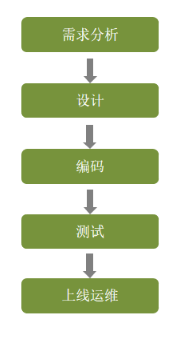
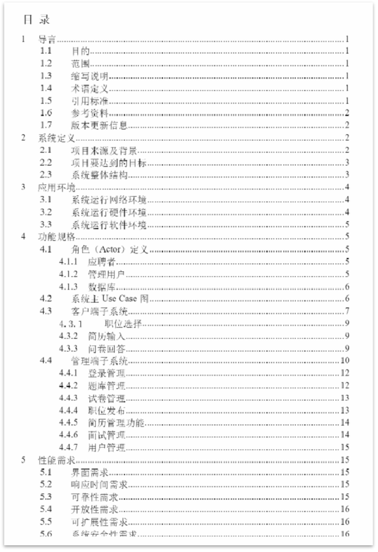
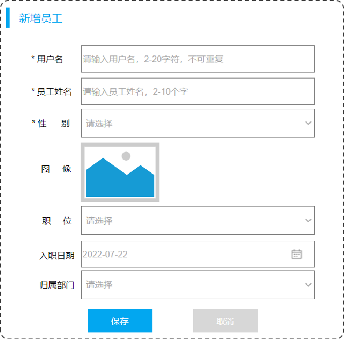
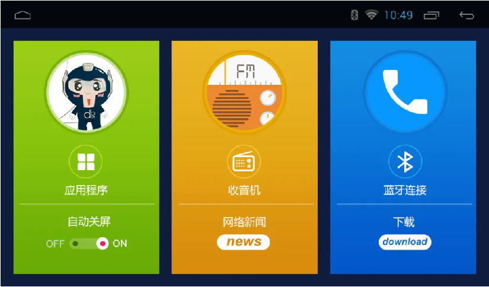
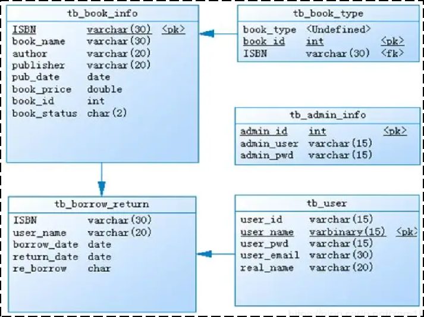
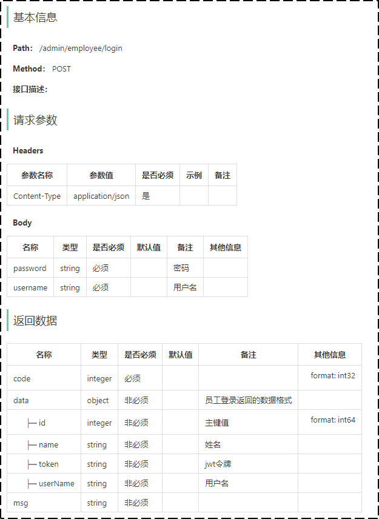
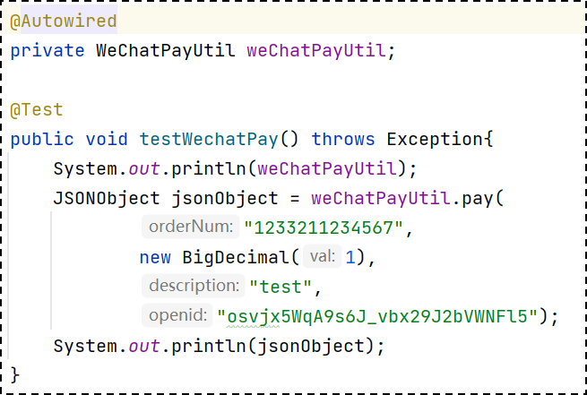
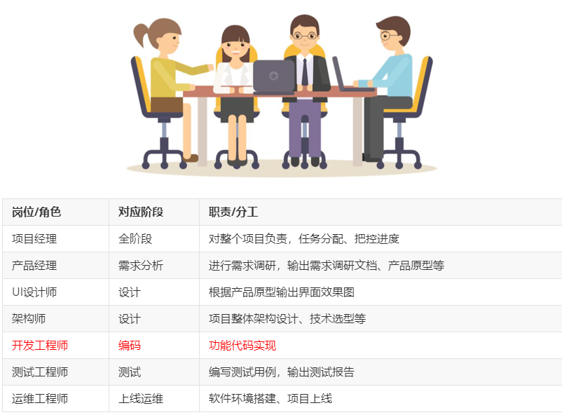

<h1 style="text-align: center;">软件开发整体介绍</h1>

---

## 开发流程

### 第 1 阶段: 需求分析

#### 完成需求规格说明书、产品原型编写

#### 需求规格说明书， 一般来说就是使用 Word 文档来描述当前项目的各个组成部分，如：系统定义、应用环境、功能规格、性能需求等，都会在文档中描述

 

#### 产品原型，一般是通过网页(html)的形式展示当前的页面展示什么样的数据, 页面的布局是什么样子的，点击某个菜单，打开什么页面，点击某个按钮，出现什么效果，都可以通过产品原型看到

 

### 第 2 阶段: 设计

#### 设计的内容包含 UI 设计、数据库设计、接口设计

#### （1）UI 设计：用户界面的设计，主要设计项目的页面效果，小到一个按钮，大到一个页面布局，还有人机交互逻辑的体现

 

#### （2）数据库设计：需要设计当前项目中涉及到哪些数据库，每一个数据库里面包含哪些表，这些表结构之间的关系是什么样的，表结构中包含哪些字段

 

#### （3）接口设计：通过分析原型图，首先，粗粒度地分析每个页面有多少接口，然后，再细粒度地分析每个接口的传入参数，返回值参数，同时明确接口路径及请求方式

 

### 第 3 阶段: 编码

#### 编写项目代码、并完成单元测试

#### 项目代码编写：作为软件开发工程师，我们需要对项目的模块功能分析后，进行编码实现

#### 单元测试：编码实现完毕后，进行单元测试，单元测试通过后再进入到下一阶段

 

### 第 4 阶段: 测试

> #### 在该阶段中主要由测试人员, 对部署在测试环境的项目进行功能测试, 并出具测试报告

### 第 5 阶段: 上线运维

> #### 在项目上线之前， 会由运维人员准备服务器上的软件环境安装、配置， 配置完毕后， 再将我们开发好的项目，部署在服务器上运行

## 角色分工

 

## 软件环境

### 开发环境(development)

> #### 我们作为软件开发人员，在开发阶段使用的环境，就是开发环境，一般外部用户无法访问
>
> #### 比如，我们在开发中使用的 MySQL 数据库和其他的一些常用软件，我们可以安装在本地， 也可以安装在一台专门的服务器中， 这些应用软件仅仅在软件开发过程中使用， 项目测试、上线时，我们不会使用这套环境了，这个环境就是开发环境

### 测试环境(testing)

> #### 当软件开发工程师，将项目的功能模块开发完毕，并且单元测试通过后，就需要将项目部署到测试服务器上，让测试人员对项目进行测试。那这台测试服务器就是专门给测试人员使用的环境， 也就是测试环境，用于项目测试，一般外部用户无法访问

### 生产环境(production)

> #### 当项目开发完毕，并且由测试人员测试通过之后，就可以上线项目，将项目部署到线上环境，并正式对外提供服务，这个线上环境也称之为生产环境

### 开发过程环境变化

> #### （1）首先，会在开发环境中进行项目开发，往往开发环境大多数都是本地的电脑环境和局域网内的环境
>
> #### （2）当开发完毕后，然后会把项目部署到测试环境，测试环境一般是一台独立测试服务器的环境
>
> #### （3）项目测试通过后，最终把项目部署到生产环境，生产环境可以是机房或者云服务器等线上环境
