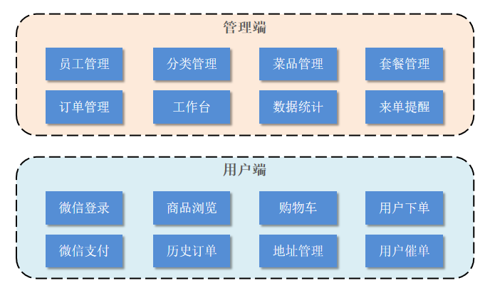
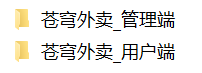
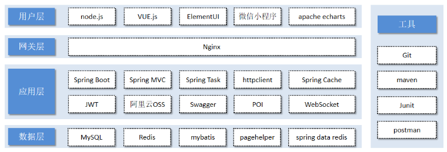

<h1 style="text-align: center;">项目介绍</h1>

---

## 项目介绍

> #### 本项目（苍穹外卖）是专门为餐饮企业（餐厅、饭店）定制的一款软件产品，包括 系统管理后台 和 小程序端应用 两部分。其中系统管理后台主要提供给餐饮企业内部员工使用，可以对餐厅的分类、菜品、套餐、订单、员工等进行管理维护，对餐厅的各类数据进行统计，同时也可进行来单语音播报功能。小程序端主要提供给消费者使用，可以在线浏览菜品、添加购物车、下单、支付、催单等

 

> #### 接下来，通过功能架构图来展示管理端和用户端的具体业务功能模块

 

#### （1）管理端功能

> #### 员工登录/退出 , 员工信息管理 , 分类管理 , 菜品管理 , 套餐管理 , 菜品口味管理 , 订单管理 ，数据统计，来单提醒

#### （2）用户端功能

> #### 微信登录 , 收件人地址管理 , 用户历史订单查询 , 菜品规格查询 , 购物车功能 , 下单 , 支付、分类及菜品浏览

## 产品原型

> #### 在课程资料中提供了产品原型

 

### 管理端

> #### 餐饮企业内部员工使用。 主要功能有

| 模块      | 描述                                                                                      |
| --------- | ----------------------------------------------------------------------------------------- |
| 登录/退出 | 内部员工必须登录后,才可以访问系统管理后台                                                 |
| 员工管理  | 管理员可以在系统后台对员工信息进行管理，包含查询、新增、编辑、禁用等功能                  |
| 分类管理  | 主要对当前餐厅经营的 菜品分类 或 套餐分类 进行管理维护， 包含查询、新增、修改、删除等功能 |
| 菜品管理  | 主要维护各个分类下的菜品信息，包含查询、新增、修改、删除、启售、停售等功能                |
| 套餐管理  | 主要维护当前餐厅中的套餐信息，包含查询、新增、修改、删除、启售、停售等功能                |
| 订单管理  | 主要维护用户在移动端下的订单信息，包含查询、取消、派送、完成，以及订单报表下载等功能      |
| 数据统计  | 主要完成对餐厅的各类数据统计，如营业额、用户数量、订单等                                  |

### 用户端

> #### 移动端应用主要提供给消费者使用。主要功能有

| 模块        | 描述                                                                                              |
| ----------- | ------------------------------------------------------------------------------------------------- |
| 登录/退出   | 用户需要通过微信授权后登录使用小程序进行点餐                                                      |
| 点餐-菜单   | 在点餐界面需要展示出菜品分类/套餐分类, 并根据当前选择的分类加载其中的菜品信息, 供用户查询选择     |
| 点餐-购物车 | 用户选中的菜品就会加入用户的购物车, 主要包含 查询购物车、加入购物车、删除购物车、清空购物车等功能 |
| 订单支付    | 用户选完菜品/套餐后, 可以对购物车菜品进行结算支付, 这时就需要进行订单的支付                       |
| 个人信息    | 在个人中心页面中会展示当前用户的基本信息, 用户可以管理收货地址, 也可以查询历史订单数据            |

## 技术选型

> #### 关于本项目的技术选型, 我们将会从 用户层、网关层、应用层、数据层 这几个方面进行介绍，主要用于展示项目中使用到的技术框架和中间件等

 

### 用户层

> #### 本项目中在构建系统管理后台的前端页面，我们会用到 H5、Vue.js、ElementUI、apache echarts(展示图表)等技术。而在构建移动端应用时，我们会使用到微信小程序

### 网关层

> #### Nginx 是一个服务器，主要用来作为 Http 服务器，部署静态资源，访问性能高。在 Nginx 中还有两个比较重要的作用： 反向代理和负载均衡， 在进行项目部署时，要实现 Tomcat 的负载均衡，就可以通过 Nginx 来实现

### 应用层

> #### SpringBoot： 快速构建 Spring 项目, 采用 "约定优于配置" 的思想, 简化 Spring 项目的配置开发
>
> #### SpringMVC：SpringMVC 是 spring 框架的一个模块，springmvc 和 spring 无需通过中间整合层进行整合，可以无缝集成
>
> #### Spring Task: 由 Spring 提供的定时任务框架
>
> #### httpclient: 主要实现了对 http 请求的发送
>
> #### Spring Cache: 由 Spring 提供的数据缓存框架
>
> #### JWT: 用于对应用程序上的用户进行身份验证的标记
>
> #### 阿里云 OSS: 对象存储服务，在项目中主要存储文件，如图片等
>
> #### Swagger： 可以自动的帮助开发人员生成接口文档，并对接口进行测试
>
> #### POI: 封装了对 Excel 表格的常用操作
>
> #### WebSocket: 一种通信网络协议，使客户端和服务器之间的数据交换更加简单，用于项目的来单、催单功能实现

### 数据层

> #### MySQL： 关系型数据库, 本项目的核心业务数据都会采用 MySQL 进行存储
>
> #### Redis： 基于 key-value 格式存储的内存数据库, 访问速度快, 经常使用它做缓存
>
> #### Mybatis： 本项目持久层将会使用 Mybatis 开发
>
> #### pagehelper: 分页插件
>
> #### spring data redis: 简化 java 代码操作 Redis 的 API

### 工具

> #### git: 版本控制工具, 在团队协作中, 使用该工具对项目中的代码进行管理
>
> #### maven: 项目构建工具
>
> #### junit：单元测试工具，开发人员功能实现完毕后，需要通过 junit 对功能进行单元测试
>
> #### postman: 接口测工具，模拟用户发起的各类 HTTP 请求，获取对应的响应结果
