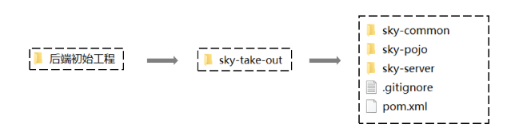
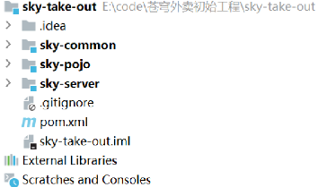
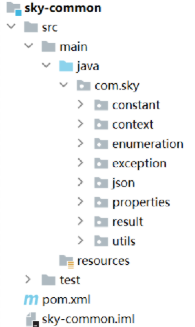
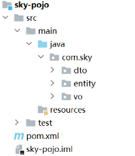
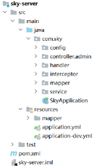
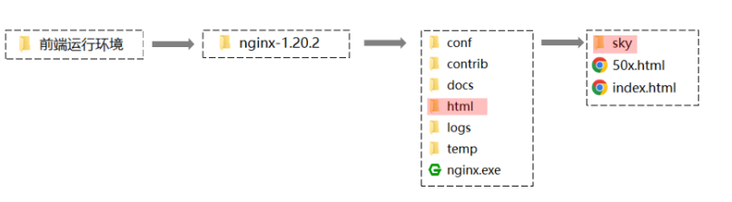
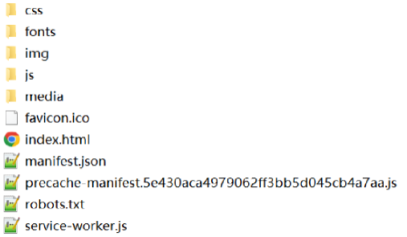

<h1 style="text-align: center;">开发环境搭建</h1>

---

## 后端环境搭建

### 资料

> #### 从当天资料中找到后端初始工程，导入 IDEA

<br/>


### 基本介绍

<br/>


<div style="padding-left:50px">

| **序号** | **名称**     | **说明**                                                       |
| -------- | ------------ | -------------------------------------------------------------- |
| 1        | sky-take-out | maven 父工程，统一管理依赖版本，聚合其他子模块                 |
| 2        | sky-common   | 子模块，存放公共类，例如：工具类、常量类、异常类等             |
| 3        | sky-pojo     | 子模块，存放实体类、VO、DTO 等                                 |
| 4        | sky-server   | 子模块，后端服务，存放配置文件、Controller、Service、Mapper 等 |

</div>

### sky-common

> #### 模块中存放的是一些公共类，可以供其他模块使用

<br/>


<div style="padding-left:200px">

| 名称        | 说明                             |
| ----------- | -------------------------------- |
| constant    | 存放相关常量类                   |
| context     | 存放上下文类                     |
| enumeration | 项目的枚举类存储                 |
| exception   | 存放自定义异常类                 |
| json        | 处理 json 转换的类               |
| properties  | 存放 SpringBoot 相关的配置属性类 |
| result      | 返回结果类的封装                 |
| utils       | 常用工具类                       |

</div>

### sky-pojo

> #### 模块中存放的是一些 entity、DTO、VO

<br/>


<div style="padding-left:150px">

| **名称**                           | **说明**                                                                    |
| ---------------------------------- | --------------------------------------------------------------------------- |
| Entity                             | 实体，通常和数据库中的表对应                                                |
| <span style="color:red">DTO</span> | <span style="color:red">数据传输对象，通常用于程序中各层之间传递数据</span> |
| <span style="color:red">VO</span>  | <span style="color:red">视图对象，为前端展示数据提供的对象</span>           |
| POJO                               | 普通 Java 对象，只有属性和对应的 getter 和 setter                           |

</div>

### sky-server

> #### 模块中存放的是 配置文件、配置类、拦截器、controller、service、mapper、启动类等

<br/>


<div style="padding-left:250px">

| 名称           | 说明               |
| -------------- | ------------------ |
| config         | 存放配置类         |
| controller     | 存放 controller 类 |
| interceptor    | 存放拦截器类       |
| mapper         | 存放 mapper 接口   |
| service        | 存放 service 类    |
| SkyApplication | 启动类             |

</div>

## 前端环境搭建

### 前端工程基于 nginx

> #### 从资料中找到前端运行环境的 nginx，移动到<span style="color:red">非中文目录</span>下

<br/>


> #### sky 目录中存放了管理端的前端资源，具体如下



### 启动 nginx，访问测试

> #### 双击 nginx.exe 即可启动 nginx 服务，访问端口号为 80
>
> #### `http://localhost:80`

<br/>


## 完善登录功能代码

> #### 打开 EmployeeServiceImpl.java，使用 MD5 算法对密码进行加密处理后存入数据库

```java
/**
     * 员工登录
     *
     * @param employeeLoginDTO
     * @return
     */
    public Employee login(EmployeeLoginDTO employeeLoginDTO) {

        //1、根据用户名查询数据库中的数据

        //2、处理各种异常情况（用户名不存在、密码不对、账号被锁定）
        //.......
        //密码比对
        // TODO 后期需要进行md5加密，然后再进行比对
        password = DigestUtils.md5DigestAsHex(password.getBytes());
        if (!password.equals(employee.getPassword())) {
            //密码错误
            throw new PasswordErrorException(MessageConstant.PASSWORD_ERROR);
        }

        //........

        //3、返回实体对象
        return employee;
    }
```
