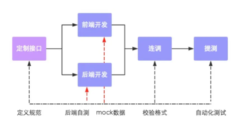
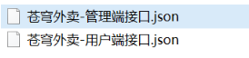
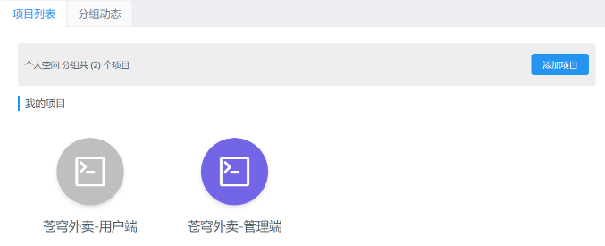
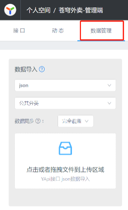
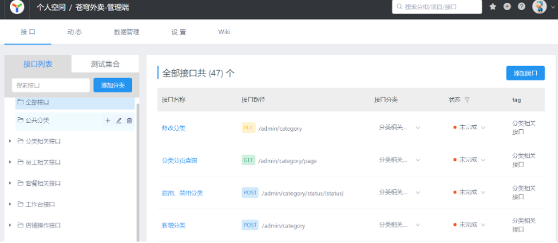

<h1 style="text-align: center;">导入接口文档</h1>

---

## 前后端分离开发流程

 

#### 第一步：定义接口，确定接口的路径、请求方式、传入参数、返回参数

#### 第二步：前端开发人员和后端开发人员并行开发，同时，也可自测

#### 第三步：前后端人员进行连调测试

#### 第四步：提交给测试人员进行最终测试

## 导入接口

#### 将课程资料中提供的项目接口导入 YApi。访问地址：http://yapi.smart-xwork.cn/

#### （1）从资料中找到项目接口文件

 

#### （2）导入到 YApi 平台，在 YApi 平台创建出两个项目

 

#### （3）选择苍穹外卖-管理端接口 . json 导入

 

#### （4）导入成功

 

