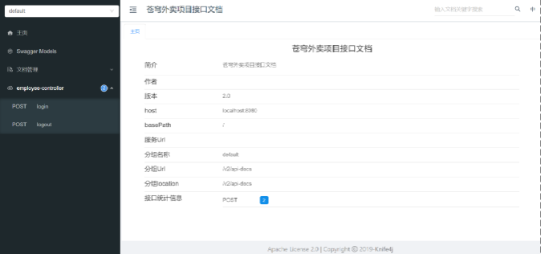

<h1 style="text-align: center;">Swagger 接口文档</h1>

---

## 基本介绍

#### Swagger 是一个规范和完整的框架，用于生成、描述、调用和可视化 RESTful 风格的 Web 服务（https://swagger.io）

#### 它的主要作用是

#### （1） 使得前后端分离开发更加方便，有利于团队协作

#### （2） 接口的文档在线自动生成，降低后端开发人员编写接口文档的负担

#### （3） 功能测试

> #### Spring 已经将 Swagger 纳入自身的标准，建立了 Spring-swagger 项目，现在叫 Springfox。通过在项目中引入 Springfox，即可非常简单快捷的使用 Swagger

#### knife4j 是为 Java MVC 框架集成 Swagger 生成 Api 文档的增强解决方案，前身是 swagger-bootstrap-ui，取名 kni4j 是希望它能像一把匕首一样小巧、轻量、并且功能强悍

#### 目前，一般都使用 knife4j 框架

## 使用步骤

### pom.xml 中添加依赖

> #### 导入 knife4j 的 maven 坐标

```xml
<dependency>
    <groupId>com.github.xiaoymin</groupId>
    <artifactId>knife4j-spring-boot-starter</artifactId>
</dependency>
```

### knife4j 相关配置

> #### 在配置类中加入 knife4j 相关配置，WebMvcConfiguration.java

```java
/**
     * 通过knife4j生成接口文档
     * @return
*/
    @Bean
    public Docket docket() {
        ApiInfo apiInfo = new ApiInfoBuilder()
                .title("苍穹外卖项目接口文档")
                .version("2.0")
                .description("苍穹外卖项目接口文档")
                .build();
        Docket docket = new Docket(DocumentationType.SWAGGER_2)
                .apiInfo(apiInfo)
                .select()
                .apis(RequestHandlerSelectors.basePackage("com.sky.controller"))
                .paths(PathSelectors.any())
                .build();
        return docket;
    }
```

### 设置静态资源映射

> #### WebMvcConfiguration.java

```java
/**
     * 设置静态资源映射
     * @param registry
*/
protected void addResourceHandlers(ResourceHandlerRegistry registry) {
        registry.addResourceHandler("/doc.html").addResourceLocations("classpath:/META-INF/resources/");
        registry.addResourceHandler("/webjars/**").addResourceLocations("classpath:/META-INF/resources/webjars/");
}
```

### 访问测试

> #### 接口文档访问路径为 `http://ip:port/doc.html` ---> `http://localhost:8080/doc.html`

<br/>


### 问题思考

#### 通过 Swagger 就可以生成接口文档，那么我们就不需要 Yapi 了？

> #### （1）Yapi 是设计阶段使用的工具，管理和维护接口
>
> #### （2）Swagger 在开发阶段使用的框架，帮助后端开发人员做后端的接口测试

## ⭐ 常用注解

### 基本介绍

| **注解**          | **说明**                                                 |
| ----------------- | -------------------------------------------------------- |
| @Api              | 用在类上，例如 Controller，表示对类的说明                |
| @ApiModel         | 用在类上，例如 entity、DTO、VO                           |
| @ApiModelProperty | 用在属性上，描述属性信息                                 |
| @ApiOperation     | 用在方法上，例如 Controller 的方法，说明方法的用途、作用 |

### 代码示例

#### （1）ApiModel

```java
package com.sky.dto;

import io.swagger.annotations.ApiModel;
import io.swagger.annotations.ApiModelProperty;
import lombok.Data;

import java.io.Serializable;

@Data
@ApiModel(description = "员工登录时传递的数据模型")
public class EmployeeLoginDTO implements Serializable {

    @ApiModelProperty("用户名")
    private String username;

    @ApiModelProperty("密码")
    private String password;

}
```

#### （2）Api、ApiOperation、ApiModelProperty

```java
package com.sky.controller.admin;

import com.sky.constant.JwtClaimsConstant;
import com.sky.dto.EmployeeLoginDTO;
import com.sky.entity.Employee;
import com.sky.properties.JwtProperties;
import com.sky.result.Result;
import com.sky.service.EmployeeService;
import com.sky.utils.JwtUtil;
import com.sky.vo.EmployeeLoginVO;
import io.swagger.annotations.Api;
import io.swagger.annotations.ApiOperation;
import lombok.extern.slf4j.Slf4j;
import org.springframework.beans.factory.annotation.Autowired;
import org.springframework.web.bind.annotation.PostMapping;
import org.springframework.web.bind.annotation.RequestBody;
import org.springframework.web.bind.annotation.RequestMapping;
import org.springframework.web.bind.annotation.RestController;

import java.util.HashMap;
import java.util.Map;

/**
 * 员工管理
 */
@RestController
@RequestMapping("/admin/employee")
@Slf4j
@Api(tags = "员工相关接口")
public class EmployeeController {

    @Autowired
    private EmployeeService employeeService;
    @Autowired
    private JwtProperties jwtProperties;

    /**
     * 登录
     *
     * @param employeeLoginDTO
     * @return
     */
    @PostMapping("/login")
    @ApiOperation(value = "员工登录")
    public Result<EmployeeLoginVO> login(@RequestBody EmployeeLoginDTO employeeLoginDTO) 	{
        //..............


    }

    /**
     * 退出
     *
     * @return
     */
    @PostMapping("/logout")
    @ApiOperation("员工退出")
    public Result<String> logout() {
        return Result.success();
    }

}
```
